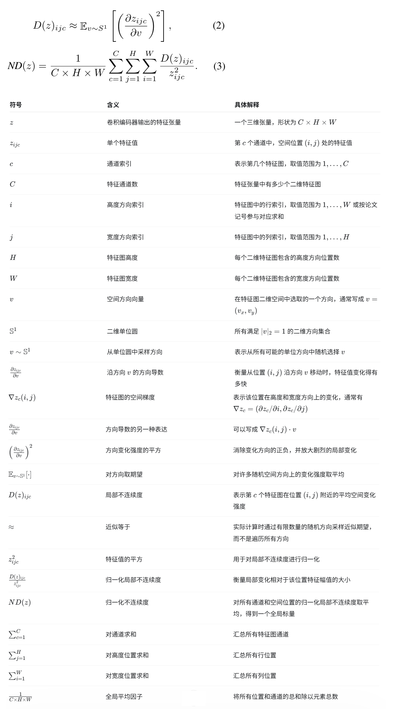
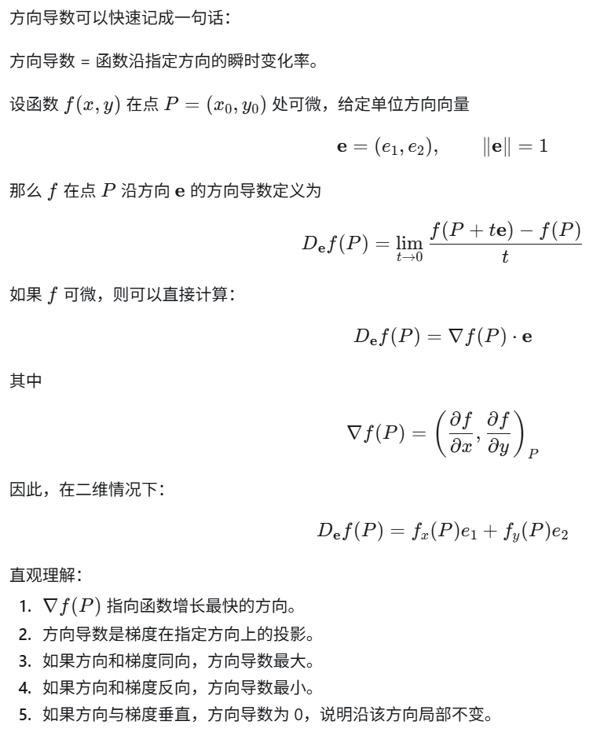
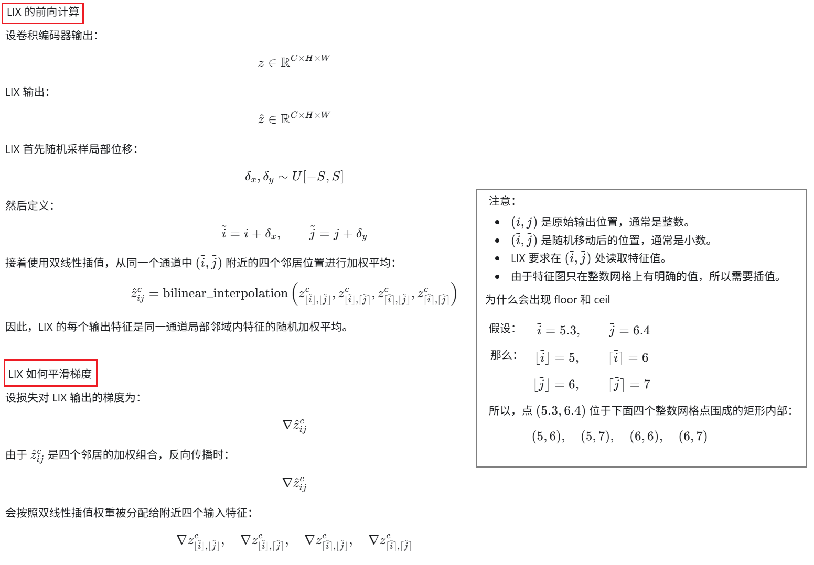
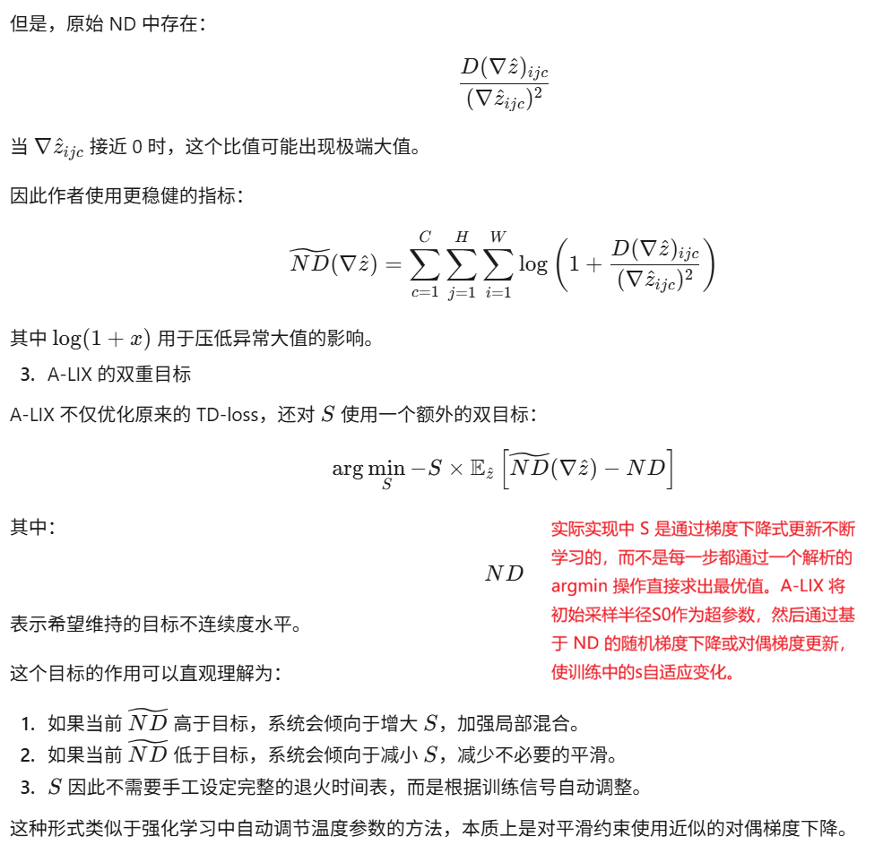
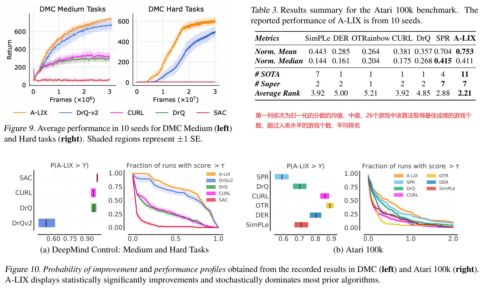

Stabilizing Off-Policy Deep Reinforcement Learning from Pixels

ICML'2022, from 伦敦国王大学、牛津大学

### 1 Introduction

论文指出导致基于视觉的离策略RL方法不能收敛或者过早收敛到次优状态的视觉致命三元组：使用卷积编码器和低强度奖励进行时间差分学习时产生的。

我们观察到视觉致命三元组的存在会导致通过卷积编码器的特征图计算的 TD 损失梯度具有很高的空间频率。我们发现这些梯度在空间上不一致，并且在反向传播到编码器参数时会导致退化的优化状态。此外，用这些梯度反复更新卷积编码器通常会导致过早收敛到退化特征表示，使评论器去拟合高方差的错误目标，这种现象我们称之为灾难性自我过拟合。

我们提出了 A-LIX，这是一种对编码器梯度提供自适应正则化的方法，通过双重目标明确防止灾难性的自我过拟合。通过应用 A-LIX，我们在 DeepMind Control 和 Atari 100k 基准测试中显著超越了之前的最先进水平，而且不需要任何数据增强或辅助损失。

### 3 Instabilities in TD-Learning from Pixels

第三章的核心目标是解释：为什么基于像素输入的离策略强化学习容易出现训练不稳定，以及随机平移增强为什么能够缓解这一问题。

#### 3.1 为什么随机平移增强有效

重要结论：随机平移增强的主要作用不是提高测试阶段对图像平移的泛化能力，而是在训练早期正则化卷积编码器，避免 TD 学习快速陷入不稳定状态。

推导依据：

1. DeepMind Control 中的摄像机通常相对智能体保持固定，因此测试时并不存在明显的平移分布变化。让策略具备平移不变性并不是完成任务所必需的归纳偏置。
2. 先前一些方法可以在不使用图像增强的情况下学到有效策略，说明平移泛化不是成功的必要条件。
3. 作者在 Cheetah Run 上训练 DrQ-v2，并在训练 50 万环境步后关闭随机平移增强。结果表明，关闭增强后性能没有下降，反而略有提升。
4. 如果从训练开始就不使用增强，智能体通常无法稳定学习；但只在训练初期使用增强，之后将其关闭，智能体仍然能够继续学习。

因此，**随机平移增强最重要的作用发生在训练早期：此时 TD 目标包含大量随机初始化产生的噪声，增强可以防止编码器过早拟合这些不可靠目标。当 TD 目标逐渐包含有效的奖励信息后，继续使用增强不再必要，甚至可能妨碍最终性能。**

#### 3.2 视觉致命三元组

重要结论：像素离策略强化学习的不稳定性主要来自三个条件的共同作用：

1. 表征学习仅依赖 TD-loss。
2. 使用表达能力很强、但没有受到适当正则化的卷积编码器进行端到端学习。
3. 训练早期奖励稀疏且幅值较低。

作者将这三个条件称为“视觉致命三元组”（visual deadly triad）。

推导依据一：离线实验隔离不同影响因素

作者在 Cheetah Run 中使用随机策略收集了 15,000 条固定transitions，然后把训练拆分为三个阶段：

1. 探索：收集固定离线数据。
2. 策略评估：使用 SARSA 和 TD-loss 训练 critic 与编码器。
3. 策略改进：冻结已经训练好的 critic，通过最大化 critic 输出训练 actor。

实验发现：

1. 只在探索阶段使用增强，对最终稳定性几乎没有影响。
2. 只在策略改进阶段使用增强，同样没有明显作用。
3. 只有在策略评估，即 TD 学习阶段使用增强，才能显著提高最终策略性能。

这说明不稳定性的主要来源不是探索不足或 actor 优化，而是 critic 和卷积编码器的端到端 TD 学习。

推导依据二：较低的 TD-loss 不代表学到了正确的价值函数

离线实验的主要结果为：

使用增强：
最终 TD-loss = 0.021
最终回报 = 86.5 ± 11.3

不使用增强：
最终 TD-loss = 0.002
最终回报 = 9.2 ± 12.1

**不使用增强的智能体具有更低的 TD-loss，却得到几乎无效的策略。这说明它并不是没有拟合训练目标，而是过度拟合了错误的训练目标。**

进一步分析表明：

1. 不使用增强的 critic 输出具有很高的方差。
2. 它的 Q 值与自身 target critic 产生的 TD 目标高度相关，相关系数很快接近 1。
3. 但它的 Q 值与真实的折扣 Monte Carlo 回报相关性较低。
4. 在零奖励样本中，TD 目标主要由随机初始化的 target critic 决定。不使用增强的智能体会优先拟合这些无信息的随机预测。

**因此，critic 实际上在使用自己的噪声预测作为监督信号，并通过自举过程不断强化这些错误。作者将该现象称为“灾难性自过拟合”（catastrophic self-overfitting）。**

推导依据三：TD 学习本身并不足以导致问题

作者进行了多组对照实验：

1. 使用低维本体状态和全连接网络：
   最终回报为 79.1 ± 7.7，接近增强智能体。
2. 冻结随机初始化的 CNN：
   最终回报为 43.6 ± 20.2，明显好于端到端训练的非增强 CNN。
3. 冻结经过预训练的 CNN：
   最终回报为 77.6 ± 18.5，接近增强智能体。

这些结果说明，主要问题并非 critic 的 TD 更新本身，而是 TD-loss 与可训练卷积编码器之间的相互作用。即使是固定的随机卷积特征，也比让 CNN 直接拟合噪声 TD 目标更加稳定。

推导依据四：提高奖励信号可以缓解问题

作者还测试了两种增强有效奖励信号的方法：

1. 对奖励进行归一化：
   最终回报提高到 38.6 ± 16.5。
2. 使用 10-step return：
   最终回报提高到 36.5 ± 20.3。

较大的奖励信号能够降低随机 target critic 在 TD 目标中的相对影响，因此可以缓解自过拟合。但这两种方法仍然没有达到随机平移增强的效果，而且会引入额外的优化方差或多步回报偏差。

综合上述实验，三个条件需要共同考虑：

仅有 TD-loss 不一定失败；
仅有 CNN 不一定失败；
稀疏奖励本身也不一定失败；
但当噪声自举目标、可自由拟合的 CNN 和弱奖励信号同时出现时，训练很容易进入灾难性自过拟合。

#### 3.3 如何提前识别灾难性自过拟合

**重要结论：灾难性自过拟合的直接表现是卷积特征及其反向传播梯度出现高频、空间不连续结构。作者提出归一化不连续度 ND，用于量化这种现象。**

推导依据一：问题主要出现在视觉表征而不是动作维度

灾难性自过拟合发生后，critic 对动作变化的敏感度显著下降，而 Q 值主要随视觉观测变化。这意味着 critic 忽略了动作与回报之间的因果关系，把建模能力用于记忆观测中的高频模式。

因此，作者将分析重点放在卷积编码器产生的特征图：

z ∈ R^(C×H×W)

推导依据二：非增强编码器对输入扰动更加敏感

作者计算编码器相对于输入图像的 Jacobian，并使用 Frobenius 范数衡量局部敏感度。

结果表明，不使用增强的编码器对输入微小扰动的敏感度平均是增强编码器的 2.85 倍。

这说明非增强编码器倾向于学习输入中的高频变化，而不是稳定、平滑的视觉结构。

需要注意的是，较高输入敏感度只是表征退化的结果，并不是作者最终采用的根本判据。真正关键的是特征和梯度在空间上的不连续性。

推导依据三：特征图与特征梯度具有相同的空间性质

可视化结果显示：

1. 使用增强时，卷积特征图在空间上较为连续，相邻位置具有一致结构。
2. 不使用增强时，特征图中出现大量高频、离散和缺乏空间意义的模式。
3. 增强智能体的特征梯度同样较为连续。
4. 非增强智能体的特征梯度具有明显的空间不连续性。

由于反向传播梯度决定卷积参数的更新方向，持续出现的不连续梯度会推动编码器生成同样不连续的特征。因此作者认为，特征梯度不连续是表征退化和灾难性自过拟合的直接原因。

推导依据四：编码器损失曲面出现尖锐峰值

作者沿两个参数方向绘制 critic 的 TD-loss 曲面。

结果表明：

1. 使用增强时，编码器参数附近的损失曲面相对平滑。
2. 不使用增强时，编码器损失曲面出现非常尖锐的峰值。
3. 这种尖锐结构主要出现在卷积编码器，而不是后续的全连接 critic 网络。

这进一步说明，过拟合主要来自 CNN 学习高频表征的能力，而不是整个 critic 网络普遍发生了过拟合。

**ND的定义如下：公式2测量每个特征位置沿随机空间方向的局部变化强度；公式3把这个局部变化除以特征自身幅值的平方，并在所有通道和空间位置上取平均，从而得到一个尺度不敏感的全局指标，用来判断特征或训练梯度中是否存在持续的高频空间不连续性。**

#### 3.4 ND 实验得到的结论

1. 使用随机平移增强的智能体具有明显更低的梯度 ND。
2. 较低的 ND 与性能提升高度相关。当 ND 下降时，智能体通常开始学到有效行为。
3. 不使用增强时，梯度 ND 长期维持在较高水平，对应训练停滞和低回报。
4. 作者另外计算了梯度指数移动平均的累计 ND。累计 ND 与瞬时 ND 几乎相同。

最后一点非常重要。它说明不连续梯度不是不同 minibatch 随机产生、可以相互抵消的噪声，而是在特征图的相同空间位置上持续出现。随机采样训练批次无法自动将其平滑掉。

因此，编码器会反复沿着相似的高频、不连续方向更新，最终形成退化的特征空间。

#### 3.5 第三章的完整因果链

训练早期奖励稀疏且幅值较低
→ TD 目标主要由随机初始化的 target critic 决定
→ critic 接收到大量不可靠的自举监督信号
→ 表达能力较强且未正则化的 CNN 开始拟合这些噪声目标
→ 特征梯度出现持续的高频空间不连续
→ 不连续梯度推动 CNN 形成高频、不连续且对输入扰动敏感的特征
→ critic 更容易根据观测细节记忆自身的目标值，而忽略动作和真实回报
→ TD-loss 很低，但 Q 值与真实 Monte Carlo 回报不一致
→ 错误预测通过自举过程被进一步强化
→ 训练过早收敛到退化解，即灾难性自过拟合

#### 3.6 第三章最重要的总体结论

随机平移增强之所以有效，并不是因为任务本身需要平移不变性，而是因为它间接平滑了传回卷积编码器的梯度，阻止持续的空间不连续梯度累积。

第三章由此为第四章的方法设计提供了直接依据：既然关键问题是特征梯度的局部空间不连续，那么可以直接在特征层执行局部信号混合，并利用 ND 指标自适应控制平滑强度，而不必依赖输入图像增强。

快速回忆一下方向导数：

### 4 Counteracting Gradient Discontinuities （Method）

第4章的核心任务是：既然第3章已经发现“空间不连续的特征梯度”会导致灾难性自过拟合，那么如何直接平滑这些梯度，同时尽量不破坏有用的视觉信息。

第4章的整体推导链是：

随机平移增强能够缓解训练不稳定
→ 它的主要作用可能是平滑卷积特征梯度
→ 可以绕过输入图像增强，直接在特征层进行局部混合
→ 得到 LIX 层
→ 由于训练不同阶段所需的平滑强度不同，再让混合范围 S 根据 ND 自适应变化
→ 得到 A-LIX。

#### 4.1 梯度平滑与随机平移增强

作者认为，随机平移增强真正起作用的原因不是让策略学会“平移不变性”，而是改变了卷积特征的计算路径，从而间接平滑反向传播到编码器的梯度。由于随机平移会改变该特征对应的局部感受野，因此这个梯度会被传回到附近不同的卷积计算路径。多次训练后，参数更新相当于聚合了多个邻近位置的梯度。因此，随机平移增强能够抑制第3章中观察到的持续性梯度不连续，对卷积编码器的梯度施加隐式空间平滑正则化。

证据：Fig. 7显示：使用增强时，特征梯度的 ND 明显更低；不使用增强时，梯度具有持续的空间不连续性。

#### 4.2 LIX：Local SIgnal MiXing

随机平移增强虽然有效，但它存在几个限制：

1. 它作用在输入图像层面，属于间接正则化。
2. 它受到 padding、stride 和卷积近似平移等变性的影响。
3. 它可能改变输入信息，依赖图像边界通常是无关背景这一事实。
4. 它会强制引入某种平移相关的归纳偏置，而这种偏置不一定适合所有环境。

因此，作者提出直接在卷积特征图上进行局部信号混合。

作者强调，LIX 与输入图像随机平移有几个重要区别：

- 第一，LIX 直接在特征层进行操作。随机平移需要通过卷积网络的近似平移等变性间接影响梯度；LIX 则明确地对特征梯度进行局部混合。
- 第二，LIX 不依赖 padding 和 stride 的近似性质。它的梯度平滑机制在特征层显式完成，因此更加直接和可控。
- 第三，LIX 不强制学习某种输入不变性。LIX 只改变局部特征的计算图，编码器仍然可以利用足够的容量保存输入中的有用信息。
- 第四，LIX 不需要假设图像边界是无关信息。随机平移通常会裁掉部分边界内容，并依赖这些内容主要是背景；LIX 不需要这个假设。

#### 4.3 A-LIX：Adaptive LIX

LIX 中最重要的超参数是局部混合半径 *S*。它决定特征会与多大范围内的邻居进行混合。

作者认为：训练早期，TD 目标不可靠，梯度中包含大量噪声和不连续成分，因此需要较强的平滑，应该使用较大的 \(S\)。训练后期，TD 目标逐渐包含真实奖励信息，梯度中有更多有用信号。如果继续使用很大的 \(S\)，可能会把有用的细节也过度平滑掉，因此应该降低 \(S\)。作者使用第3章定义的归一化不连续度 ND，来衡量特征梯度是否足够平滑。

### 5 Performance Evaluation

### 6 代码

官方代码在[这里](https://github.com/Aladoro/Stabilizing-Off-Policy-RL)，[RoboBase](https://github.com/swirl-uk/robobase)也提供了实现