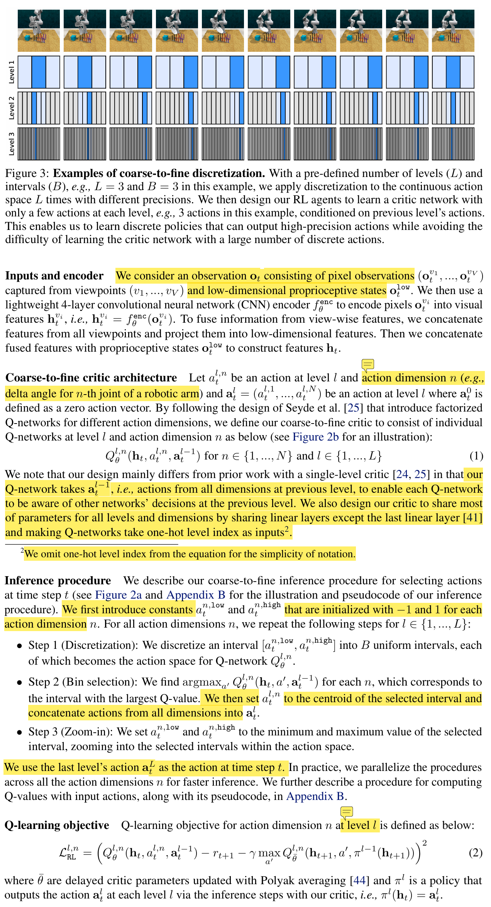
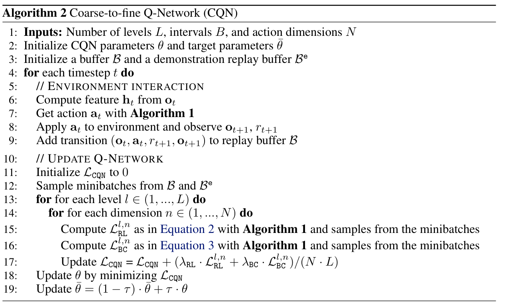
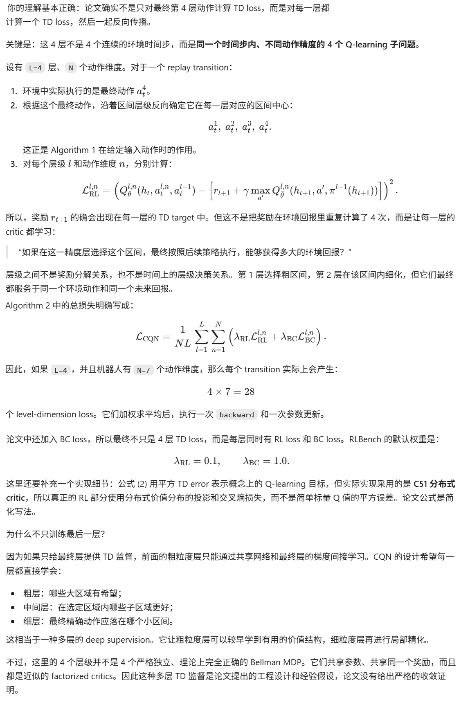
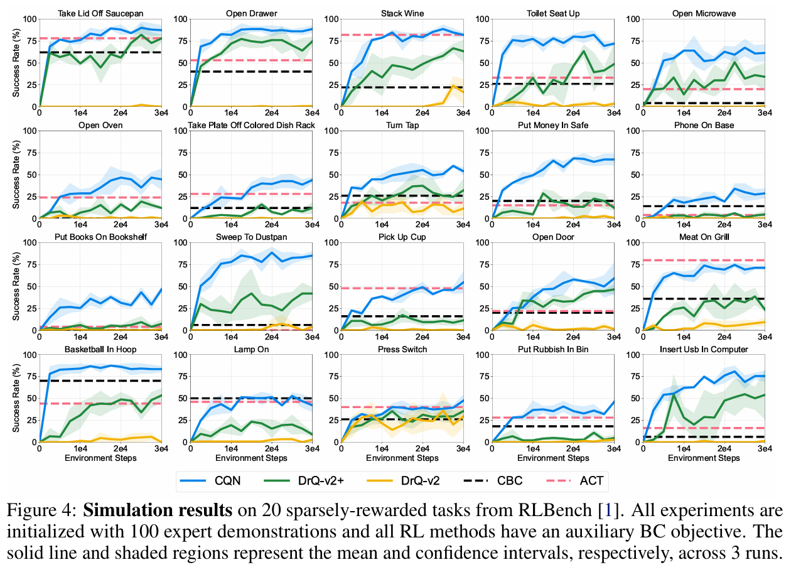

**Continuous Control with Coarse-to-fine Reinforcement Learning**

CoRL '2024, from Dyson Robot Learning Lab。（确实就是那个做吹风机和扫地机器人的公司）

### 1 Introduction

在本文中，我们认为在将强化学习应用于连续控制领域时，许多挑战源于使用演员-评论家算法，这些算法引入了一个独立的演员网络。尽管最近在稳定演员-评论家算法方面取得了一些进展，由于演员和评论家网络之间复杂的交互，它们仍容易出现不稳定情况。相比之下，基于价值的强化学习算法在概念上更简单、更稳定，因为它们仅依赖评论家网络，但在各种领域也取得了显著的成功。然而，基于价值的强化学习算法本质上是为离散动作环境设计的。为了在连续控制领域中利用基于价值的强化学习算法的优势，近期的研究集中于通过将连续动作空间离散化为多个区间来实现其使用。然而，这种离散化方案在动作精度和样本效率之间存在权衡：在精细化的机器人任务中需要更多的区间，但动作数量增加可能会让强化学习训练和探索变得更加困难。这种单层离散化可能无法扩展到需要高精度操作的领域，因为这类领域通常需要精细的离散化。

为了在不进行这种权衡的情况下，将基于价值的强化学习算法用于精细连续控制任务，我们提出了由粗到细的强化学习（Coarse-to-fine Reinforcement Learning, CRL）框架，它可以训练 RL 代理以粗到细的方式放大连续动作空间。我们的核心思想是训练一个agent，通过重复以下步骤来输出动作：

1. 将连续动作空间离散化成多个区间，
2. 选择具有最高 Q 值的区间在下一层进一步离散化。

与之前需要大量划分区间才能实现高精度的单层方法不同，我们的框架只需每层 3 个区间就能实现精细控制。在这个新的 CRL 框架下，我们提出了 Coarse-to-fine Q Network (CQN)，一种用于连续控制的基于价值的 RL 算法，并证明它能够以高样本效率稳健地学习解决一系列连续控制任务。

通过在一个基于示例的强化学习设置中进行大量实验，并且只使用少量环境交互和专家示范，我们证明了 CQN 能够稳健地学习解决来自 RLBench  和现实环境的各种稀疏奖励的视觉机器人操作任务。我们的结果很有趣，因为实验中没有使用预训练、运动规划、关键点提取、相机校准、深度信息和手工设计的奖励。此外，我们还展示了 CQN 是通用的，适用于视觉机器人操作以外的各种基准。

### 3 Method

具体来说，给定层数 L 和箱子数量 B，我们对连续动作空间进行 L 次离散化，这与之前一次性将动作空间离散成多个区间的方法 不同。然后，我们训练 RL 智能体通过重复以下操作来逐步缩小对连续动作空间的探索：(i) 在当前层将连续动作空间离散成 B 个区间，(ii) 选择 Q 值最高的区间，在下一层继续细分。

下面这段原文还是很清晰好理解的，直接贴出来：

AI提炼的摘要信息如下：

我对论文的核心理解如下：

- 论文真正提出的是 **Coarse-to-fine Reinforcement Learning (CRL)** 框架，CQN 是其中的一个具体实现。
- 连续动作空间首先被归一化为区间，例如 `[-1, 1]`。每一层把当前区间划分成 `B` 个子区间，用 Q 网络选择价值最高的子区间，然后只在该区间内继续细分。
- 经过 `L` 层后，每个动作维度获得约 `B^L` 级的精度，但每一层的 Q 网络只需要在 `B` 个候选动作之间选择。
- CQN 使用按动作维度分解的 critic：\[ Q_\theta^{l,n}(h_t,a_t^{l,n},a_t^{l-1}) \]当前动作维度的 Q 网络会看到上一层所有动作维度的选择，因此不同维度之间不是完全独立的。
- 训练目标是多层、多维度共享同一个环境奖励的 Q-learning。实际实现使用 C51 分布式 critic、目标网络、Polyak 更新和三步回报。
- 视觉机器人实验中，BC 不是单独的策略，而是一个辅助的 margin-based Q 学习损失；成功的在线轨迹还会被重新标记为 demonstrations。
- 关键工程设置包括：目标 Q 网络负责选动作、小高斯噪声 `N(0, 0.01)`、delta-joint action、示范数据和在线数据混合采样、观测帧堆叠，以及从示范数据估计动作范围。
- 论文没有给出 CRL/CQN 的正式收敛定理；主要论证来自设计直觉、消融实验和跨任务实验结果。

最值得注意的实验结论是：

- 单层离散化的性能在大约 65 个 bins 左右达到峰值，继续增加 bins 反而下降。
- CQN 在 RLBench 中使用 `L=3, B=5`，现实机器人中使用 `L=4, B=3`。
- RL 损失、BC 损失和分布式 critic 三者同时使用时效果最好。
- 成功轨迹重标记为 demonstrations 对性能帮助很大。
- 更高层数并不一定更好，超过 3-4 层后性能下降，作者推测共享网络容量有限且过细层级的学习信号会互相干扰。
- 在 DMC 中，CQN 对状态输入总体具有竞争力；像素输入下在操作任务上表现较好，但在 locomotion 任务中容易因朴素探索策略而早早停滞。
- 论文自身承认仍依赖较多示范数据，且尚未解决高 UTD 比率、更强视觉表征、搜索式动作选择、离线预训练和自动化现实机器人重置等问题。

**疑问1**：是关于损失函数的设计，按照我的直觉，我会把CQN当作一个黑盒的DQN网络，里面多层（假设4层）离散化/动作采样的过程是内部的细节，所以我以为损失函数只计算最后一层动作也就是最终作用到环境上的动作的TD error，但是论文的公式(2)似乎是对每一层都复用该时间步的奖励反复计算TD error?  如果是这样，那么是把4层的4个loss加起来做backward吗？

### 4 Experiments

### 5 代码

官方代码在[这里](https://github.com/younggyoseo/CQN)， [RoboBase](https://github.com/swirl-uk/robobase)也提供了实现