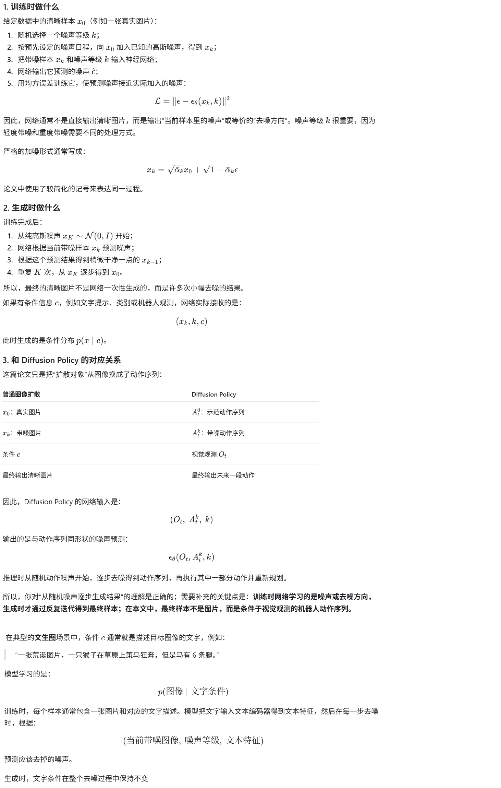
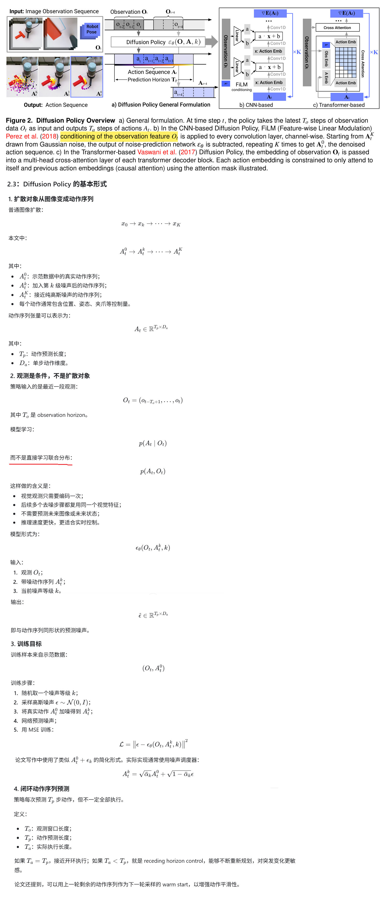
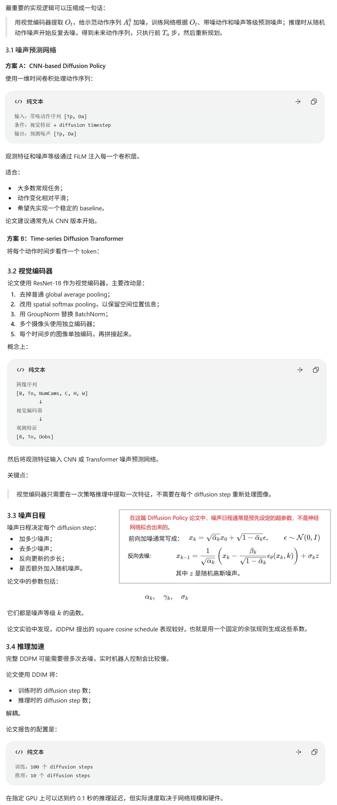
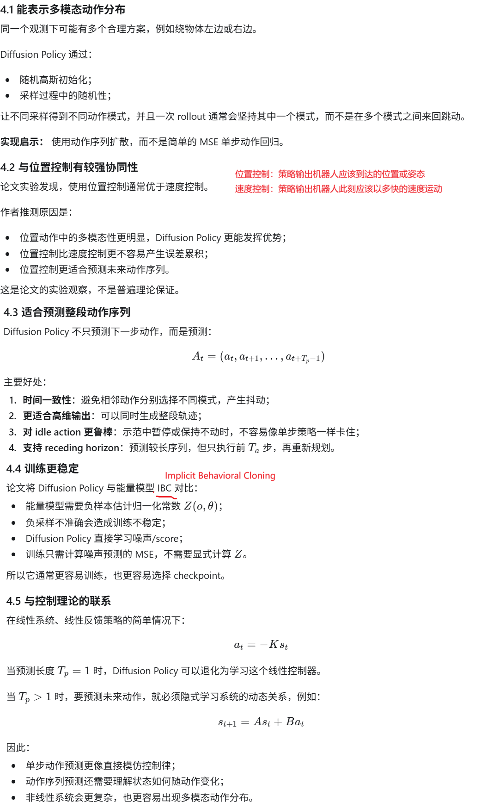
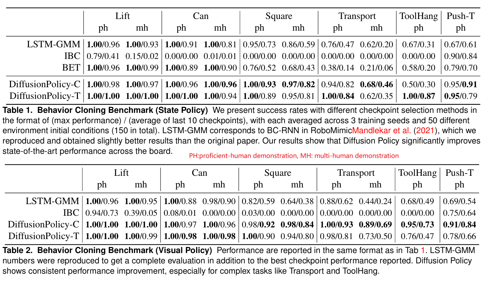

**Diffusion Policy: Visuomotor Policy Learning via Action Diffusion**

Robotics: Science and Systems Conference'2023, from 哥伦比亚大学

### 1 Introduction

这篇论文中的Diffusion Policy是离线模仿学习中的一种行为克隆方法。训练数据通常是专家的示范轨迹，用监督学习训练，不会用到奖励（区别于Offline RL的关键点）。训练阶段通常不交互环境。它通常不会系统性地发现超越示范数据的新策略，但可能因为数据融合、闭环反馈和更稳定的动作生成，在实际成功率上超过某个专家或某批示范轨迹。

#### 1.1 复习一下背景知识：扩散模型



### 3 Method

#### 3.1 思路



#### 3.2 具体设计



#### 3.3 最小训练伪代码

```python
# obs:       [B, To, NumCams, C, H, W]
# action_gt: [B, Tp, Da]

obs_feat = visual_encoder(obs)
# obs_feat: [B, To, Dobs]

t = random_timesteps(batch_size=B)

noise = torch.randn_like(action_gt)

action_noisy = scheduler.add_noise(
    action_gt,
    noise,
    t
)

noise_pred = policy(
    obs_feat=obs_feat,
    noisy_action=action_noisy,
    timestep=t
)

loss = F.mse_loss(noise_pred, noise)

optimizer.zero_grad()
loss.backward()
optimizer.step()
```

#### 3.4 最小推理伪代码

```python
# 当前观测
obs_feat = visual_encoder(obs)

# 从随机动作噪声开始
action = torch.randn(
    batch_size,
    Tp,
    Da,
    device=device
)

for t in scheduler.inference_timesteps:
    noise_pred = policy(
        obs_feat=obs_feat,
        noisy_action=action,
        timestep=t
    )

    action = scheduler.step(
        noise_pred,
        t,
        action
    ).prev_sample

# action: [B, Tp, Da]

# 只执行前 Ta 步
execute(action[:, :Ta])
```

#### 3.5 解惑

Q：为什么训练步数和推理步数可以不同呢？

A：因为训练时学的是预测所有/各种噪声等级下的噪音，训练并不是让模型固定执行 100 次连续更新。这里的“训练 100 步”指的是 **100 个噪声等级**，不是只进行 100 次梯度更新。实际训练通常会进行成千上万次优化迭代，每次随机抽一个噪声等级。推理时可以跳过中间等级，训练步数和推理步数不同，通常需要使用 DDIM、DPM-Solver 等支持跳步的采样器；如果严格使用原始 DDPM 的逐步马尔可夫采样，通常不能随意改变步数。


Q：论文为什么强调它是多模态的？ 是说可以是基于视觉观测，也可以是结构化的向量观测？

A：论文强调的“多模态”不是指“支持多种输入模态”，而是指在同一个观测下，专家动作分布可能有多个合理的模式。例如机器人看到物体在中间，需要把它推到目标位置，机器人可以从左边绕过去，也可以从右边绕过去。这是两个不同的动作模式。如果使用普通 MSE 行为克隆，模型可能学到所有动作的平均值：从中间过去，导致失败。Diffusion Policy 则可以从动作分布中采样出一个完整模式：要么从左边绕过去，要么从右边绕过去。

### 4 Diffusion Policy的有趣特征



### 5 Evaluation



### 6 代码

不只是python代码（基于状态和基于视觉输入两种），[官方](https://diffusion-policy.cs.columbia.edu/)还提供了数据等。

[RoboBase](https://github.com/swirl-uk/robobase)也提供了代码。

