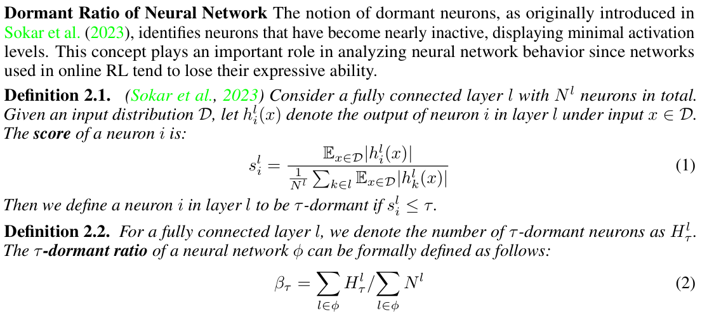
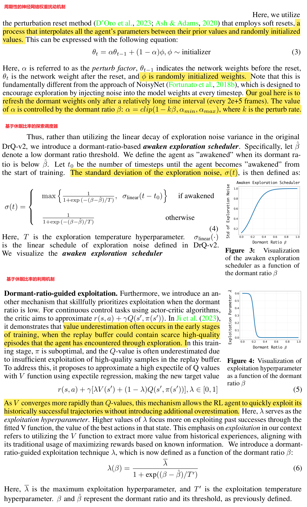
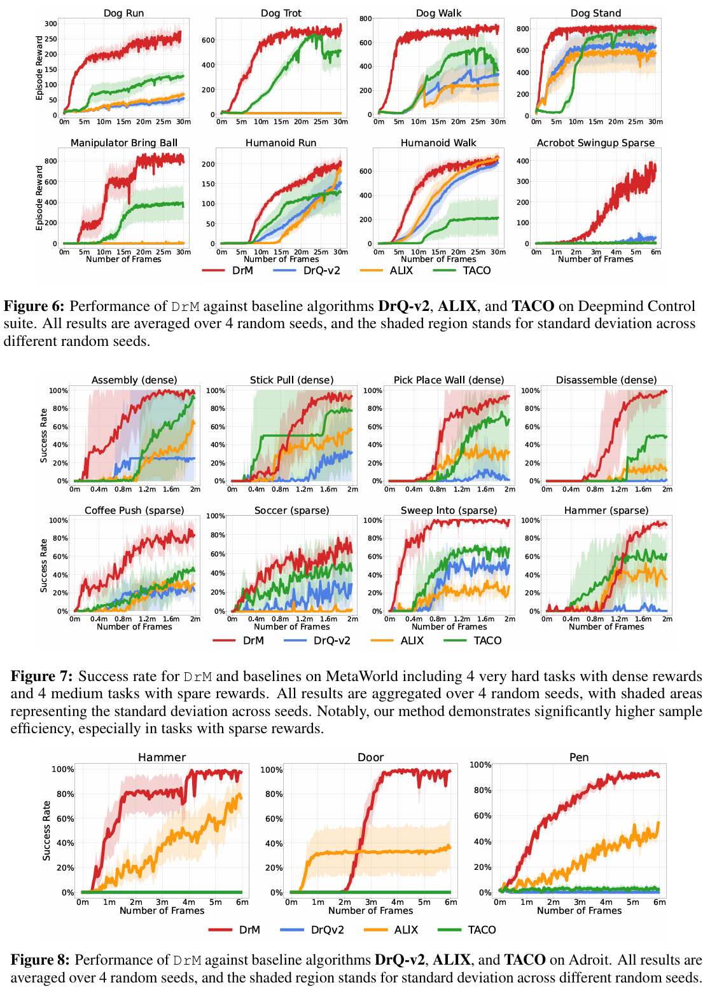

DRM: MASTERING VISUAL REINFORCEMENT LEARN ING THROUGH DORMANT RATIO MINIMIZATION（休眠比率最小化）

ICLR'2024, from 清华大学、马里兰大学

### 1 Introduction

目前基于视觉输入的RL算法在几乎所有性能方面仍然不令人满意，比如样本效率、渐近性能以及对随机种子选择的鲁棒性。

视觉强化学习的性能问题首先出现在面对复杂运动学和大量自由度的情况下，比如 DeepMind Control Suite中的Dog和Humanoid任务，或在 Adroit中的灵巧手操作任务，如果没有示范的话。其次，目前领先的视觉强化学习代理在不同的初始随机种子下，在学习过程中可能会陷入局部最优。

我们观察到，在RL训练过程中，当agent运动不活跃时，策略神经网络也有很高比例的不活跃神经元，这被定义为休眠神经元。随着训练的进行，智能体获取新技能通常会伴随着休眠神经元比例的下降，也就是休眠率的下降。因此，我们假设并通过实验验证了休眠率可以作为衡量智能体活跃程度的内在指标，而不管它收到的外部奖励如何。这种联系为在强化学习智能体中平衡探索和利用开辟了一条新路径。

我们提出的DrM 算法引入了三种简单的机制，旨在在降低休眠比率的同时有效地在探索和利用之间取得平衡：

1. 周期性的神经网络权重扰动机制
2. 基于休眠比率的探索调度器
3. 从 Chen 等人（2021a）扩展而来的基于休眠比率的利用机制。

因此，当休眠比率高时，智能体可以更注重探索，而当休眠比率低时，则可以将注意力转向利用。DrM 易于实现、计算效率高，并且在实践中样本效率也很高。

我们在Deepmind Control Suite、MetaWorld、Adroit三类环境共计19个很有挑战的任务下评测，DrM比最好的baselines方法分别减少了70%, 45%, 60%的样本（展现出很高的样本效率），同时在渐进性能方面，DrM比最好的baselines提高了65%, 35%, and 75%。

### 2 Method

#### 休眠比率的定义

#### DrM的三个措施

### 3 Experiments

### 4 代码

官方代码在[这里](https://github.com/XuGW-Kevin/DrM)。[RoboBase](https://github.com/swirl-uk/robobase)也有实现DrM。