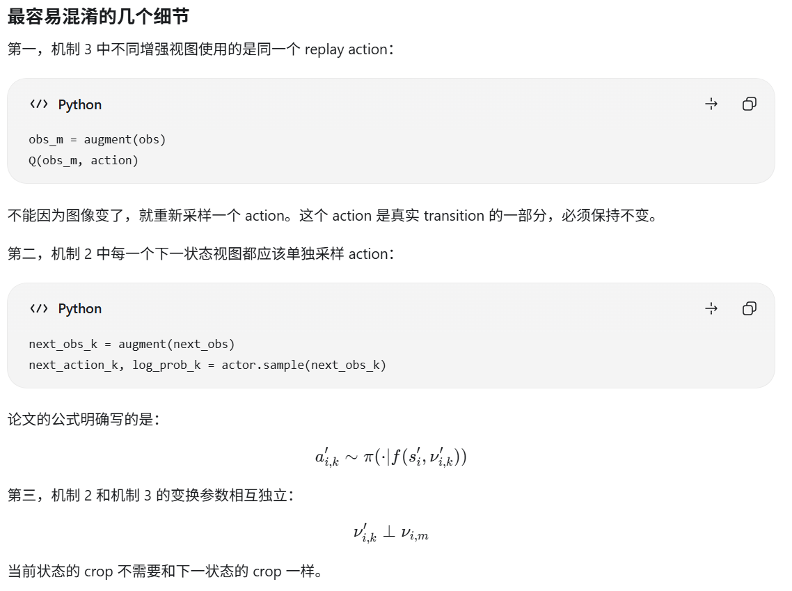

**Image Augmentation Is All You Need: Regularizing Deep Reinforcement Learning from Pixels**

ICLR'2021， from Facebook & New York University

### 1、引言

令人惊讶的是，数据增强在强化学习社区受到的关注相对较少，这正是本文的重点。关键思想是使用标准的图像变换来扰动输入观察，做为Q函数的输入，使得同一输入图像的不同变换具有相似的Q函数值。

在图像识别任务中，图像翻转和旋转不会改变语义标签。不过，强化学习中并不合适，因为它破坏了动作和观测之间的物理对应关系，所以本论文最主要的图像增强是：

我们只对从回放缓冲区采样的图像应用数据增强，而不对样本采集过程使用。DeepMind控制套件的图像尺寸为84 × 84。我们在每一边填充4个像素（通过重复边界像素），然后随机裁剪出84 × 84的图像，这样原始图像就会在±4像素范围内随机偏移。每次从回放缓冲区采样图像时都会重复这个过程。

我们的DrQ方法，包括三种独立机制：

1. 输入图像的变换
2. 对K次图像变换取Q目标的平均值
3. 对M次图像变换取Q函数本身的平均值

如果 [K=1,M=1]，那么 DrQ 就只会回到图像变换，这使得将 DrQ 应用到任何无模型的强化学习算法变得很简单，因为它不需要对算法本身进行任何修改。

### 2、算法

详细的算法见下面的SAC算法伪代码：

```
# SAC主干流程
for each timestep t = 1..T do
	a_t ∼ π(·|s_t)
	s_t ∼ p(·|s_t,a_t)
	D←D∪(s_t,a_t,r(s_t,a_t),s_t)
	update_critic(D)
	update_actor(D)   
end for

#两个更新函数的具体实现

# 假设我们有以下组件：
# actor: 策略网络
# critic: 当前的Q网络 (包含Q1, Q2)
# target_critic: 目标的Q网络
# alpha: SAC的温度系数 (可学习或固定)
# augment_fn: 图像随机平移函数 (机制1)

def update_critic(replay_buffer, K=2, M=2, gamma=0.99):
    # 1. 从经验回放池采样一个Batch
    # s, a, r, s_next, done 的 shape 均为 [Batch_Size, ...]
    s, a, r, s_next, done = replay_buffer.sample(batch_size=512)
    
    # ==========================================
    # 【机制2】 Target Q Augmentation (对 K 次变换求平均)
    # 对应论文公式 (1)
    # ==========================================
    target_q_list = []
    
    for k in range(K):
        # 机制1：对 s_next 进行随机平移增强
        s_next_aug_k = augment_fn(s_next) 
        
        # 用当前策略计算 s_next_aug_k 下的动作和 log_prob
        # 注意：在SAC中，动作也是基于增强后的状态采样的
        a_next_k, log_pi_k = actor(s_next_aug_k) 
        
        # 计算 Target Q (使用双Q网络中较小的值，并减去 entropy 项)
        q1_target, q2_target = target_critic(s_next_aug_k, a_next_k)
        q_target_k = torch.min(q1_target, q2_target) - alpha * log_pi_k
        
        target_q_list.append(q_target_k)
    
    # 将 K 个 target Q 在 K 的维度上求平均，得到最终的 target Q
    # shape: [Batch_Size, 1]
    mean_target_q = torch.stack(target_q_list, dim=0).mean(dim=0) 
    
    # 计算最终的 Target Value (y)
    # shape: [Batch_Size, 1]
    y = r + gamma * (1 - done) * mean_target_q
    y = y.detach() # 截断梯度，这是标准TD error的做法


    # ==========================================
    # 【机制3】 Q Augmentation (对 M 次变换求平均)
    # 对应论文公式 (3)
    # ==========================================
    critic_loss_list = []
    
    for m in range(M):
        # 机制1：对当前状态 s 进行随机平移增强
        s_aug_m = augment_fn(s)
        
        # 【关键点】：动作 a 是 Buffer 中采样的历史真实动作，不随 m 改变！
        # 我们只是用不同的增强视角(s_aug_m)去评估同一个历史动作(a)
        q1_pred, q2_pred = critic(s_aug_m, a) 
        
        # 计算 MSE Loss
        loss_m = F.mse_loss(q1_pred, y) + F.mse_loss(q2_pred, y)
        critic_loss_list.append(loss_m)
        
    # 将 M 个 Loss 求平均，得到最终的 Critic Loss
    critic_loss = torch.stack(critic_loss_list, dim=0).mean(dim=0)


    # ==========================================
    # 网络更新
    # ==========================================
    # 更新 Critic
    critic_optimizer.zero_grad()
    critic_loss.backward()
    critic_optimizer.step()
    
    # (省略 Actor 的更新，Actor 更新时也需要对 s 做一次 augment_fn(s))
    # (省略 Target Network 的软更新)
    
    return critic_loss.item()
    


def update_actor(replay_buffer):
    # 1. 从经验回放池采样一个Batch
    s, _, _, _, _ = replay_buffer.sample(batch_size=512)
    
    # ==========================================
    # 【机制1】 基础数据增强 (Actor 仅使用机制1)
    # ==========================================
    # 对当前状态 s 进行随机平移增强
    s_aug = augment_fn(s) 
    

    # ==========================================
    # 2. Actor 前向传播 (重参数化技巧)
    # ==========================================
    # Actor 输出高斯分布的 mean 和 log_std
    mean, log_std = actor(s_aug)
    
    # 【关键细节1】：SAC的重参数化采样
    std = torch.exp(log_std)
    normal = torch.distributions.Normal(mean, std)
    # 采样噪声 (注意：这里需要保留梯度，以便反向传播给mean和std)
    x_t = normal.rsample()  
    
    # 【关键细节2】：Tanh 激活与雅可比修正 (Jacobian Correction)
    # 动作必须限制在 [-1, 1] 之间，所以使用 tanh
    a = torch.tanh(x_t) 
    
    # 计算 log_prob，必须减去 tanh 带来的修正项，否则概率密度是不守恒的！
    # 公式: log_pi(a) = log_normal(x_t) - sum(log(1 - tanh(x_t)^2))
    log_pi = normal.log_prob(x_t) - torch.log(1 - a.pow(2) + 1e-6)
    # 在 action 维度上求和 (假设动作是多维的)
    log_pi = log_pi.sum(dim=-1, keepdim=True) 
    

    # ==========================================
    # 3. Critic 评估 (计算 Actor Loss)
    # ==========================================
    # 获取当前的温度系数 alpha
    alpha = torch.exp(log_alpha.detach())
    
    # 用 Critic 评估增强后的状态和采样的动作
    # 【关键细节3】：这里不需要梯度回传给 Critic，所以用 torch.no_grad() 或者 detach
    # 但注意，梯度需要回传给 Actor (通过 a 和 log_pi)
    q1_pi, q2_pi = critic(s_aug, a)
    q_pi = torch.min(q1_pi, q2_pi) # 取较小的Q值，防止过估计
    
    # ==========================================
    # 4. 计算 Actor Loss 和 Alpha Loss
    # ==========================================
    # Actor Loss: 最小化 (alpha * log_pi - Q)
    # 即：最大化 Q - alpha * 熵
    actor_loss = (alpha * log_pi - q_pi).mean()
    
    # Alpha Loss: 自动调节温度系数，使策略熵逼近 target_entropy
    # 公式: L_alpha = -alpha * (log_pi + target_entropy)
    alpha_loss = -(log_alpha * (log_pi + target_entropy).detach()).mean()
    

    # ==========================================
    # 5. 网络更新
    # ==========================================
    # 更新 Actor
    actor_optimizer.zero_grad()
    actor_loss.backward()
    actor_optimizer.step()
    
    # 更新 温度参数 alpha
    alpha_optimizer.zero_grad()
    alpha_loss.backward()
    alpha_optimizer.step()
    
    return actor_loss.item(), alpha_loss.item(), alpha.item()
```



### 3、实验效果


### 4、代码

论文里给的官方代码链接失效了。