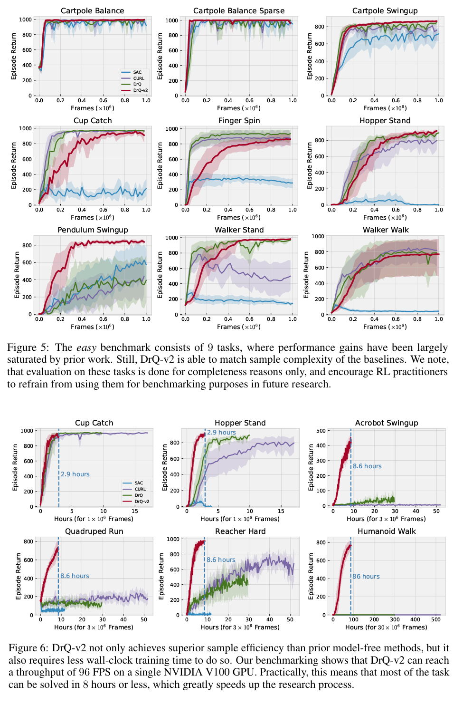

**Mastering Visual Continuous Control: Improved Data-Augmented Reinforcement Learning**

NeurIPS'2021, from Facebook

### 1、算法设计

我们在DrQ算法的基础上提出了改进版本DrQ v2：

DrQ-v2 并不是简单地在 DrQ 上调几个超参数，而是同时修改了 RL backbone、target return、图像增强、探索策略、关键超参数和底层实现。论文最终将这些改动组合成 DrQ-v2，并通过 ablation study 验证了各个改动的作用。论文在引言中明确总结了主要变化：SAC 改为 DDPG、加入 multi-step return、给 random shift 加 bilinear interpolation、引入 exploration schedule，以及重新选择关键超参数。

#### 1.1把底层 RL 算法从 SAC 换成 DDPG

DrQ 原来以 SAC 作为 backbone，而 DrQ-v2 改成使用 DDPG。

这是 DrQ-v2 最核心的算法结构变化之一。

论文给出的动机是：

DrQ 中使用 SAC 时，自动 entropy adjustment 在一些情况下会导致 entropy 过早下降，从而造成探索不足。对于 humanoid 等困难任务，这会导致 agent 很早就陷入某些次优行为，难以继续探索。

作者通过 ablation 发现，DDPG 的探索行为比 SAC 更适合这些困难的视觉控制任务。

因此，DrQ-v2 放弃 SAC，改用 DDPG，并通过显式 exploration noise 控制探索。论文指出，这个改动对于解决 hard exploration tasks 非常重要。

#### 1.2因为换成 DDPG，可以自然地加入 n-step return

DrQ 基于 SAC，因此没有方便地使用较大的 n-step return。

DrQ-v2 使用 DDPG 后，加入 n-step return 来计算 TD target。

论文强调，这样做的目的主要是：

让 reward 更快地向前传播；
改善 long-horizon task 的学习速度；
增强困难探索任务中的 sample efficiency。

论文解释说，SAC 的 soft Q target 还需要考虑每一步的 policy entropy，因此当 n 较大时，在 off-policy 场景下计算 n-step target 会比较麻烦。

而 DDPG 不需要估计每一步 entropy，因此更适合直接使用 n-step return。

作者最终选择 3-step return。

ablation 也显示：

1-step return < 3-step return
5-step return 也有改善
最终采用 3-step 作为性能和计算开销之间的折中。

#### 1.3 在 DrQ 的 random shift augmentation 上增加 bilinear interpolation

DrQ 本身已经使用 random shift image augmentation。

DrQ-v2 保留这一机制，没有把数据增强换掉。

具体来说：

首先仍然对 84×84 图像做 random shift；
然后在 shifted image 上进一步做 bilinear interpolation。

作者发现，这个简单修改在所有任务上都可以带来额外的 performance boost。

所以这一点应该理解成：

DrQ：
random shift

DrQ-v2：
random shift + bilinear interpolation

#### 1.4 把 exploration 从固定噪声改成随训练过程衰减的 schedule

DDPG 本身是 deterministic policy，所以 DrQ-v2 需要显式加入 exploration noise。

最开始作者发现固定强度的 exploration noise 还可以工作，但不同训练阶段实际上需要不同程度的 exploration：

训练早期：
需要较强 exploration，避免过早陷入局部行为。

训练后期：
应该逐渐减少随机性，让 agent 更稳定地利用已经发现的好行为。

因此 DrQ-v2 引入 scheduled exploration noise：

训练初期使用较大的 noise；
随着训练进行，noise 线性下降；
训练后期变得更加 deterministic。

论文的 ablation 结果表明，这种 decay schedule 对困难探索任务尤其有效，对 humanoid 任务帮助明显。

#### 1.5 replay buffer 大幅增大

这是 DrQ-v2 的另一个重要修改。

DrQ 使用的 replay buffer 大小是 100K。

DrQ-v2 改成 1M，相当于扩大 10 倍。

作者的解释是：

困难任务，尤其是 Reacher、Humanoid 这类具有复杂行为分布和多样初始状态的任务，需要保存更多样化的经验。

较大的 replay buffer 可以减轻 catastrophic forgetting。

ablation 发现：

较大的 replay buffer 明显改善性能；
尤其在 Reacher Hard 等任务上效果明显。

最终 DrQ-v2 使用 1M buffer。

#### 1.6 batch size 从 512 降到 256

DrQ 和 CURL 使用 512 的 batch size。

DrQ-v2 改成 256。

作者发现：

较小的 batch size 并没有造成明显性能下降；
但可以显著降低计算开销，提高训练效率。

因此 DrQ-v2 最终采用 256，而不是 DrQ 中的 512。

这里可以注意一个逻辑：

DrQ-v2 并不是盲目追求更大的 batch 来提高稳定性，而是在保证性能的前提下主动降低 batch size，从而降低计算成本。

#### 1.7 learning rate 从 1e-3 降到 1e-4

DrQ 使用的 learning rate 是 1e-3。

DrQ-v2 使用 1e-4。

作者发现更小的 learning rate 可以：

让训练更加稳定；
同时不会损失 learning speed。

所以这也是最终采用的关键 hyper-parameter change。

#### 1.9 不再给 encoder 使用 target network

这是一个比较容易被忽略，但论文明确提到的实现级算法变化。

DrQ-v2 明确指出：

与 DrQ 不同，DrQ-v2 不再为 encoder 单独维护 target network。

计算 target value 时：

Q function 有 target network；
但 encoder 始终使用最新的 encoder weights。

也就是说：

DrQ：
encoder 有 target version

DrQ-v2：
encoder 不再单独维护 target version

这是一个比较细的结构调整，论文没有把它作为 headline contribution，但它确实属于 DrQ-v2 与 DrQ 的算法实现差异。

#### 1.10 critic 使用 clipped double Q-learning

DrQ-v2 的 critic 部分采用两个 Q-functions，并使用 clipped double Q-learning 来减少 overestimation bias。

这部分来自 TD3 风格设计。

论文中明确说：

DrQ-v2 训练两个 Q-functions；
在 target 中使用两个 Q-function 中较小的那个；
目的就是减少 Q-value overestimation bias。

不过这一点需要特别谨慎理解：

它不是论文强调的“DrQ-v2 相比 DrQ 的第一大创新”，因为 DrQ-v2 的核心 ablation 主要集中在 SAC→DDPG、n-step、buffer、exploration schedule 等方面。

所以做笔记时，我会把它归到：

“具体 critic implementation 变化”

而不是：

“DrQ-v2 最核心的四项改进”。

#### 1.11 random shift augmentation 的实现被重写，以提高速度

这属于“算法之外，但对最终 DrQ-v2 很重要”的修改。

DrQ 使用 Kornia 的 RandomCrop。

DrQ-v2 换成自己基于 PyTorch grid_sample 实现的 augmentation。

原因有两个：

第一，作者发现 Kornia 的实现涉及 CPU 到 GPU 的中间数据传输，会破坏 GPU pipeline。

第二，grid_sample 更容易加入 bilinear interpolation。

新的实现使 image augmentation 的 training throughput 提高了大约 2 倍。

#### 1.12 replay buffer 实现被重写

除了“buffer 从 100K 增加到 1M”之外，DrQ-v2 还重新实现了 replay buffer。

DrQ 原来的 replay buffer 存在：

memory management 不够好；
CPU 到 GPU 的数据传输较慢；
限制了能够存储的 image transitions 数量。

DrQ-v2 对 replay buffer 重新实现后：

storage capacity 增加约 10 倍；
data transfer 更快。

作者强调，训练速度的提升对于最终解决 humanoid 任务非常重要，因为它让大量实验和超参数搜索变得可行。

### 2、实验效果

摘录部分结果如下，更多信息见原论文

### 3、代码

见[这里](https://github.com/facebookresearch/drqv2)，另外openreview上也有[代码](https://openreview.net/attachment?id=L5HKN-IsdSE&name=supplementary_material)。

[RoboBase](https://github.com/swirl-uk/robobase)也实现了该算法。