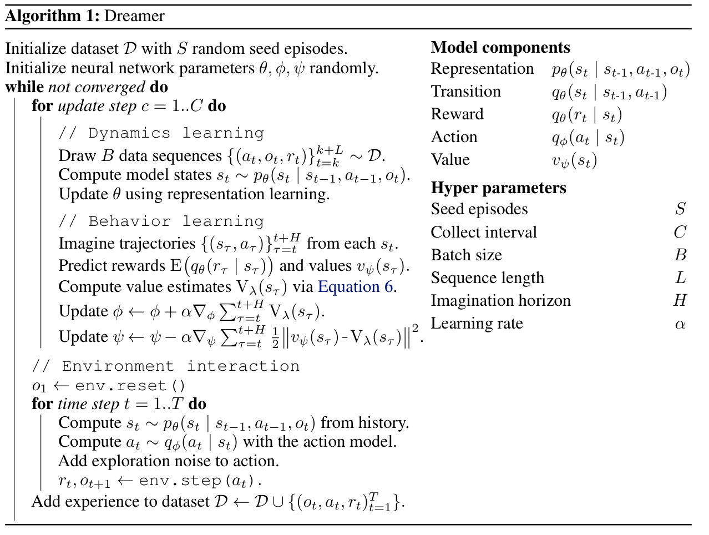
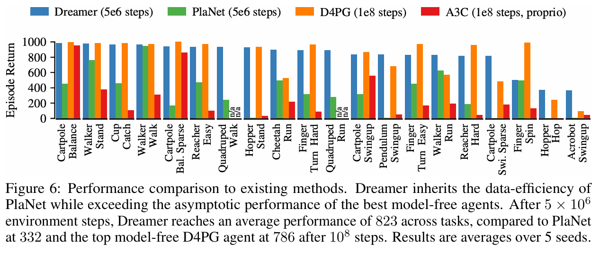

**DREAM TO CONTROL: LEARNING BEHAVIORS BY LATENT IMAGINATION**

ICLR'2020, from Google Brain

# 1、Dreamer用到的世界模型的背景知识


你已经有监督学习、RL 和 NLP 自监督学习背景，所以最合适的理解方式是：

> Dreamer 的世界模型训练，本质上是一个“带动作条件的时序生成模型”，很像 NLP 中的 teacher forcing 语言模型，只不过 token 换成了图像，控制信号换成了机械臂动作。

下面用 pick-place 具体展开。

## 1. 真实数据长什么样？

训练世界模型不需要一个“会做任务的 teacher policy”。第一批轨迹可以来自随机策略；真正提供监督信号的是环境本身返回的下一帧和奖励。

机械臂执行一段任务，得到一串经验：

```
o_0: 摄像头图像，物体在桌面上
a_0: 机械臂向右移动
r_0: 0

o_1: 物体仍在画面中，机械臂更靠近它
a_1: 机械臂向前移动
r_1: 0

o_2: 机械手到达物体旁边
a_2: 闭合夹爪
r_2: 0

o_3: 夹爪抓住物体
a_3: 向目标位置移动
r_3: 0

o_4: 物体被放到目标区域
r_4: 1
```

数据集就是很多这样的序列：

```
图像，动作，奖励，图像，动作，奖励，...
```

这里没有人告诉模型：

```
“这一帧的正确潜状态是 z=某个向量”
```

因此，潜状态没有人工标签。这一点和 NLP 很像：

- NLP 没有人标注“这句话的语义向量应该是多少”；
- Dreamer 也没有人标注“这张图像的机器人状态向量应该是多少”。

模型通过预测和重建间接学出这种表示。

------

## 2. Dreamer 实际上有几类网络？

为了简化，可以把它看成五个模块。

```
历史信息 + 当前图像
        ↓
图像编码器 / 表示模型
        ↓
潜状态 z_t

潜状态 z_t + 动作 a_t
        ↓
动力学模型
        ↓
下一潜状态 z_{t+1}

潜状态 z_t
        ├─→ 图像解码器：重建当前图像
        └─→ 奖励预测器：预测当前奖励
```

还需要一个记忆状态 \(h_t\)，用来保存历史，例如：

```
机械臂刚才从哪里移动过？
物体之前是在向左还是向右？
夹爪是不是已经闭合？
```

所以实际内部状态不是简单的“当前图片编码”，而是：

```
历史动作 + 历史图像 + 当前图像
        ↓
当前潜状态
```

------

## 3. 一次训练样本是怎样处理的？

假设当前时刻是 \(t\)。

### 第一步：根据历史预测当前状态

模型先利用过去的信息：

```
过去的潜状态
+ 上一个动作
        ↓
预测当前潜状态
```

例如，模型可能预测：

```
“机械臂应该在物体左侧，物体还没有被抓住”
```

这是模型在没有直接看当前图像时的判断。

### 第二步：看真实图像，得到校正后的状态

现在把真实图像 \(o_t\) 输入图像编码器：

```
历史预测
+ 当前真实图像
        ↓
校正后的潜状态
```

如果模型刚才判断错了，真实图像会告诉它：

```
机械臂其实已经到了物体上方
```

这个“看过真实图像后的状态”是训练时的辅助状态。

### 第三步：要求潜状态解释真实图像和奖励

从这个校正后的潜状态，模型需要完成两件事：

```
潜状态
  ├─→ 重建真实图像 o_t
  └─→ 预测真实奖励 r_t
```

例如：

```
潜状态应该能够重建：
- 机械臂的位置
- 物体的位置
- 夹爪的开合状态
- 目标区域的位置
```

同时预测：

```
当前是否已经抓取成功
当前是否已经放置成功
```

所以，真实图像和真实奖励就是训练世界模型时的“监督信号”。

------

## 4. 它算不算有监督学习？

可以说：

> 训练过程有监督目标，但不是传统意义上的人工标注监督学习。

更准确地说，它是自监督学习。

因为目标直接来自环境记录的数据：

- 输入：过去的图像和动作；
- 目标：真实的当前图像、下一帧图像以及真实奖励；
- 不需要人工标注“物体坐标”“抓取状态”等标签。

这很像 NLP 的 next-token prediction：

| NLP              | Dreamer                        |
| ---------------- | ------------------------------ |
| 上下文 token     | 历史图像和动作                 |
| 下一个真实 token | 当前或下一张真实图像           |
| 预测下一个 token | 预测潜状态、图像和奖励         |
| token embedding  | 图像编码后的潜状态             |
| teacher forcing  | 训练时使用真实下一帧来校正状态 |

区别是，Dreamer 的输出不只是下一张图像，还包括奖励和可用于控制的潜状态。

------

## 5. 世界模型的三个核心训练要求

### 要求一：潜状态能还原当前画面

如果潜状态只记住了“奖励是多少”，却不知道机械臂和物体在哪里，那么它无法预测动作后果。

所以图像重建迫使它保留控制相关的视觉信息。

在 pick-place 中，它至少要学会保留类似信息：

```
机械臂在哪里
物体在哪里
目标在哪里
夹爪是否打开
物体是否已经被抓住
```

不一定以人类可读的字段形式出现，但信息必须存在于潜状态中。

### 要求二：潜状态能预测奖励

如果模型只能重建图像，却不知道什么是成功，那么它可能只是一个视频压缩器，而不是强化学习世界模型。

奖励预测器告诉它：

```
抓到物体时奖励应该变化
放到目标区域时奖励应该更高
动作失败时不要给高价值
```

### 要求三：不看未来图像时也能预测未来

这是最关键的一点。

训练时模型可以看真实图像：

```
历史 + 当前真实图像
```

但想象时没有未来真实图像：

```
历史 + 假设动作
```

因此必须要求：

```
只根据历史和动作得到的预测状态
```

不要和：

```
看完真实图像得到的校正状态
```

差别太大。

否则模型训练时表现很好，但一旦进入想象阶段，没有真实图像可看，就会立即失效。

这就是 Dreamer 中潜状态一致性约束的作用。论文里用 KL 正则来实现这个约束。

------

## 6. Dreamer和 DQN、PPO、SAC 的区别

RL这些方法主要从真实经验中学习：

```
真实状态 → 真实动作 → 真实奖励 → 更新策略
```

Dreamer 则是：

```
真实经验 → 学世界模型
真实潜状态 → 模型中想象动作和未来 → 更新策略
```

因此 Dreamer 的环境交互效率更高，但依赖世界模型是否准确。

## 7.世界模型训练的损失函数构造

可以把世界模型的训练画成这样：

```
过去状态 h_t
   ├──────────────→ 预测潜状态 z_t
   │                 不看当前图像
   │
   └ + 当前真实图像 o_t
                     ↓
               校正潜状态 z'_t
                     ↓
          ┌──────────┴──────────┐
          ↓                     ↓
      重建图像 o_t          预测奖励 r_t
          │                     │
          └──── 与真实数据比较 ──┘

同时约束：
预测潜状态 z_t ≈ 校正潜状态 z'_t
```

因此更完整地说：

```
世界模型损失
=
图像重建损失
+
奖励预测损失
+
预测潜状态与校正潜状态之间的 KL 损失
```

## 8. 在世界模型里想象

“在模型中想象”就是把世界模型当作一个可交互的模拟器，反复给它动作，让它返回预测的下一状态和奖励。更准确地说，它不是在“视频模拟器”中交互，而是在一个能预测状态转移和奖励的潜空间模拟器中交互。

Dreamer 把学到的世界模型当作一个潜空间模拟器，actor 在这个模拟器里执行大量虚拟动作，利用模型返回的预测状态和奖励训练策略；只有最终的数据采集和校正，才需要回到真实环境。

可以把 Dreamer 的世界模型抽象成：

```
输入：
    当前潜状态
    一个动作

输出：
    下一潜状态
    预测奖励
    是否可能终止
```

## 9.和常见模拟器的关系

通常来说，如果 PyBullet 等常见模拟器已经足够快、足够准确，而且可以大量交互，那么确实不一定需要 Dreamer。

因为一个现成的高质量模拟器，本身就是一个世界模型。

Dreamer世界模型的优势场景：

1. 当缺乏现成的模拟器，且从真实环境构造模拟器的方案昂贵、危险或真实环境不好度量所需metrics，那么用少量真实数据训练一个可复用的内部模拟器。
2. 用现成的模拟器来训练，用Dreamer来实现sim-to-real的gap填补

# 2、Dreamer方法

Dreamer算法步骤的构成有三部分：

1. 使用数据集中的交互数据，训练世界模型
2. 把学到的世界模型当作一个潜空间模拟器，actor 在这个模拟器里执行大量虚拟动作，利用模型返回的预测状态和奖励训练策略
3. actor与环境交互，补充训练用的数据集




```
θ：整套 world model 的参数集合
φ：actor 的参数
ψ：critic 的参数

pθ：看真实图像后推断潜状态
qθ：不用未来图像，预测潜状态和奖励
qφ：动作策略分布
```

如果是用随机策略收集数据训练世界模型，由于随机策略并不能完成复杂的任务，所以收集到的数据仅仅覆盖真实环境很少的观测和动态，那不可能一步到位的训练好世界模型。可以从上面的算法看出：它不是先训练一个完整、准确的世界模型，再开始强化学习，而是一个持续自举的循环。

# 3、实验效果



# 4、代码

[这里](https://github.com/danijar/dreamer)