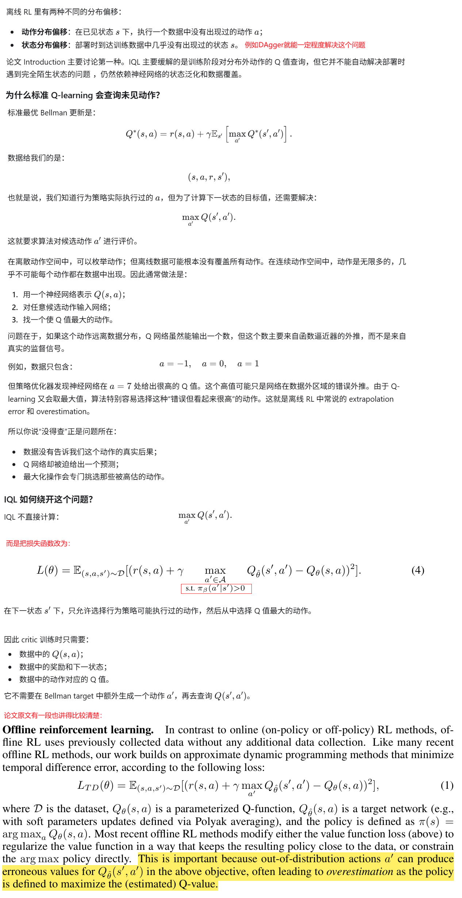
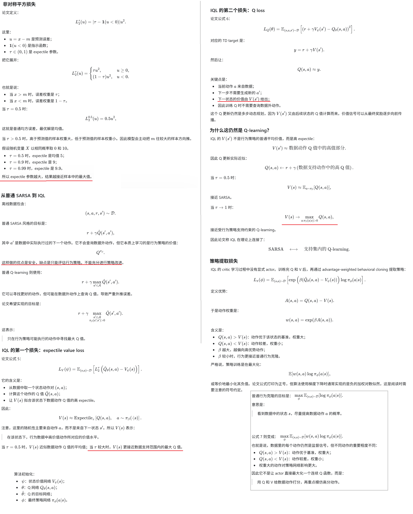
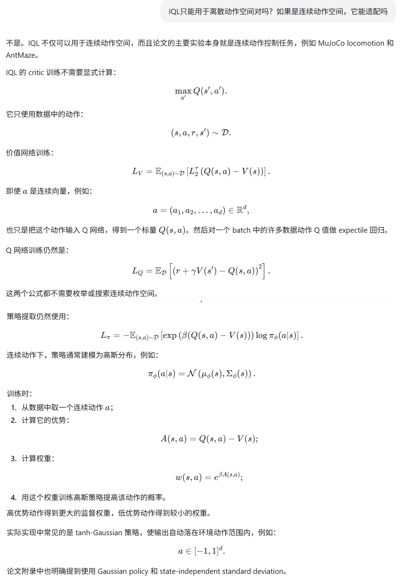
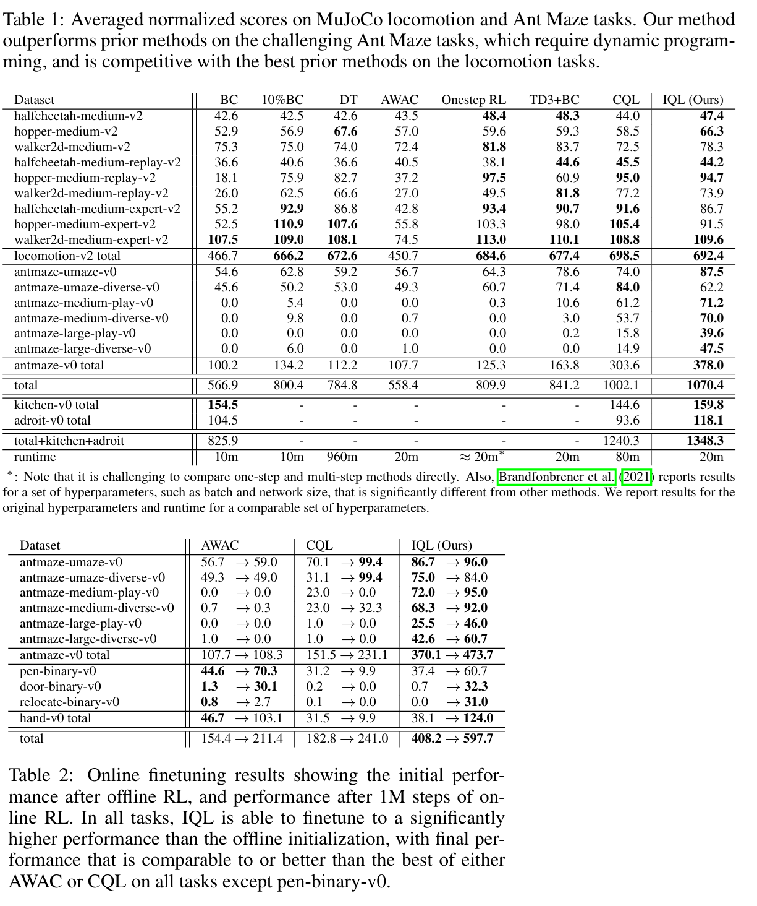

**OFFLINE REINFORCEMENT LEARNING WITH IMPLICIT Q-LEARNING**

ICLR'2021, from 加州伯克利大学

### 1 Introduction

离线强化学习（Offline RL）解决的是如何完全从之前收集的数据中学习出有效策略的问题，而无需在线互动，适用于在现实世界中用未经训练的策略进行在线探索是昂贵或危险的，但已有先前的数据可用的场景。

离线 RL 的目标通常是利用已有数据和奖励函数（与IL的主要差异和界定标准就是是否使用奖励、是否最大化价值），学习一个比数据收集策略更好的策略。如果行为策略本来就是专家级别，那么“超过它”可能没有意义，行为克隆反而足够。但在许多任务中，行为策略只是一个有噪声、有缺陷的采集策略，所以才需要策略改进。

不过，这也带来了很大的挑战：要把策略提升到比收集数据时的行为策略更高的水平，就需要对数据集中未出现的动作估算其价值，而这又需要在策略改进和分布偏移之间进行权衡，因为与数据中动作差异太大的动作，其价值很可能无法准确估算。这个权衡很关键，因为大多数现有的离线强化学习方法在训练过程中需要查询未见过动作的价值来改进策略，因此要么需要限制这些动作保持在分布内，要么需要对它们的价值进行正则化。

我们主要的贡献是隐式Q学习（IQL），这是一种新的离线强化学习算法，它能够在不查询未见过动作的值的情况下，仍然执行多步动态规划更新。我们的方法实现起来很简单，只需要在一个类似SARSA的TD更新中的损失函数稍作修改，而且计算效率非常高。此外，我们的方法在D4RL这一流行的离线强化学习基准上展示了最先进的性能。

**AI解惑**：

### 4 IMPLICIT Q-LEARNING

### 5 EXPERIMENTAL EVALUATION

### 6 代码

官方代码[这里](https://github.com/ikostrikov/implicit_q_learning)。

[RoboBase](https://github.com/swirl-uk/robobase/tree/master)提供了基于DrQ v2的IQL