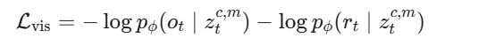

**Masked World Models for Visual Control**

CoRL'2022, from 加州伯克利大学、谷歌

### 1 Introduction


### 4 Masked World Models

#### 4.1 MAE（masked autoencoder）

你基本理解对，但需要修正两点。

1. **MAE 不是某一个固定的 CNN 网络，而是一种“掩码自编码器”方法/训练范式。**

经典 MAE 通常由：

```
图像
  ↓
Patchify：切成像素 patch
  ↓
随机 mask 一部分 patch
  ↓
ViT Encoder：只处理未被 mask 的 patch
  ↓
ViT Decoder：结合 mask token，重建完整图像
```

因此：

- MAE 的核心是“随机遮挡输入的一部分，再重建原始输入”；
- Encoder 和 Decoder 通常都是 Transformer/ViT；
- CNN 并不是 MAE 的必要组成部分；
- 原始 MAE 通常使用 patchify stem，而不是 CNN stem。

1. **MWM 使用的是 MAE 思想的一个变体。**

MWM 的结构是：

```
图像
  ↓
CNN convolution stem
  ↓
得到卷积特征 map
  ↓
mask 掉部分卷积特征 token
  ↓
ViT Encoder
  ↓
ViT Decoder
  ├─ 重建原始图像
  └─ 预测奖励
```

所以对于 MWM，可以说：

> MWM 使用 CNN + ViT 构成的掩码自编码器，其中 CNN 负责提取早期局部视觉特征，ViT Encoder/Decoder 负责建模全局关系并完成重建。

但严格来说，不能说“MAE 就是 CNN + ViT”。更准确的关系是：

```
MAE：一种 masked autoencoding 方法
MWM：采用卷积特征 masking 的 MAE 风格视觉自编码器 + 潜在动力学模型
```

训练目标也不只是“输入图像和输出图像的距离”:



其中：

- 第一项是图像重建损失，实际实现中主要是整张图像的 MSE；
- 第二项是辅助奖励预测损失；
- 奖励预测用于让视觉表示编码任务相关信息。

另外，MWM 中有两个不同用途的编码结果：

- 训练自编码器时：使用 masked 表示 \(z_t^{c,m}\)，同时重建图像和预测奖励；
- 训练动力学模型及执行策略时：使用无 mask 表示 \(z_t^{c,0}\)，作为 RSSM 的输入。

所以你的理解可以改写成：

> MWM 中的视觉自编码器采用 CNN stem + ViT Encoder + ViT Decoder。训练时随机 mask CNN 输出的部分特征，通过图像重建和奖励预测进行自监督/辅助监督学习，从而得到视觉表示；随后冻结该编码器，用无掩码视觉表示训练潜在动力学模型。

#### 4.2 visual representation learning

更精确地说，Visual Representation Learning 模块的前向过程是：

```
观测图像 o_t
   ↓
CNN convolution stem
   ↓
卷积特征 h_t^c
   ↓
随机 mask 一部分卷积特征
   ↓
ViT Encoder
   ↓
潜在视觉表示 z_t^{c,m}
   ↓
ViT Decoder
   ├─ 重建图像 o_hat_t
   └─ 预测奖励 r_hat_t
```

因此它确实可以产生三类结果：

1. **隐藏视觉表示**

   \[ z_t^{c,m} \]

   这是 ViT Encoder 的中间表示，用于图像重建和奖励预测。

   在动力学学习和控制时，使用的是无掩码版本：

   \[ z_t^{c,0} \]

   它作为 RSSM 的输入。

2. **重建图像**

   \[ \hat{o}_t \]

   目标是尽可能接近原始观测 \(o_t\)，通常通过像素重建损失/MSE 训练。

3. **预测奖励**

   \[ \hat r_t \]

   目标是接近 replay buffer 中记录的真实奖励 \(r_t\)。这一项是辅助任务，用于让 \(z_t\) 包含更多任务相关信息。

需要注意一个小细节：奖励 \(r_t\) 不是视觉自编码器的输入图像通道，而是训练样本中同时提供的监督信号：

\[ (o_t,r_t) \]

所以可以概括为：

> 输入观测图像 \(o_t\)，经过 CNN + masked ViT Encoder 得到视觉表示 \(z_t\)，再由 ViT Decoder 同时重建图像和预测奖励；训练时通过图像重建损失与奖励预测损失学习视觉表示。

在 MWM 中，图像重建和奖励预测主要用于训练视觉表示；后续控制真正使用的是 \(z_t^{c,0}\)，而不是重建图像 \(\hat o_t\)。

#### 4.3 潜在动力学模型

不想往下了，太复杂，我用不起来，出了点问题也不知道怎么调试