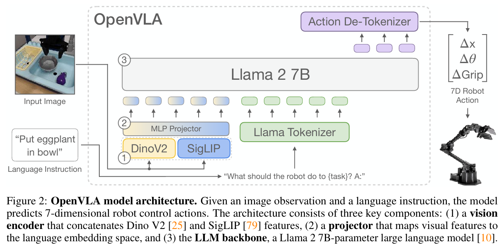
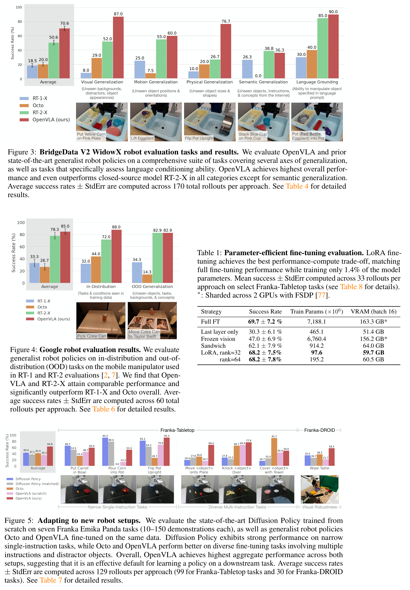

**OpenVLA: An Open-Source Vision-Language-Action Model**

CoRL'2025, from Stanford University, UC Berkeley,Toyota Research Institute, Google Deepmind

### 1 Introduction

机器人操作学习策略的一个明显弱点是它们无法超出训练数据进行泛化。像 RT-2这样的 VLA 展示了令人印象深刻的稳健性结果，同时还能推广到新的物体和任务，为通用机器人策略设定了新的标准。然而，VLAs 在机器人领域的广泛应用一直很有挑战性，因为:

1. 现有的 VLAs 大多是封闭的，公众无法访问
2. 之前的工作没有探索如何高效地对 VLAs 进行新任务的微调，而这正是其普及的关键部分。

我们提出了OpenVLA，一个拥有7B参数的开源视觉-语言-动作模型（VLA），在Open X-Embodiment数据集的970k个机器人实验回合中训练。它开箱即用的支持控制多个机器人，并且可以通过参数高效微调快速适应新的机器人场景。OpenVLA 的checkpoits和 PyTorch 训练流程完全开源，模型可以从 HuggingFace 下载并进行微调。 OpenVLA 可以通过LoRA方法在消费级 GPU 上进行微调，并且通过量化可以高效地提供服务，而不会影响下游成功率。

```
注：
视觉条件语言模型（VLMs）是通过互联网规模的数据训练的，用来根据输入的图像和语言提示生成自然语言的模型。大多数VLMs的架构由三个主要部分组成：(1) 一个视觉编码器，将图像输入映射为若干“图像块嵌入”，(2) 一个投影器，将视觉编码器的输出嵌入映射到语言模型的输入空间，(3) 一个大型语言模型（LLM）骨干。在VLM训练期间，模型采用端到端训练，目标是在从各种互联网来源采集的成对或交错的视觉和语言数据上进行下一个文本标记预测。

VLA是将VLM直接整合到机器人控制领域的端到端的视觉-动作操作策略中，用微调过的大型预训练视觉语言模型，用来预测机器人动作。
```


用于机器人控制的VLA模型有三个主要好处：

1. 它在大规模互联网视觉-语言数据集上对预训练的视觉和语言组件进行对齐
2. 使用通用架构，而不是专门为机器人控制定制的架构，使我们能够利用现代 VLM 训练背后的可扩展基础设施，并以最少的代码修改扩展到训练十亿参数策略
3. 它为机器人技术直接受益于 VLM 的快速进步提供了途径。

### 3 Method



#### 3.1 概述

为了训练 OpenVLA，我们对一个预训练的 Prismatic-7B VLM 主干网络进行了微调，用于机器人动作预测。我们将动作预测问题表述为一个“视觉-语言”任务，其中输入的观察图像和自然语言任务指令被映射为一个预测的机器人动作序列。为了让 VLM 的语言模型主干能够预测机器人动作，我们通过将连续的机器人动作映射到语言模型分词器使用的离散标记，在 LLM 的输出空间中表示这些动作。我们将机器人动作的每个维度分别离散化为 256 个区间。对于每个动作维度，我们设置区间宽度以均匀划分训练数据中动作的第 1 到第 99 百分位间的区间。使用这种离散化方法，我们可以得到 N 维机器人动作的 N 个离散整数，范围在 [0...255] 之间。

不幸的是，OpenVLA 的语言骨干使用的分词器，也就是 Llama 分词器 ，只为微调时新引入的词元保留了 100 个“特殊词元”，对于我们 256 个动作离散化的词元来说太少了。于是，我们再次选择简单的方法，直接用我们的动作词元覆盖 Llama 分词器词汇表中使用频率最低的 256 个词元（也就是最后 256 个词元）。一旦动作被处理成一串词元，OpenVLA 就会用标准的下一个词元预测目标进行训练，只在预测的动作词元上评估交叉熵损失。

#### 3.2 设计决策

在开始最终模型训练之前，我们在小规模实验中探索了各种设计决策：

1. 我们尝试了多个VLM骨干网络。
2. 我们比较了 224 × 224px 和 384 × 384px 两种分辨率输入的性能
3. 我们发现，在 VLA 训练过程中对视觉编码器进行微调而不是冻结视觉编码器的参数，对于获得良好的 VLA 性能非常关键。
4. 我们发现对于 VLA 训练来说，反复多次使用训练数据集很重要，同时真实机器人表现会不断提升，直到训练动作标记的准确率超过 95%。我们最终的训练运行对训练数据集总共进行了 27 个周期。
5. 我们使用固定学习率2e-5，我们发现学习率预热没有带来好处。

#### 3.3 硬件基础设施要求

最终的 OpenVLA 模型在一个包含 64 块 A100 GPU 的集群上训练了 14 天，总共约 21,500 A100 小时，使用的批量大小为 2048。在推理时，OpenVLA 在以 bfloat16 精度加载（即未量化）时需要 15GB 的 GPU 内存，并且在一块 NVIDIA RTX 4090 GPU 上运行速度约为 6Hz。我们可以通过量化进一步减少 OpenVLA 在推理时的内存占用，而不会影响在实际机器人任务中的性能。

为了方便，我们实现了一个远程 VLA 推理服务器，可以让机器人实时远程接收动作预测流——这样就不需要使用强大的本地计算设备来控制机器人了。

### 5 Experiments



### 6 局限

OpenVLA的局限：

1. 它目前只支持单张图片的观察。
2. 提高 OpenVLA 的推理吞吐量对于实现高频控制环境下的 VLA 控制至关重要，例如高精度的控制场景需要达到50Hz

### 7 代码

官网在[这里](https://openvla.github.io/)