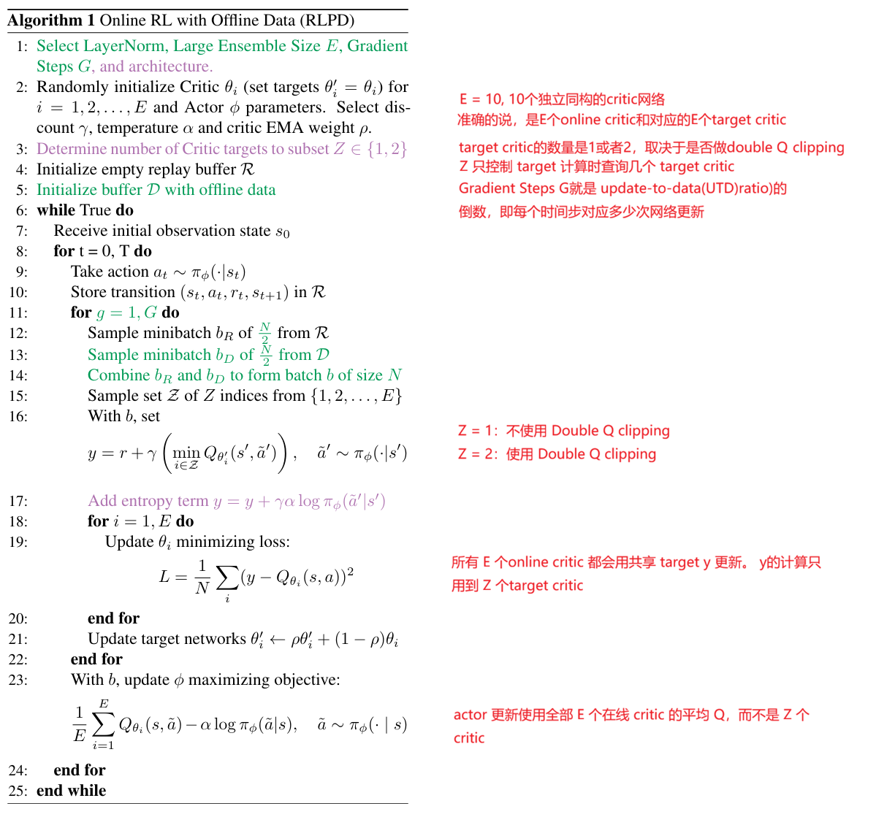
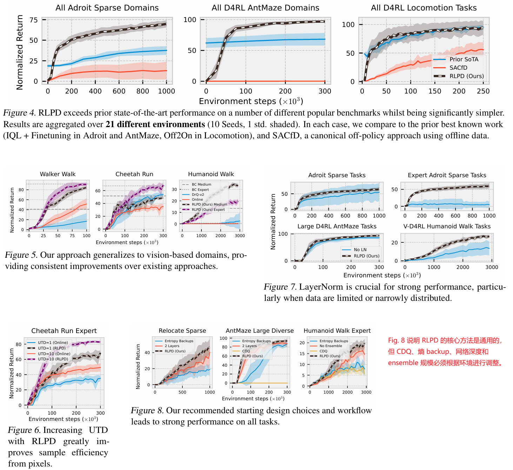

**Efficient Online Reinforcement Learning with Offline Data**

ICML'2023, from UC Berkeley and University of Oxford

### 1 Introduction

离线专家数据对于OnLine RL是非常有意的补充，尤其对于与真实环境交互存在高成本高风险的场景。离线专家数据的使用，通常采取两种方式：

1. 通过offline RL或者IL预训练使用这些数据，再结合OnLine RL finetune，缺点是pipeline步骤更多、需要调试的超参数更多
2. 不做预训练，直接在online RL时按一定比例采样专家数据进行update。这类方法通常引入行为克隆/KL散度等约束来处理分布变化（ distribution shift）的问题，通过约束它表现出类似离线数据的行为，例如CQL方法，缺点是对于offline专家数据的质量要求更高

我们提出的方法RLPD(Reinforcement Learning with Prior Data)

1. 基于在线离策略的RL方法（ off-policy model-free RL），例如SAC/TD3/DDPG或者DQN
2. 不进行预训练也不进行约束（作者其实在吹牛逼啦，明显有下面的约束），在线 replay buffer 与离线数据各采样 50% 的 symmetric sampling；
3. 对离线数据质量和数量透明（agnostic）、没有要求（算法跑起来技术上没有要求，但有的任务没有离线数据根本就不收敛，你说没有要求？）
4. 算法做了一些非侵入性的改造：
   1. Layer Normalization 减少对外推动作的高估；
   2. 提高 UTD/gradient steps，使离线数据更快通过 Bellman backup 被利用,但由此会导致过拟合，RLPD通过随机化选择critic组装  + 随机选择 target critic 计算 Bellman target 来进行正则化避免过拟合。

### 4 Method

RLPD 额外拥有一个固定的离线数据集 D：

```
离线数据 D + 在线 replay buffer R -> off-policy RL
```

作者希望满足以下条件：

1. 不进行离线 RL 预训练。
2. 不加入行为克隆或其他显式模仿约束。
3. 不要求离线数据一定是专家数据。
4. 允许策略继续在线探索离线数据之外的状态和动作。
5. 尽可能简单地扩展已有的 SAC 等算法。

RLPD 的主要问题

离线数据通常只覆盖状态-动作空间的一小部分。使用函数逼近器时，critic 可能需要评估数据分布之外的动作：

```
Q(s, a)
```

如果动作 a 不在数据分布中，Q 网络可能产生非常大的错误值。随后 actor 会倾向于选择这些错误高值动作，critic 又会继续根据这些错误目标更新，最终导致：

```
Q 值过度估计 -> actor 选择错误动作 -> critic 继续发散
```

在纯离线 RL 中，通常通过限制策略不要偏离数据分布来缓解这个问题。但 RLPD 处于在线学习环境，可以真正访问环境，因此作者不希望用强约束阻止探索，而是希望：

```
允许策略探索，但限制 critic 的灾难性外推
```

#### 4.1 对称采样：同时使用在线数据和离线数据

RLPD 的第一个设计是 symmetric sampling。

每次训练 batch 都由两部分组成：

```
N/2 个样本来自在线 replay buffer R
N/2 个样本来自离线数据集 D
```

最终：

```
batch = batch_online + batch_offline
```

这与简单地把离线数据预先放入 replay buffer 不同。

对称采样则始终保持固定比例：

```
50% 在线数据 + 50% 离线数据
```

作者实验发现，具体比例并不特别敏感，但 50% 是一个较好的折中：

- 离线比例太低：利用先验数据不充分。
- 离线比例太高：在线数据和探索作用减弱。
- 100% 离线：算法失去真正的在线学习能力。

#### 4.2 LayerNorm：抑制 critic 的灾难性外推

LayerNorm 是 RLPD 的第二个关键设计，即使输入动作 a 位于离线数据分布之外，Q 网络的输出也不会无约束地变得极大。

LayerNorm 的作用可以概括为：

```
限制 Q 值的数值爆炸，而不是限制策略的行为范围
```

因此它和行为克隆、KL 约束等方法不同：

- 不要求策略接近离线数据；
- 不禁止策略访问未知动作；
- 不直接惩罚 OOD action；
- 只降低这些动作产生灾难性高 Q 值的可能性。

这正是 RLPD 与许多纯离线 RL 方法的区别：

```
纯离线 RL：限制策略不要离开数据分布
RLPD：允许离开数据分布，但限制 critic 的外推幅度
```

LayerNorm 在以下场景尤其重要：

- 奖励稀疏；
- 离线数据量较少；
- 离线数据覆盖范围很窄；
- 状态或动作维度较高；
- critic 更新次数较多；
- 在线 replay buffer 初期很小。

具体的：

1. **LayerNorm 加在 critic 网络上，E个online critic和E个target critic都有加入，actor不加入**
2. **LayerNorm 加在 critic 的中间表示上，而不是 Q 值输出上**

#### 4.3 Sample-efficient RL：让离线数据更快发挥作用

离线数据不会自动变成有用知识。RLPD 需要通过 Bellman backup 反复使用这些离线 transition。

因此，作者提高每个环境步对应的梯度更新次数，也就是 UTD ratio：

```
每采集 1 个在线环境样本，执行 G 次梯度更新
```

论文中的默认状态任务设置是：

```
G = 20
```

提高 UTD 可以让离线数据更快参与训练，但也会带来统计过拟合：

```
更新次数过多 -> critic 过度拟合已有样本 -> 泛化变差
```

因此 RLPD 使用 critic ensemble 进行正则化。

默认设置：

```
critic数量 E = 10
```

每个 critic 都有自己的参数。训练时：

1. 所有 critic 都用同一个 Bellman target 更新；
2. target 计算时随机选取一个或两个 target critic；
3. actor 更新时使用所有 critic 的平均 Q 值。

重要的是：

```
ensemble size E
```

和：

```
target subset size Z
```

不是同一个概念。

论文中的设置是：

```
E = 10
Z ∈ {1, 2}
```

如果 Z=1：

```
y = r + γ Q_i'(s', a')
```

其中 i 是随机选出的一个 critic。

如果 Z=2：

```
y = r + γ min(Q_i'(s', a'), Q_j'(s', a'))
```

这对应 Clipped Double Q-Learning，也就是 CDQ。

因此，RLPD 的 ensemble 并不意味着一定要对全**部 10 个 critic** 取最小值。它可以：

- 使用 10 个 critic 进行集成；
- 只随机抽取 1 个或 2 个 critic 计算 target；
- 在 actor 更新时平均所有 critic。

对于像素输入，作者还加入了随机平移数据增强，以缓解视觉输入上的 TD 过拟合。

#### 4.4 环境相关设计选择

RLPD 有一部分设计是通用的，另一部分必须根据环境进行调整。

##### 4.4.1 CDQ 是否使用

CDQ 使用两个 critic 的最小值：

```
min(Q1, Q2)
```

好处是可以抑制 Q 值过估计。

问题是它可能过于保守，因为 min 操作倾向于选择偏低的估计值。对于稀疏奖励任务，这可能压制本来就很弱的正向价值信号。

因此：

- 某些环境中 CDQ 有帮助；
- 某些环境中使用单个随机 critic target 更好；
- 不能默认所有环境都使用 CDQ。

在 RLPD 中，这对应：

```
Z = 2：使用 CDQ
Z = 1：不使用 CDQ
```

##### 4.4.2 是否使用 entropy backup

SAC 通常在 target 中加入熵相关项，以鼓励探索。

RLPD 保留了这个选项，但作者发现它不是普遍有效的：

- 在某些 locomotion 任务中，熵 backup 有帮助；
- 在 AntMaze、Adroit 等任务中，去掉 entropy backup 往往更好；
- 熵项是否有效取决于奖励结构、探索难度和数据分布。

因此，entropy backup 是环境相关选择，而不是 RLPD 的绝对组成部分。

##### 4.4.3 2 层还是 3 层 MLP

网络深度同样与环境有关。

论文比较了：

```
2-layer MLP
3-layer MLP
```

结果显示：

- 简单 locomotion 任务常使用 2 层；
- AntMaze 和 Adroit 等更复杂任务常使用 3 层；
- 像素任务中使用 2 层；
- 更深网络有时能提高稳定性，但并非总是更好。

#### 4.5 RLPD 的完整训练流程



#### 一句话总结 RLPD

RLPD 的本质不是“把离线数据加入 SAC”这么简单，而是：

```
用对称采样持续利用离线数据，
用 LayerNorm 限制 critic 的 OOD 外推，
用大 ensemble 和高 UTD 提高样本效率，
再根据具体环境调整 CDQ、熵备份和网络深度。
```

其中最关键的思想是：

```
RLPD 不限制策略探索离线数据分布之外，
而是限制 critic 对未知区域产生灾难性高估。
```

### 5 Experiments



### 6 代码

官方代码在[这里](https://github.com/ikostrikov/rlpd)

