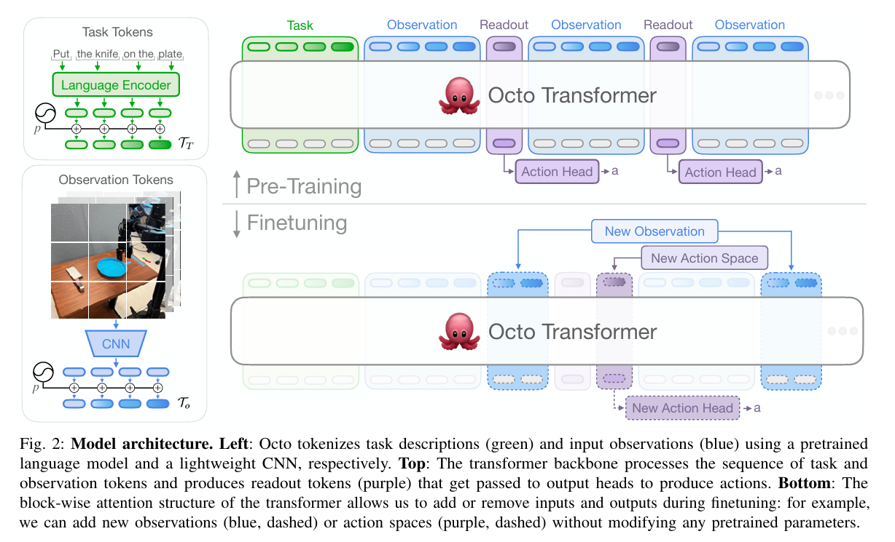
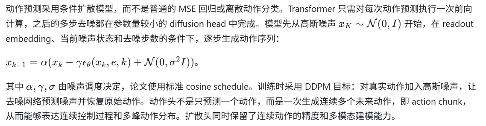
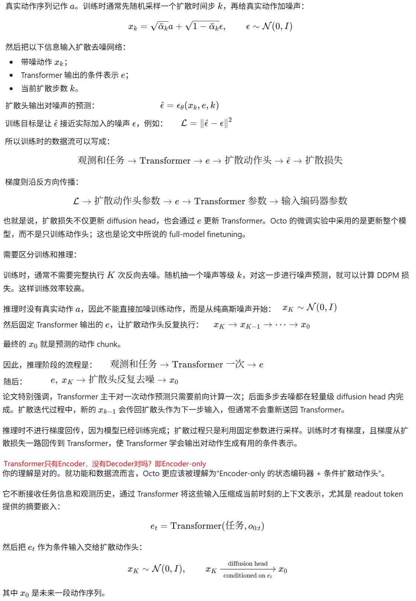
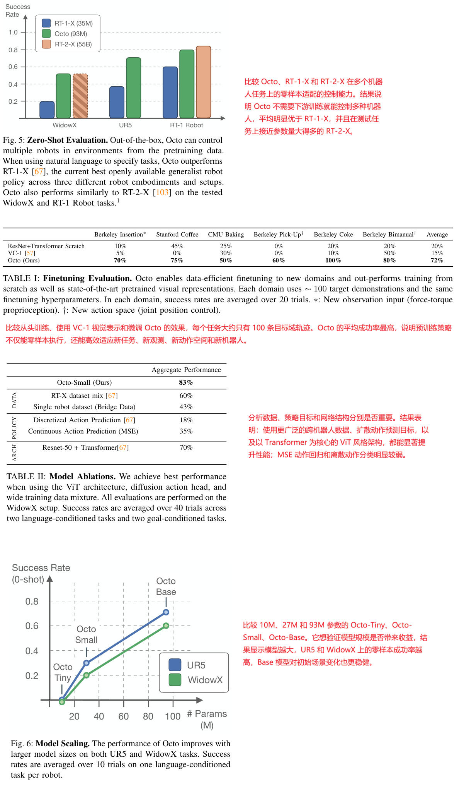

**Octo: An Open-Source Generalist Robot Policy**

Robotics: Science and Systems 2024, from UC Berkeley Stanford Carnegie Mellon University Google Deepmind

### 1 Introduction

一句话描述：

```
Octo，一个开源的、通用的机器人操作策略。Octo 是一个基于 Transformer 的策略，在来自 Open X-Embodiment 数据集的 80 万个多样化机器人episode进行了模仿学习预训练。它支持灵活的任务和观察定义，并且可以快速微调以适应新的观察和动作空间。
```

机器人学习的常见方法是针对特定的机器人和任务在收集的数据集上训练策略。这样从零开始学习每个任务都需要大量的数据收集，而且最终得到的策略通常只能在有限范围内进行泛化。

要打造可以控制多种机器人执行多种任务的“通用机器人模型”已经被证明很有挑战性。在机器人领域训练一个统一的控制策略有独特的挑战，需要处理不同的机器人形态、传感器配置、动作空间、任务规范、环境和计算预算。

在这个方向上，一些工作提出了机器人基础模型，它们可以直接将机器人观察映射到动作，并为新的领域和机器人提供零样本或少样本的泛化能力。虽然这些模型在向真正的“通用机器人模型”迈进方面取得了重要进展，但在多个关键方面仍然存在限制：它们通常限制下游用户只能使用预先定义且往往受限的输入观测，例如单个摄像头流；它们缺乏对新领域进行有效微调的支持；更重要的是，最大规模的这些模型并未向公众开放。

我们设计了一个系统，用于预训练更适合下游机器人应用中多样化接口的通用机器人策略。我们模型的核心是一个 transformer 架构，它将任意输入 token（由观测和任务生成）映射到输出 token（然后解码为动作），并可以在多样的机器人和任务数据集上进行训练。在没有额外训练的情况下，这个策略可以接受不同的摄像头配置（比如工作区摄像头或手腕摄像头），可以控制不同的机器人，并且可以通过语言命令或目标图像来引导——只需简单地更改输入到模型中的标记。最重要的是，通过添加合适的适配器，并使用一个小的目标领域数据集和可用的计算资源进行微调，这个模型可以适应新的机器人设置，包括新的传感器输入、动作空间或形态变化。我们的设计适合高效地针对新的机器人场景进行微调，包括具有不同动作空间和不同相机与本体感知信息组合的机器人。

### 3 Method

#### 3.1 概述



Octo 的核心目标是训练一个能跨机器人、跨任务、跨传感器配置迁移的通用操作策略。模型将任务描述、图像观测和历史观测都转换为统一的 token 序列，再由 Transformer 统一建模，最后通过动作头生成连续动作。它支持语言指令、目标图像、多个相机输入、观测历史以及不同机器人动作空间，并且在下游微调时可以加入新的观察或动作输出，而不必重新训练整个主干网络。

输入端包含三类信息：语言指令、目标图像和机器人观测序列。语言经过 T5-base 编码为语言 token；图像观测和目标图像经过浅层卷积网络处理，再切分为图像 patch token；不同时间步的观测还会加入可学习的位置嵌入。最终序列大致由任务 token 和按时间排列的观测 token 组成。这样的设计没有把输入固定成某一种相机、某一种传感器或某一种任务格式，因此可以适应腕部相机、第三人称相机、目标图像以及其他新增观测。

Transformer 使用 block-wise causal attention。某一时间步的观测 token 只能关注任务 token，以及当前和更早时间步的观测 token，不能看到未来信息；对于数据中不存在的模态，相应 token 会被完全 mask 掉。模型还在序列中加入可学习的 readout token。readout token 可以读取此前的任务和观测信息，但不会反向影响这些输入 token，因此相当于提取当前观测历史的紧凑状态表示，类似 BERT 中的 CLS token。动作头读取这些状态表示并输出动作。

Octo 的关键结构是模块化的微调接口。新增任务输入、相机或其他观测时，只需加入新的位置嵌入和轻量级编码器；新增动作空间时，只需添加新的动作 head。预训练 Transformer 的主体参数可以保留。这种“输入 token 化、主干共享、输出 head 解耦”的结构，使模型能够从预训练的末端执行器控制迁移到关节位置控制，也能够加入新的力/力矩等观测，而不需要重新初始化大规模网络。

预训练数据来自 Open X-Embodiment。作者从约 150 万条机器人轨迹中筛选出 25 个数据集，最终使用约 80 万条轨迹训练 Octo（imitation learning）。筛选标准包括：必须有图像观测，使用末端执行器 delta 控制，排除过于重复、图像分辨率过低或任务过于局限的数据。数据集还被粗略分为更具多样性和较低多样性的集合，更具多样性的数据会被提高采样权重，重复性较高的数据则被降权。不同数据集缺失的相机通道用零填充，并统一夹爪动作约定，使 `+1` 表示夹爪打开、`0` 表示夹爪闭合。



微调阶段继续使用同一个扩散目标，并更新完整模型；作者发现更新整个模型优于冻结部分预训练参数。典型设置是使用约 100 条目标域轨迹，训练 50k steps，采用线性 warmup 加 cosine learning-rate decay。训练时使用两帧观测历史，超过这一长度后收益明显递减；使用 hindsight goal relabeling，从轨迹未来状态中随机选取一个状态作为目标图像。训练还包含常规图像增强，并随机置零语言指令或目标图像，使模型能够分别依赖语言或视觉目标进行控制；对于没有语言标注的数据，则始终采用目标图像条件，从而降低对语言标注的依赖。

模型规模上，Octo 有 Tiny、Small 和 Base 等版本，其中论文重点提供约 27M 参数的 Octo-Small 和约 93M 参数的 Octo-Base。训练使用 AdamW、权重衰减 0.1、梯度裁剪 1.0 和 inverse-square-root 学习率衰减；Base 模型使用 batch size 2048，在 TPU v4-128 上训练 300k steps。整体方法的设计逻辑可以概括为：用大规模跨机器人数据学习通用视觉和控制表示，用 Transformer 的 token 与 mask 机制保持输入输出的可组合性，再用条件扩散动作头表达连续、长时序和多模态的机器人动作。

下游微调的时候，可以用：

1. IL 微调：Octo 原生支持，也是论文实际验证的方法；
2. offline RL 微调：理论上可行，但需要奖励数据、critic 和新的训练目标；
3. online RL 微调：理论上可行，但需要环境交互、奖励设计和完整的 RL 工程改造。

#### 3.2 扩散模型和Transformer的配合

可以把 Octo 看成：

“Transformer 负责理解当前任务和观测，扩散模型负责把这种理解转换成具体动作。”

##### 1、扩散模型和 Transformer 的位置关系

在 Octo 中，二者不是并列的两个完整模型，也不是 Transformer 中间插入了一个扩散层，而是前后串联：

任务指令 / 目标图像 / 相机观测 / 历史观测
→ 各自编码成 token
→ Transformer
→ readout token 表示 \(e\)
→ 条件扩散动作头
→ 一段连续机器人动作

Transformer 的输出 \(e\) 可以理解为“当前应该做什么、环境处于什么状态”的上下文表示。扩散动作头接收这个表示，然后生成动作序列。

因此两者分工不同：

- Transformer：提取视觉、语言、时间历史中的高层和中层信息，形成条件表示。
- 扩散模型：在这个条件表示下，建模动作分布并生成具体动作。
- 扩散模型不是用来生成图像，而是用来生成连续的机器人动作 chunk，例如未来若干步的位姿增量和夹爪动作。

Octo 选择扩散动作头，是因为同一个任务在某些状态下可能存在多个合理动作。MSE 回归容易把多个动作平均成一个不一定可执行的动作，而扩散模型可以表示多峰、连续的动作分布。

##### 2、前向传播时数据如何流转，梯度如何回传



##### 3、一句话概括：

Transformer 产生“动作生成的条件表示”，扩散模型根据这个表示从随机噪声中逐步采样出动作；训练时扩散损失的梯度会穿过动作头回传到 Transformer，推理时 Transformer 只运行一次，扩散头在其固定输出条件下重复去噪。

### 4 Experiments



### 5 代码

见[官方网站](https://octo-models.github.io/)