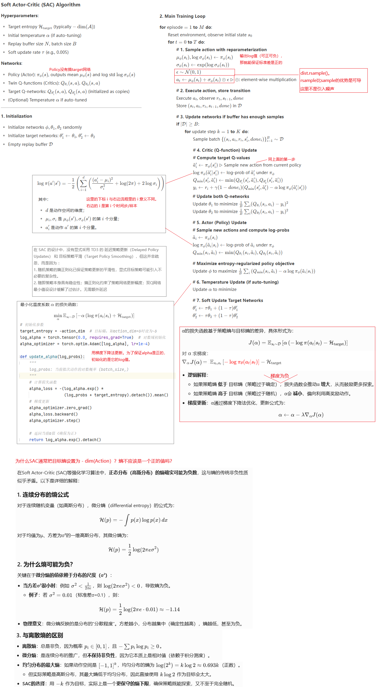

**Soft Actor-Critic:Off-Policy Maximum Entropy Deep Reinforcement Learning with a Stochastic Actor**

model-free的深度强化学习算法已经在很多有挑战的决策与控制任务中展现，但这些方法遇到了两个很典型的挑战：

1. 非常高的抽样（样本）复杂性。智能体需要与环境进行极大量交互（通常数百万至数十亿次）才能学到有效策略
2. 脆弱的收敛，对细致的调参有很高的要求

这两个挑战严重的影响了DRL方法在复杂真实场景的落地。

这篇论文，我们提出了soft actor-critic方法：一种off-policy的基于actor-critic方法的熵最大化的深度强化学习方法。actor除了最大化reward期望值，还要最大化熵：让动作尽量随机。SAC通过离线策略数据重用和随机策略的熵正则化，解决了连续控制任务中样本效率与稳定性的平衡问题我们的方法在很多连续的benchmark任务里取得了先进的表现。而且，相比之前其他off-policy方法，我们的算法非常稳定，使用很多不同的随机种子做实验都获得了相同的先进表现。

bison:   在深度强化学习（Deep Reinforcement Learning, DRL）中，**Model-free** 意味着智能体（agent）对马尔可夫决策过程（MDP）的**转移概率矩阵 P(s′∣s,a)** 和**奖励函数 R(s,a,s′)** 完全未知，只能通过与环境的交互来学习策略或价值函数。与之对应的是 **Mode-Based**

### introduction

如前面所说的DRL普遍应用和两个挑战。

on-policy learning是导致非常高的抽样复杂性的一个原因，每次policy梯度下降，都要求收集新的样本，智能体重新与环境交互。off-policy learning可以反复利用抽样的样本，但off-policy方法对于传统的策略梯度类算法并不直接可行，对于Q Learning类算法是直接可用的。

off-policy learning与高维度的非线性函数拟合器（例如深度神经网络就是一种）结合，会面临不稳定和难以收敛的挑战，尤其是在连续的state空间和连续的动作空间。这种场景下，常用的DDPG算法提供样本高效率的同时，对超参数非常敏感和脆弱。

最大熵RL方法修改了RL的目标函数，引入最大熵使得探索和鲁棒性有非常显著的提升。行业内之前的工作显示：最大熵的做法在off-policy和on-policy方法里都适用。

bison：原文绕来绕去的车轱辘话，一言以蔽之：off-policy解决样本效率问题，最大熵解决off-policy随之而来的稳定性问题。

SAC方法可以轻松的扩展到一些高维的非常复杂的任务场景中，例如Humanoid benchmark，它的动作空间有21维，DDPG算法在这种测试下难有好的结果。

SAC方法有三个关键点：

1. 连续动作空间的actor-critic架构。actor网络输出的是动作的概率分布（高斯分布的均值与标准差）而不是确定性的动作
2. off-policy方法，提高样本效率
3. 最大化熵，提升稳定度、加强探索

### From Soft Policy Iteration to Soft Actor-Critic

这一节看不懂，似乎又是论文的核心，所以让AI帮忙解读：

#### 算法

论文中算法描述太简单，我请AI帮我给出了详细的SAC算法版本：

### Experiments

#### 对比评估

SAC与其他几个SOTA算法的实验对比：

1. deep deterministic policy gradient (DDPG) 
2. proximal policy optimization (PPO) 
3. soft Q-learning(SQL) 
4. twin delayed deep deterministic policy gradient algorithm (TD3)

#### 措施消减评估

下图表明：随机性的策略输出可以提升训练的稳定性。确定性的SAC版本（红色）显示不同初始化随机种子下的平均回报差异巨大。

下面的图表表明：

1. 推理的时候，关闭了熵正则，直接使用概率密度最高的均值作为动作，相比训练时候引入随机熵，推理获得更高的回报
2. SAC对reward值缩放敏感，需要为每个任务单独调试缩放倍数。
3. SAC对目标网络软更新系数，太大了会不稳定，太小了训练效率慢

### Conclusion

我们提出了soft actor-critic算法，这是一种基于最大熵框架的off-policy深度强化学习方法，能够在保持熵最大化的优势的同时，实现高效的样本利用率和训练稳定性。我们的理论分析证明了软策略迭代（Soft Policy Iteration）的收敛性，并基于此理论推导出实用的SAC算法。实验结果表明，SAC在性能上显著优于当前最先进的离线策略（如DDPG）和在线策略（如PPO）深度强化学习方法，并且在样本效率方面远超DDPG。

我们的研究结果表明，随机策略+熵最大化的强化学习方法能够显著提升算法的鲁棒性和稳定性。未来，进一步探索最大熵方法（如结合二阶优化信息或更复杂的策略表示）将是一个极具潜力的研究方向。