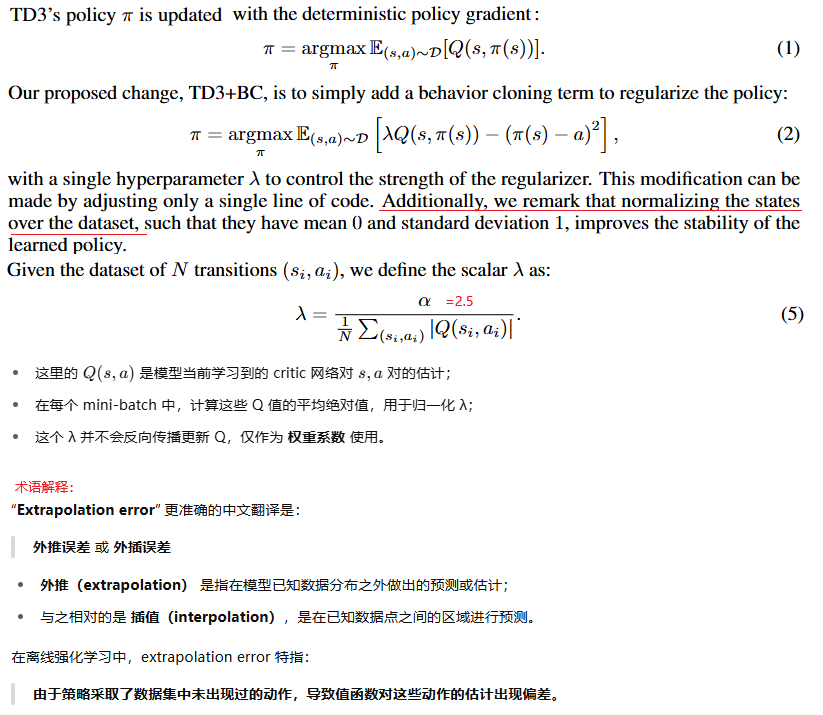
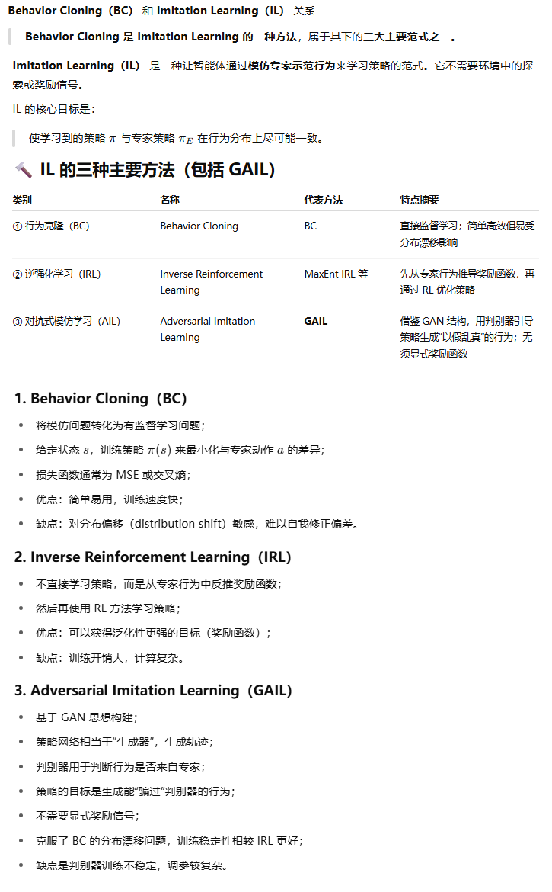
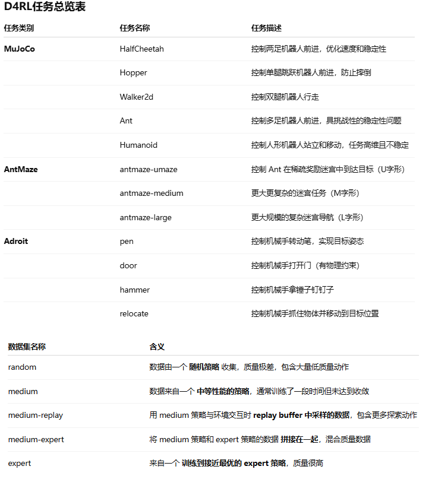
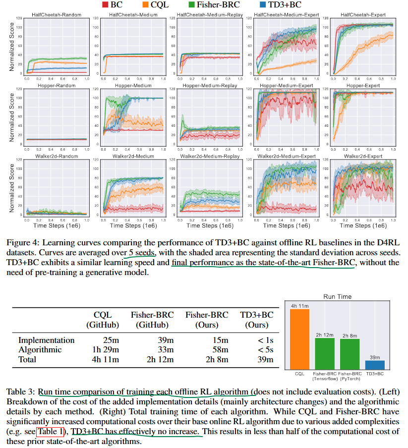
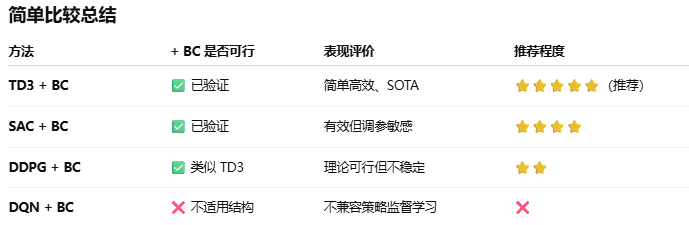
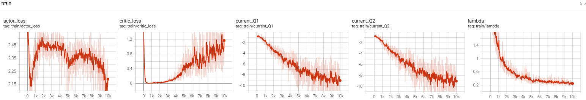
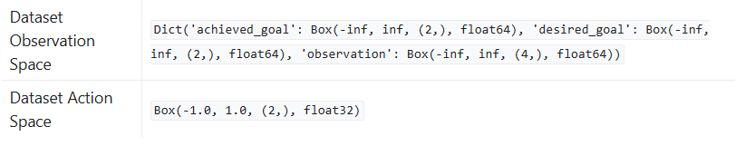
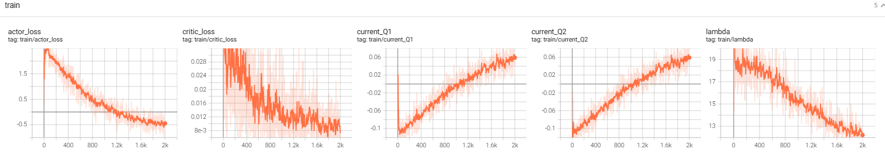
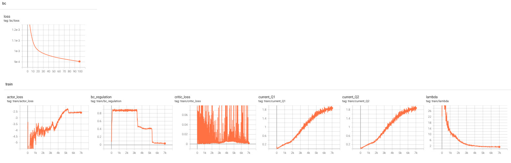

**A Minimalist Approach to Offline Reinforcement Learning**

一种离线强化学习的极简实现

### 1、Introduction

离线强化学习（Offline Reinforcement Learning）指的是在一组固定的离线数据上训练智能体。由于对数据分布之外的动作（out-of-distribution actions）进行价值估计时容易产生误差，因此大多数离线强化学习算法都会通过约束或正则化策略网络，使其生成的动作尽可能接近离线数据中的动作分布。

将已有的在线强化学习算法改造为离线版本，通常会引入额外的复杂性。离线强化学习方法往往需要新增超参数、辅助模块（如生成模型），并对基础的在线RL算法结构进行调整。

本文的目标是在**尽量少改动的前提下**，让一个深度强化学习算法能够在离线环境中运行良好。我们发现，只需在策略更新中加入行为克隆项（behavior cloning term），并对数据进行标准化处理，即可将一个在线RL算法转化为一个离线RL算法，并达到与当前最先进算法相当的性能。该方法不仅易于实现和调试，而且由于省去了额外计算，大大降低了运行成本（节省了一半以上的训练时间）。


在线RL，需要agent与环境交互，这通常是昂贵的，而且未经训练的agent与环境交互是很有风险的（例如自动驾驶、自动手术）。离线RL使用历史上的log数据、或者利用人类专家的操作演示，避免了昂贵且高风险的环境交互。

离线RL算法的训练结果通常表现更差，由于对训练数据集以外的(s,a)的价值估计误差，agent会的这些分布以外的动作价值出现高估而更倾向于这些动作，导致性能表现差。

这类问题的解决方法通常是让 被训练的策略模型 尽量 接近行为模型（也就是产生训练数据的与环境交互的模型），方法通常叫做：batch限制、KL控制、行为正则、策略限制。

各种离线RL算法都很复杂难以实现。bison：类比一下RND、ICM，在基本RL算法基础上加了两三个神经网络，我就怎么都复现不出来好的实验结果。

本论文提出的算法，是在TD3算法的基础上做很小的改动（ use TD3 with behavior cloning (BC) for the purpose of offline RL）：



### 2、Related Work

我们是首先提出对TD3算法应用行为克隆而改造为offline算法的。但行业内对于把RL与BC或者其他模仿学习手段的研究也很普遍。

然后论文介绍了 RL+BC、RL+Imitation、Offline RL等等行业内进行的研究。



### 3、Background

介绍了RL、offline RL、BC:

BC. Another approach for training policies is through imitation of an expert or behavior policy. **Behavior cloning (BC)** is an approach for imitation learning , where the policy is trained with supervised learning to directly imitate the actions of a provided dataset. Unlike RL, this
process is highly dependent on the performance of the data-collecting process.


Most offline RL algorithms are built explicitly on top of an existing off-policy deep RL algorithm, such as TD3 or SAC , but then further modify the underlying algorithm.

### 4、Challenges in Offline RL

RL algorithms are notoriously difficult to implement and tune, where minor code-level optimizations and hyperparameters can have non-trivial impact of performance and stability. This problem may be additionally amplified in the context of offline RL

这章节从实现的复杂度、性能高低、额外的计算开销、训练的稳定性等维度，对三个离线RL算法做了分析比较。

### 5、A Minimalist Offline RL Algorithm

introduction部分有说，这里不重复。论文也没有更多算法描述

### 6、Experiments

#### 什么是D4RL数据集

D4RL（Datasets for Deep Data-Driven Reinforcement Learning）提供了多个经典强化学习任务的**离线经验数据集**

也是Farama Foundation这个非盈利组织提供的。



#### 实验对比效果



### 7、Conclusion

我自然要问，其他离策略算法，可以用论文中的类似思路改造为offline RL吗？

AI：



### 8、bison的实验

#### pendulum

step1：先用SAC算法训练一个expert，然后让expert在eval模式下与环境交互收集经验数据，保存下来（10完个时间步）。这里不贴详细代码了，用之前的SAC的代码即可快速搞定。

step2：使用TD3+BC算法，进行offline RL。

我靠，学习效果很好，一把成功，下面是评估函数的输出，玩过倒立摆的人都知道，一个回合-200左右的回报是训练有素的agent了：

```
Evaluation Episode 1, Reward: -0.15
Evaluation Episode 2, Reward: -123.72
Evaluation Episode 3, Reward: -236.22
Evaluation Episode 4, Reward: -231.89
Evaluation Episode 5, Reward: -240.85

#好奇心重的我一定会问：只用TD3，不加BC，可以纯离线训练出不错的agent吗？
# 下面是去掉BC正则项训练的agent的表现，具体视觉效果就是钟摆不断的转，立不起来
Evaluation Episode 1, Reward: -1561.17
Evaluation Episode 2, Reward: -1379.67
Evaluation Episode 3, Reward: -1380.50
Evaluation Episode 4, Reward: -1506.39
Evaluation Episode 5, Reward: -1655.49
```



TD3+BC的代码如下（在TD3的基础上，改动真的好小，而且不复杂）：

```python
import datetime
import os
import random
import numpy as np
import gym
import torch
import torch.nn as nn
import torch.nn.functional as F
from torch.optim import Adam
from collections import deque
from torch.utils.tensorboard import SummaryWriter

# 设置随机种子保证可复现性
SEED = 42
random.seed(SEED)
np.random.seed(SEED)
torch.manual_seed(SEED)
torch.cuda.manual_seed(SEED)
torch.backends.cudnn.deterministic = True


# 超参数配置
class Config:
    DEVICE = torch.device("cuda" if torch.cuda.is_available() else "cpu")
    ENV_NAME = "Pendulum-v1"
    MAX_EPISODES = 10000  # 最大训练回合数
    MAX_STEPS = 200  # 每回合最大步数
    BATCH_SIZE = 256  # 从经验池采样的批次大小
    GAMMA = 0.99  # 折扣因子
    TAU = 0.005  # 目标网络软更新系数
    LR_ACTOR = 1e-4  # Actor学习率
    LR_CRITIC = 1e-3  # Critic学习率
    REPLAY_BUFFER_SIZE = 100000  # 经验回放池大小
    EXPLORATION_NOISE = 0.1  # 探索噪声标准差
    POLICY_NOISE = 0.1  # 目标策略平滑噪声标准差
    NOISE_CLIP = 0.3  # 噪声截断范围
    POLICY_UPDATE_FREQ = 2  # 策略网络延迟更新频率
    CHECKPOINT_DIR = "./td3_checkpoints"  # 模型保存目录
    CHECKPOINT_INTERVAL = 50  # 每隔多少回合保存一次模型
    LOGS_DIR = "./logs"


# 创建检查点目录
os.makedirs(Config.CHECKPOINT_DIR, exist_ok=True)
os.makedirs(Config.LOGS_DIR, exist_ok=True)
writer = SummaryWriter(f"{Config.LOGS_DIR}/td3_bc_pendulum_{datetime.datetime.now().strftime('%m%d_%H%M%D')}")


# Actor策略网络
class Actor(nn.Module):
    def __init__(self, state_dim, action_dim, max_action):
        super(Actor, self).__init__()
        self.max_action = max_action

        # 网络结构
        self.l1 = nn.Linear(state_dim, 256)
        self.l2 = nn.Linear(256, 256)
        self.l3 = nn.Linear(256, action_dim)

    def forward(self, state):
        """
        输入: state [batch_size, state_dim]
        输出: action [batch_size, action_dim], 范围[-max_action, max_action]
        """
        state = state / torch.tensor([[1.0, 1.0, 8.0]]).to(Config.DEVICE)
        a = F.relu(self.l1(state))
        a = F.relu(self.l2(a))
        a = torch.tanh(self.l3(a)) * self.max_action
        return a


# Critic价值网络 (双Q网络)
class Critic(nn.Module):
    def __init__(self, state_dim, action_dim):
        super(Critic, self).__init__()
        # Q1网络
        self.l1 = nn.Linear(state_dim + action_dim, 256)
        self.l2 = nn.Linear(256, 256)
        self.l3 = nn.Linear(256, 1)

        # Q2网络 (结构相同但参数独立)
        self.l4 = nn.Linear(state_dim + action_dim, 256)
        self.l5 = nn.Linear(256, 256)
        self.l6 = nn.Linear(256, 1)

    def forward(self, state, action):
        """
        输入:
            state [batch_size, state_dim]
            action [batch_size, action_dim]
        输出:
            Q1值 [batch_size, 1], Q2值 [batch_size, 1]
        """

        sa = torch.cat([state, action], dim=1)
        sa = sa / torch.tensor([[1.0, 1.0, 8.0, 2.0]]).to(Config.DEVICE)

        # Q1网络前向
        q1 = F.relu(self.l1(sa))
        q1 = F.relu(self.l2(q1))
        q1 = self.l3(q1)

        # Q2网络前向
        q2 = F.relu(self.l4(sa))
        q2 = F.relu(self.l5(q2))
        q2 = self.l6(q2)

        return q1, q2

    def Q1(self, state, action):
        """仅返回Q1值"""
        sa = torch.cat([state, action], dim=1)
        sa = sa / torch.tensor([[1.0, 1.0, 8.0, 2.0]]).to(Config.DEVICE)
        q1 = F.relu(self.l1(sa))
        q1 = F.relu(self.l2(q1))
        q1 = self.l3(q1)
        return q1


# 经验回放池
class ReplayBuffer:
    def __init__(self, max_size):
        self.buffer = deque(maxlen=max_size)

    def add(self, state, action, reward, next_state, done):
        """存储单步经验"""
        self.buffer.append((state, action, reward, next_state, done))

    def sample(self, batch_size):
        """随机采样批次经验"""
        batch = random.sample(self.buffer, batch_size)
        # 转换为PyTorch张量并移动到设备
        states = torch.FloatTensor(np.array([t[0] for t in batch])).to(Config.DEVICE)
        actions = torch.FloatTensor(np.array([t[1] for t in batch])).to(Config.DEVICE)
        rewards = torch.FloatTensor(np.array([t[2] for t in batch])).unsqueeze(1).to(Config.DEVICE)
        next_states = torch.FloatTensor(np.array([t[3] for t in batch])).to(Config.DEVICE)
        dones = torch.FloatTensor(np.array([t[4] for t in batch])).unsqueeze(1).to(Config.DEVICE)
        return states, actions, rewards, next_states, dones

    def __len__(self):
        return len(self.buffer)


# TD3算法主体
class TD3:
    def __init__(self, state_dim, action_dim, max_action):
        self.max_action = max_action

        # 初始化网络
        self.actor = Actor(state_dim, action_dim, max_action).to(Config.DEVICE)
        self.actor_target = Actor(state_dim, action_dim, max_action).to(Config.DEVICE)
        self.actor_target.load_state_dict(self.actor.state_dict())
        self.actor_optimizer = Adam(self.actor.parameters(), lr=Config.LR_ACTOR)

        self.critic = Critic(state_dim, action_dim).to(Config.DEVICE)
        self.critic_target = Critic(state_dim, action_dim).to(Config.DEVICE)
        self.critic_target.load_state_dict(self.critic.state_dict())
        self.critic_optimizer = Adam(self.critic.parameters(), lr=Config.LR_CRITIC)

        # 经验回放池
        self.replay_buffer = ReplayBuffer(Config.REPLAY_BUFFER_SIZE)

        # 训练计数器
        self.total_it = 0
        self.lambda_ = 1.0

    def select_action(self, state, add_noise=True):
        """
        根据状态选择动作 (推理时add_noise=False)
        输入: state [state_dim] (numpy数组)
        输出: action [action_dim] (numpy数组)
        """
        state = torch.FloatTensor(state).unsqueeze(0).to(Config.DEVICE)  # [1, state_dim]
        action = self.actor(state).cpu().data.numpy().flatten()  # [action_dim]

        if add_noise:
            # 添加探索噪声
            noise = np.random.normal(0, Config.EXPLORATION_NOISE, size=action.shape)
            action = (action + noise).clip(-self.max_action, self.max_action)
        return action

    def train(self, batch_size):
        """训练一步"""
        self.total_it += 1

        # 从经验池采样
        states, actions, rewards, next_states, dones = self.replay_buffer.sample(batch_size)

        # 计算目标Q值 (带策略平滑和双Q网络最小值)
        with torch.no_grad():
            # 目标策略动作 + 平滑噪声
            noise = (torch.randn_like(actions) * Config.POLICY_NOISE).clamp(
                -Config.NOISE_CLIP, Config.NOISE_CLIP)
            next_actions = (self.actor_target(next_states) + noise).clamp(
                -self.max_action, self.max_action)

            # 双Q网络目标值取最小
            target_Q1, target_Q2 = self.critic_target(next_states, next_actions)
            target_Q = torch.min(target_Q1, target_Q2)
            target_Q = rewards + (1 - dones) * Config.GAMMA * target_Q

        # 更新Critic网络 (最小化TD误差)
        current_Q1, current_Q2 = self.critic(states, actions) #type:torch.Tensor
        critic_loss = F.mse_loss(current_Q1, target_Q) + F.mse_loss(current_Q2, target_Q)
        writer.add_scalar("train/current_Q1", current_Q1.mean().cpu().item(), self.total_it)
        writer.add_scalar("train/current_Q2", current_Q2.mean().cpu().item(), self.total_it)

        self.lambda_ = 2.5 / current_Q1.abs().mean().item()
        writer.add_scalar('train/lambda', self.lambda_, self.total_it)

        self.critic_optimizer.zero_grad()
        critic_loss.backward()
        torch.nn.utils.clip_grad_norm_(self.critic.parameters(), 1.0) #对梯度进行裁剪，防止梯度爆炸
        self.critic_optimizer.step()
        writer.add_scalar("train/critic_loss", critic_loss.cpu().item(), self.total_it)

        # 延迟更新Actor和目标网络
        if self.total_it % Config.POLICY_UPDATE_FREQ == 0:
            # 更新Actor (最大化Q值)
            new_actions = self.actor(states)
            bc_regulation = F.mse_loss(new_actions, actions)
            actor_loss = -self.critic.Q1(states, new_actions).mean() * self.lambda_ + bc_regulation

            self.actor_optimizer.zero_grad()
            actor_loss.backward()
            torch.nn.utils.clip_grad_norm_(self.actor.parameters(), 1.0) #对梯度进行裁剪，防止梯度爆炸
            self.actor_optimizer.step()

            writer.add_scalar("train/actor_loss", actor_loss.cpu().item(), self.total_it)

            # 软更新目标网络
            for param, target_param in zip(self.critic.parameters(), self.critic_target.parameters()):
                target_param.data.copy_(Config.TAU * param.data + (1 - Config.TAU) * target_param.data)

            for param, target_param in zip(self.actor.parameters(), self.actor_target.parameters()):
                target_param.data.copy_(Config.TAU * param.data + (1 - Config.TAU) * target_param.data)

# 训练函数
def train_td3(resume_checkpoint=None):
    # 初始化环境
    env = gym.make(Config.ENV_NAME)
    state_dim = env.observation_space.shape[0]
    action_dim = env.action_space.shape[0]
    max_action = float(env.action_space.high[0])
    env.close()
    del env

    # 初始化TD3
    td3 = TD3(state_dim, action_dim, max_action)

    start_episode = 0

    # 加载专家离线数据集
    experience = torch.load('./pendulum_expert_experience.pth', weights_only=False)
    for e in experience:
        state, action, reward, next_state, terminated, truncated, info = e
        done = terminated or truncated
        td3.replay_buffer.add(state, action, reward, next_state, done)

    for episode in range(start_episode, Config.MAX_EPISODES):
            td3.train(Config.BATCH_SIZE)

    eval_td3(td3)


# 推理函数 (加载模型并渲染)
def eval_td3(td3:TD3,  num_episodes=5):
    # 初始化环境 (带渲染)
    env = gym.make(Config.ENV_NAME, render_mode="human")

    td3.actor.eval()
    # 推理循环
    for episode in range(num_episodes):
        state, _ = env.reset()
        episode_reward = 0

        for step in range(Config.MAX_STEPS):
            action = td3.select_action(state, add_noise=False)  # 推理时不加噪声
            next_state, reward, terminated, truncated, _ = env.step(action)
            done = terminated or truncated

            state = next_state
            episode_reward += reward

            if done:
                break

        print(f"Evaluation Episode {episode + 1}, Reward: {episode_reward:.2f}")
    td3.actor.train()
    env.close()


# 主函数
def main(arg):
    train_td3()
    
main("train")
```

#### minari开源数据集

D4RL数据集，项目已经移动到[这里](https://github.com/Farama-Foundation/Minari)了，文档在[这里](https://minari.farama.org/main/content/basic_usage/)，合并到minari项目了。

我们用[umaze任务](https://minari.farama.org/main/datasets/D4RL/pointmaze/umaze-v2/)做实验，刻意练习一下使用minari开源数据集

关于maze2d



结果很好，2000个epoche就学得很好了，见[评估视频](img/BC_UMaze.mp4)：



```python
import minari

import datetime
import os
import random
import numpy as np
import torch
import torch.nn as nn
import torch.nn.functional as F
from torch.optim import Adam
from collections import deque
from torch.utils.tensorboard import SummaryWriter


#改动极小，几乎就只修改这4行，外加一个load2replaybuffer函数，把专家数据加载到replaybuffer里
expert_dataset = minari.load_dataset('D4RL/pointmaze/umaze-v2')
n_action = 2
n_state = 8
max_action = 1


# 设置随机种子保证可复现性
SEED = 42
random.seed(SEED)
np.random.seed(SEED)
torch.manual_seed(SEED)
torch.cuda.manual_seed(SEED)
torch.backends.cudnn.deterministic = True


# 超参数配置
class Config:
    DEVICE = torch.device("cuda" if torch.cuda.is_available() else "cpu")
    ENV_NAME = "Pendulum-v1"
    MAX_EPISODES = 2000  # 最大训练回合数
    MAX_STEPS = 2000  # 每回合最大步数
    BATCH_SIZE = 256  # 从经验池采样的批次大小
    GAMMA = 0.99  # 折扣因子
    TAU = 0.005  # 目标网络软更新系数
    LR_ACTOR = 1e-4  # Actor学习率
    LR_CRITIC = 1e-3  # Critic学习率
    REPLAY_BUFFER_SIZE = 100_000  # 经验回放池大小
    EXPLORATION_NOISE = 0.1  # 探索噪声标准差
    POLICY_NOISE = 0.1  # 目标策略平滑噪声标准差
    NOISE_CLIP = 0.3  # 噪声截断范围
    POLICY_UPDATE_FREQ = 2  # 策略网络延迟更新频率
    CHECKPOINT_DIR = "./td3_checkpoints"  # 模型保存目录
    CHECKPOINT_INTERVAL = 50  # 每隔多少回合保存一次模型
    LOGS_DIR = "./logs"


# 创建检查点目录
os.makedirs(Config.CHECKPOINT_DIR, exist_ok=True)
os.makedirs(Config.LOGS_DIR, exist_ok=True)
writer = SummaryWriter(f"{Config.LOGS_DIR}/td3_bc_maze_{datetime.datetime.now().strftime('%m%d_%H%M%D')}")


# Actor策略网络
class Actor(nn.Module):
    def __init__(self, state_dim, action_dim, max_action):
        super(Actor, self).__init__()
        self.max_action = max_action

        # 网络结构
        self.l1 = nn.Linear(state_dim, 256)
        self.l2 = nn.Linear(256, 256)
        self.l3 = nn.Linear(256, action_dim)

    def forward(self, state):

        a = F.relu(self.l1(state))
        a = F.relu(self.l2(a))
        a = torch.tanh(self.l3(a)) * self.max_action
        return a


# Critic价值网络 (双Q网络)
class Critic(nn.Module):
    def __init__(self, state_dim, action_dim):
        super(Critic, self).__init__()
        # Q1网络
        self.l1 = nn.Linear(state_dim + action_dim, 256)
        self.l2 = nn.Linear(256, 256)
        self.l3 = nn.Linear(256, 1)

        # Q2网络 (结构相同但参数独立)
        self.l4 = nn.Linear(state_dim + action_dim, 256)
        self.l5 = nn.Linear(256, 256)
        self.l6 = nn.Linear(256, 1)

    def forward(self, state, action):
        """
        输入:
            state [batch_size, state_dim]
            action [batch_size, action_dim]
        输出:
            Q1值 [batch_size, 1], Q2值 [batch_size, 1]
        """

        sa = torch.cat([state, action], dim=1)


        # Q1网络前向
        q1 = F.relu(self.l1(sa))
        q1 = F.relu(self.l2(q1))
        q1 = self.l3(q1)

        # Q2网络前向
        q2 = F.relu(self.l4(sa))
        q2 = F.relu(self.l5(q2))
        q2 = self.l6(q2)

        return q1, q2

    def Q1(self, state, action):
        """仅返回Q1值"""
        sa = torch.cat([state, action], dim=1)
        q1 = F.relu(self.l1(sa))
        q1 = F.relu(self.l2(q1))
        q1 = self.l3(q1)
        return q1


# 经验回放池
class ReplayBuffer:
    def __init__(self, max_size):
        self.buffer = deque(maxlen=max_size)

    def add(self, state, action, reward, next_state, done):
        """存储单步经验"""
        self.buffer.append((state, action, reward, next_state, done))

    def sample(self, batch_size):
        """随机采样批次经验"""
        batch = random.sample(self.buffer, batch_size)
        # 转换为PyTorch张量并移动到设备
        states = torch.FloatTensor(np.array([t[0] for t in batch])).to(Config.DEVICE)
        actions = torch.FloatTensor(np.array([t[1] for t in batch])).to(Config.DEVICE)
        rewards = torch.FloatTensor(np.array([t[2] for t in batch])).unsqueeze(1).to(Config.DEVICE)
        next_states = torch.FloatTensor(np.array([t[3] for t in batch])).to(Config.DEVICE)
        dones = torch.FloatTensor(np.array([t[4] for t in batch])).unsqueeze(1).to(Config.DEVICE)
        return states, actions, rewards, next_states, dones

    def __len__(self):
        return len(self.buffer)


# TD3算法主体
class TD3:
    def __init__(self, state_dim, action_dim, max_action):
        self.max_action = max_action

        # 初始化网络
        self.actor = Actor(state_dim, action_dim, max_action).to(Config.DEVICE)
        self.actor_target = Actor(state_dim, action_dim, max_action).to(Config.DEVICE)
        self.actor_target.load_state_dict(self.actor.state_dict())
        self.actor_optimizer = Adam(self.actor.parameters(), lr=Config.LR_ACTOR)

        self.critic = Critic(state_dim, action_dim).to(Config.DEVICE)
        self.critic_target = Critic(state_dim, action_dim).to(Config.DEVICE)
        self.critic_target.load_state_dict(self.critic.state_dict())
        self.critic_optimizer = Adam(self.critic.parameters(), lr=Config.LR_CRITIC)

        # 经验回放池
        self.replay_buffer = ReplayBuffer(Config.REPLAY_BUFFER_SIZE)

        # 训练计数器
        self.total_it = 0
        self.lambda_ = 1.0


    def select_action(self, state, add_noise=True):
        """
        根据状态选择动作 (推理时add_noise=False)
        输入: state [state_dim] (numpy数组)
        输出: action [action_dim] (numpy数组)
        """
        state = torch.FloatTensor(state).unsqueeze(0).to(Config.DEVICE)  # [1, state_dim]
        action = self.actor(state).cpu().data.numpy().flatten()  # [action_dim]

        if add_noise:
            # 添加探索噪声
            noise = np.random.normal(0, Config.EXPLORATION_NOISE, size=action.shape)
            action = (action + noise).clip(-self.max_action, self.max_action)
        return action

    def train(self, batch_size):
        """训练一步"""
        self.total_it += 1

        # 从经验池采样
        states, actions, rewards, next_states, dones = self.replay_buffer.sample(batch_size)

        # 计算目标Q值 (带策略平滑和双Q网络最小值)
        with torch.no_grad():
            # 目标策略动作 + 平滑噪声
            noise = (torch.randn_like(actions) * Config.POLICY_NOISE).clamp(
                -Config.NOISE_CLIP, Config.NOISE_CLIP)
            next_actions = (self.actor_target(next_states) + noise).clamp(
                -self.max_action, self.max_action)

            # 双Q网络目标值取最小
            target_Q1, target_Q2 = self.critic_target(next_states, next_actions)
            target_Q = torch.min(target_Q1, target_Q2)
            target_Q = rewards + (1 - dones) * Config.GAMMA * target_Q

        # 更新Critic网络 (最小化TD误差)
        current_Q1, current_Q2 = self.critic(states, actions)  # type:torch.Tensor
        critic_loss = F.mse_loss(current_Q1, target_Q) + F.mse_loss(current_Q2, target_Q)
        writer.add_scalar("train/current_Q1", current_Q1.mean().cpu().item(), self.total_it)
        writer.add_scalar("train/current_Q2", current_Q2.mean().cpu().item(), self.total_it)

        self.lambda_ = 2.5 / current_Q1.abs().mean().item()
        writer.add_scalar('train/lambda', self.lambda_, self.total_it)

        self.critic_optimizer.zero_grad()
        critic_loss.backward()
        torch.nn.utils.clip_grad_norm_(self.critic.parameters(), 1.0)  # 对梯度进行裁剪，防止梯度爆炸
        self.critic_optimizer.step()
        writer.add_scalar("train/critic_loss", critic_loss.cpu().item(), self.total_it)

        # 延迟更新Actor和目标网络
        if self.total_it % Config.POLICY_UPDATE_FREQ == 0:
            # 更新Actor (最大化Q值)
            new_actions = self.actor(states)
            bc_regulation = F.mse_loss(new_actions, actions)
            actor_loss = -self.critic.Q1(states, new_actions).mean() * self.lambda_ + bc_regulation

            self.actor_optimizer.zero_grad()
            actor_loss.backward()
            torch.nn.utils.clip_grad_norm_(self.actor.parameters(), 1.0)  # 对梯度进行裁剪，防止梯度爆炸
            self.actor_optimizer.step()

            writer.add_scalar("train/actor_loss", actor_loss.cpu().item(), self.total_it)

            # 软更新目标网络
            for param, target_param in zip(self.critic.parameters(), self.critic_target.parameters()):
                target_param.data.copy_(Config.TAU * param.data + (1 - Config.TAU) * target_param.data)

            for param, target_param in zip(self.actor.parameters(), self.actor_target.parameters()):
                target_param.data.copy_(Config.TAU * param.data + (1 - Config.TAU) * target_param.data)

    def load2replaybuffer(self):
        for i in range(len(expert_dataset)):
            traj = expert_dataset[i] # 一条完整的轨迹
            obs = np.concatenate([traj.observations["observation"], traj.observations["desired_goal"], traj.observations["achieved_goal"]], axis=-1)
            states = obs[:-1]
            next_states = obs[1:]
            actions = traj.actions
            rewards = traj.rewards
            terminations = traj.terminations  # (T,)
            truncations = traj.truncations  # (T,)
            # 构造 done = termination OR truncation
            dones = np.logical_or(terminations, truncations).astype(np.float32)  # (T,)

            #把每一个时间步都加入到buffer
            traj_len = len(rewards)
            for j in range(traj_len):
                self.replay_buffer.add(states[j], actions[j], rewards[j], next_states[j], dones[j])
            if len(self.replay_buffer.buffer) >= Config.REPLAY_BUFFER_SIZE:
                break


# 训练函数
def train_td3(resume_checkpoint=None):


    # 初始化TD3
    td3 = TD3(n_state, n_action, max_action)

    start_episode = 0

    # 加载专家离线数据集
    td3.load2replaybuffer()

    for episode in range(start_episode, Config.MAX_EPISODES):
        td3.train(Config.BATCH_SIZE)

    eval_td3(td3)


# 推理函数 (加载模型并渲染)
def eval_td3(td3: TD3, num_episodes=5):
    # 初始化环境 (带渲染)
    env  = expert_dataset.recover_environment(render_mode='human')
    td3.actor.eval()
    # 推理循环
    for episode in range(num_episodes):
        obs, _ = env.reset()
        episode_reward = 0

        for step in range(Config.MAX_STEPS):
            state = np.concatenate([obs["observation"], obs["desired_goal"], obs["achieved_goal"]])
            state = torch.FloatTensor(state).unsqueeze(0).to(Config.DEVICE)
            action = td3.select_action(state, add_noise=False)  # 推理时不加噪声
            obs, reward, terminated, truncated, _ = env.step(action)
            done = terminated or truncated

            episode_reward += reward

            if done:
                break

        print(f"Evaluation Episode {episode + 1}, Reward: {episode_reward:.2f}")
    td3.actor.train()
    env.close()


# 主函数
def main(arg):
    train_td3()


main('train')
```

#### racecar

###### 收集专家数据

定义环境、收集专家数据，注意FPS=20，后面训练也需要对齐。通过键盘手动操作小车，跑了100个episode，得到一个轨迹列表。

```python
import datetime
import random
import time
import numpy

import pybullet as p
import pybullet_data
import gymnasium as gym
import numpy as np
from gymnasium import spaces
from torch.utils.tensorboard import SummaryWriter
import math
import imageio
import torch
import torch.nn as nn
import torch.nn.functional as F
import torch.optim as optim
from torch.distributions import Categorical
import pygame

steer = 0
throttle = 0
FPS = 20


class RaceCarEnv(gym.Env):
    """
    赛车强化学习环境，基于PyBullet和PyTorch实现
    环境特点：
    - 包含一个封闭赛道，有墙壁边界
    - 赛车需要从起点到终点，避免撞墙
    - 奖励设计：撞墙惩罚-1，移动距离负奖励，到达终点+3
    - 状态空间：车辆位置
    - 动作空间：转向和油门控制
    """

    def __init__(self, writer:SummaryWriter, render=False,fps=20):
        # 检测是否在并行环境中运行
        if hasattr(self, 'metadata') and 'is_vector_env' in self.metadata and self.metadata['is_vector_env']:
            raise RuntimeError(
                "RaceCarEnv does not support parallel execution with SB3 VecEnv. "
                "Please use a single instance of the environment."
            )
        super(RaceCarEnv, self).__init__()
        self.writer = writer


        # 连接物理引擎
        if render:
            self.physicsClient = p.connect(p.GUI)
        else:
            self.physicsClient = p.connect(p.DIRECT)

        # 设置搜索路径
        p.setAdditionalSearchPath(pybullet_data.getDataPath())
        self.fps = 20
        p.setTimeStep(1/self.fps, physicsClientId=self.physicsClient)
        p.setRealTimeSimulation(1, physicsClientId=self.physicsClient)

        # 定义动作空间和状态空间
        self.action_space = spaces.Box(
            low=np.array([-1, 0]),  # 转向, 油门
            high=np.array([1, 1]),
            dtype=np.float32
        )

        self.observation_space = spaces.Box(
            low=np.array([-np.inf, -np.inf, -np.inf, -np.inf, -np.pi, -np.pi, -np.pi, -np.inf, -np.inf]),
            high=np.array([np.inf, np.inf, np.inf, np.inf, np.pi,   np.pi, np.pi, np.inf, np.inf]),
            dtype=np.float32
        )

        # 环境参数
        self.max_steps = 10_000  # 最大步数
        self.current_step = 0 #每一回合里的步数计数器
        self.total_step = 0  #环境运行过程中一直累加的计数器
        self.car = None
        self.walls = []
        self.finish_line = None
        self.start_pos = [0.5, 0.5,0.1]  # 起点位置
        self.finish_pos = [14.5, 7.5, 0.1]  # 终点位置
        self.last_pos = None  # 上一步的位置
        self.recordVedio = False
        self.frames = []
        self.prev_state = None

        self.coins = [] #中途奖励的金币
        # 重置环境
        self.reset()

    def _create_track(self):
        """创建封闭的S型赛道"""
        p.resetSimulation()
        p.setGravity(0, 0, -10)

        # 加载地面和赛车
        p.loadURDF("plane.urdf")
        self.car = p.loadURDF("racecar/racecar.urdf", self.start_pos)

        if self.total_step == 3:
            for j in range(p.getNumJoints(self.car)):
                info = p.getJointInfo(self.car, j)
                print(f"Joint {j}: Name={info[1]}, Type={info[2]}, range:{info[8]} to {info[9]}")

        self._add_wall(0,0, 2,0)
        self._add_wall(0, 0, 0, 4)
        self._add_wall(2, 0, 2, 2)
        self._add_wall(0,4, 8,4)
        self._add_wall(2, 2, 10, 2)
        self._add_wall(10, 2, 10, 6)
        self._add_wall(10,6, 15,6)

        self._add_wall(8, 4, 8, 8)
        self._add_wall(8, 8, 15, 8)
        self._add_wall(15, 6, 15, 8)

        #赛道中间还有金币，鼓励探索
        self.coins.append([3 ,3])
        self.coins.append([9, 5])
        self.coins.append([11, 7])

    def _add_wall(self, startx, starty, endx, endy):
        """
        在(startx,starty)到(endx,endy)之间创建一堵物理墙
        参数:
            startx, starty: 起点坐标 (x,y)
            endx, endy: 终点坐标 (x,y)
        返回:
            wall_id: 创建的墙体ID
        """
        # 墙体参数
        thickness = 0.3  # 厚度0.3米
        height = 0.5  # 高度0.5米
        mass = 100  # 质量100kg

        # 计算墙体中心位置和长度
        center_x = (startx + endx) / 2
        center_y = (starty + endy) / 2
        length = math.sqrt((endx - startx) ** 2 + (endy - starty) ** 2)

        # 计算墙体朝向角度（弧度）
        angle = math.atan2(endy - starty, endx - startx)

        # 创建碰撞形状（长方体）
        wall_collision = p.createCollisionShape(
            p.GEOM_BOX,
            halfExtents=[length / 2, thickness / 2, height / 2]
        )

        # 创建视觉形状（灰色半透明）
        wall_visual = p.createVisualShape(
            p.GEOM_BOX,
            halfExtents=[length / 2, thickness / 2, height / 2],
            rgbaColor=[0.5, 0.5, 0.5, 0.8]
        )

        # 创建墙体刚体
        wall_id = p.createMultiBody(
            baseMass=mass,
            baseCollisionShapeIndex=wall_collision,
            baseVisualShapeIndex=wall_visual,
            basePosition=[center_x, center_y, height / 2],
            baseOrientation=p.getQuaternionFromEuler([0, 0, angle])
        )

        # 设置物理参数（静态墙体）
        p.changeDynamics(
            wall_id,
            -1,
            lateralFriction=1.0,
            restitution=0.7,
            linearDamping=0.5,
            angularDamping=0.5
        )
        self.walls.append(wall_id)

        return wall_id


    def reset(self, seed=None):
        """重置环境到初始状态"""
        global  steer
        global  throttle
        steer = 0
        throttle = 0

        p.resetSimulation()
        self._create_track()

        # 重置赛车位置和速度
        p.resetBasePositionAndOrientation(
            self.car,
            self.start_pos,
            p.getQuaternionFromEuler([0, 0, math.pi/2])
        )
        p.resetBaseVelocity(
            self.car,
            linearVelocity=[0, 0, 0],
            angularVelocity=[0, 0, 0]
        )

        self.current_step = 0
        self.last_pos = np.array(self.start_pos[:2])  # 只记录x,y坐标

        #抽样录一个回合视频
        if self.recordVedio and len(self.frames) > 10:
            imageio.mimsave(f"./logs/racecar_{datetime.datetime.now().strftime('%H%M%S')}.mp4", self.frames, format='FFMPEG', fps=self.fps)
            self.writer.add_scalar("steps/saveMP4", 1, self.total_step)

        self.frames = []
        if random.randint(0, 40) < 1:
            self.recordVedio = True
        else:
            self.recordVedio = False


        # 获取初始状态
        state = self._get_state()
        self.prev_state = state
        return state,{}

    def step(self, action):
        """
        执行一个动作
        Args:
            action: [转向, 油门], 值在[-1, 1]之间
        Returns:
            state: 新状态
            reward: 奖励值
            done: 是否结束
            info: 额外信息
        """
        # 解析动作
        steer = action[0]  # 转向 -1(左)到1(右)
        throttle = action[1]  # 油门 -1(倒车)到1(前进)

        # 设置赛车控制
        self._apply_action(steer, throttle)

        # 步进模拟
        p.stepSimulation()
        self.current_step += 1
        self.total_step += 1

        # 获取新状态
        state = self._get_state()

        # 计算奖励
        external_reward, done = self._compute_reward(state)
        #记录回合结束的时候的位置
        if done:
            self.writer.add_scalar("steps/pos_x", state[0], self.total_step)
            self.writer.add_scalar("steps/pos_y", state[1], self.total_step)

        # 检查是否超过最大步数
        truncated = False
        if self.current_step >= self.max_steps:
            truncated = True

        if self.recordVedio:
            # 录制视频
            rgb = self._render_camera_frame()
            self.frames.append(rgb)


        reward = external_reward
        if self.total_step % 100 == 0:
            self.writer.add_scalar("steps/external_reward", external_reward, self.total_step)


        info = {
            "steps": self.current_step,
            "position": state[:2],
            "is_success": done and external_reward > 0
        }

        self.prev_state = state
        # 更新最后位置
        self.last_pos = state[:2]

        return state, reward, done, truncated, info

    def _apply_action(self, steer, throttle):
        '''
Joint 0: Name=b'base_link_joint', Type=4, range:0.0 to -1.0
Joint 1: Name=b'chassis_inertia_joint', Type=4, range:0.0 to -1.0
Joint 2: Name=b'left_rear_wheel_joint', Type=0, range:0.0 to -1.0
Joint 3: Name=b'right_rear_wheel_joint', Type=0, range:0.0 to -1.0
        Joint 4: Name=b'left_steering_hinge_joint', Type=0, range:-1.0 to 1.0
Joint 5: Name=b'left_front_wheel_joint', Type=0, range:0.0 to -1.0
        Joint 6: Name=b'right_steering_hinge_joint', Type=0, range:-1.0 to 1.0
Joint 7: Name=b'right_front_wheel_joint', Type=0, range:0.0 to -1.0
Joint 8: Name=b'hokuyo_joint', Type=4, range:0.0 to -1.0
Joint 9: Name=b'zed_camera_joint', Type=4, range:0.0 to -1.0
Joint 10: Name=b'zed_camera_left_joint', Type=4, range:0.0 to -1.0
Joint 11: Name=b'zed_camera_right_joint', Type=4, range:0.0 to -1.0

AI说：
若关节名义范围是[0.0, -1.0]（即默认负向旋转），但设置target_vel=2.0（正值）时：
物理引擎会尝试按正向旋转驱动关节。
实际能否达到目标速度取决于max_force和物理约束（如惯性、摩擦等）。
        '''
        """应用控制动作到赛车"""
        # 前轮转向
        steering_angle = steer   # 限制转向角度

        # 设置转向
        p.setJointMotorControl2(
            self.car,
            4,
            p.POSITION_CONTROL,
            targetPosition=-steering_angle
        )
        p.setJointMotorControl2(
            self.car,
            6,
            p.POSITION_CONTROL,
            targetPosition=-steering_angle
        )

        # 设置驱动轮速度
        max_force = 100
        target_vel = throttle * 50  # 控制速度


        for wheel in [2, 3, 5,7]:
            p.setJointMotorControl2(
                self.car,
                wheel,
                p.VELOCITY_CONTROL,
                targetVelocity=target_vel,
                force=max_force
            )

    def _render_camera_frame(self):
        car_pos, _ = p.getBasePositionAndOrientation(self.car)
        x, y = car_pos[0], car_pos[1]

        view_matrix = p.computeViewMatrix(
            cameraEyePosition=[x - 5, y - 5, 5],
            cameraTargetPosition=[x, y, 0],
            cameraUpVector=[0, 0, 1]
        )

        projection_matrix = p.computeProjectionMatrixFOV(
            fov=60,
            aspect=320 / 240,
            nearVal=0.1,
            farVal=100.0
        )

        width, height, rgb, _, _ = p.getCameraImage(
            width=320,
            height=240,
            viewMatrix=view_matrix,
            projectionMatrix=projection_matrix,
            renderer=p.ER_BULLET_HARDWARE_OPENGL
        )

        rgb_array = np.reshape(rgb, (height, width, 4))[:, :, :3].astype(np.uint8)
        return rgb_array

    def _get_state(self):
        """获取当前状态（车辆位置、速度和转向关节状态）"""
        # 1. 获取车辆位置（x,y）
        pos, _ = p.getBasePositionAndOrientation(self.car)
        position = np.array(pos[:2])  # 只取x,y坐标

        # 2. 获取车辆速度（x,y方向）
        linear_vel, _ = p.getBaseVelocity(self.car)
        velocity = np.array(linear_vel[:2])  # 只取x,y方向速度

        # 3 获取小车的朝向：
        pos, orn = p.getBasePositionAndOrientation(self.car)
        euler = p.getEulerFromQuaternion(orn)
        heading = euler[2]

        # 4. 获取转向关节状态（前轮两个关节）
        # 获取转向关节角度（前轮两个关节）
        steering_angle1 = p.getJointState(self.car, 4)[0]  # 第一个转向关节
        steering_angle2 = p.getJointState(self.car, 6)[0]  # 第二个转向关节

        # 获取转向关节角速度
        steering_vel1 = p.getJointState(self.car, 4)[1]  # 第一个转向关节角速度
        steering_vel2 = p.getJointState(self.car, 6)[1]  # 第二个转向关节角速度

        # 合并所有状态信息
        state = np.concatenate([
            position,  # 车辆位置 (x,y)
            velocity,  # 车辆速度 (vx,vy)
            [heading],
            [steering_angle1],  # 第一个转向关节角度
            [steering_angle2],  # 第二个转向关节角度
            [steering_vel1],  # 第一个转向关节角速度
            [steering_vel2]  # 第二个转向关节角速度
        ], dtype=np.float32)

        #抽样打印一下状态信息，以观察值的范围
        if self.total_step > 1000 and self.total_step < 1002:
            print("state sample:", state)

        return state

    def _compute_reward(self, state):
        """计算奖励"""
        # 参考 bipedalwalker的设计，因为 bipedalwalker 这个task能够很好的收敛，所以参考它比较有信心

        done = False
        reward = 0

        # 1. 检查是否撞墙
        contact_points = p.getContactPoints(self.car)
        if contact_points:
            for point in contact_points:
                if point[2] in self.walls:  # 检查是否与墙壁碰撞, point[2]:body unique id of body B
                    reward =  -1 # 撞墙惩罚
                    done = True
                    self.writer.add_scalar("steps/hitWall", 1, self.total_step)
                    print('hit wall')
                    return reward, done

        # 2. 检查是否到达终点
        finish_distance = np.linalg.norm(state[:2] - np.array(self.finish_pos[:2]))
        if finish_distance < 2.0:  # 接近终点
            reward = +3  # 到达终点奖励
            done = True
            self.writer.add_scalar("steps/reachGoal", 1, self.total_step)
            print('goal')
            return  reward, done


        return reward, done

    def render(self, mode='human'):
        """渲染环境"""
        pass  # PyBullet会自动处理渲染

    def close(self):
        """关闭环境"""
        p.disconnect()


def get_user_action():
    global steer
    global throttle

    for event in pygame.event.get():
        if event.type == pygame.QUIT:
            pygame.quit()
            exit()

        if event.type == pygame.KEYDOWN:
            flag = False
            if event.key == pygame.K_LEFT:
                #print("left")
                flag = True
                steer += -0.2
            if event.key == pygame.K_RIGHT:
                #print("right")
                flag = True
                steer += 0.2
            if event.key == pygame.K_UP:
                #print("up")
                flag = True
                throttle += 0.1
            if event.key == pygame.K_DOWN:
                #print("down")
                flag = True
                throttle += -0.1
            if flag:
                throttle = max(min(throttle, 1), -1)
                steer = max(min(steer, 1), -1)
                return numpy.array([steer, throttle], dtype=numpy.float32)

    return  numpy.array([steer, throttle], dtype=numpy.float32)


if __name__ == '__main__':
    pygame.init()
    pygame.display.set_mode((400, 300))  # 创建一个最小窗口，必要！
    clock = pygame.time.Clock()

    writer = SummaryWriter( f'logs/racecar_expert_{datetime.datetime.now().strftime("%m%d_%H%M%S")}')
    env = RaceCarEnv(writer, True)
    all_traj = []
    for _ in range(100):
        done = False
        obs, _ = env.reset()
        traj = []
        traj_started = False
        while not done:
            clock.tick(FPS)
            p.stepSimulation(env.physicsClient)
            action = get_user_action()
            if (action[0] != 0 or action[1] != 0) and traj_started == False:
                traj_started = True
                print('start a trajectory')

            next_obs,reward, terminated, truncated, info = env.step(action)
            if traj_started:
                traj.append((obs, action, reward, terminated, truncated, info, next_obs))
            obs = next_obs
            if terminated or truncated:
                break
        all_traj.append(traj)
        print(f'trajectory len:{len(traj)}')
        print(f'has collected {len(all_traj)} trajectories')

    torch.save(all_traj, './expert_racecar_traj.pth')


```

收集到的专家数据[在这里](models/expert_racecar_traj.pth)

###### 训练

想了各种办法也不收敛，百思不得其解：

1. 把目标位置编码到state里输入给网络
2. 把state进行归一化：小车位置和目标位置都除以15
3. 一开始就进行100个epoch的纯behavior clone
4. 篡改专家数据里的reward，如果为0就改为-0.01

结果训练出来的agent，一启动就把车左转，一头撞死在墙上，获得 -1回报。tb上报如下：




```python
import datetime
import random
import time

import numpy
import pybullet as p
import pybullet_data
import gymnasium as gym
import numpy as np
from gymnasium import spaces
from torch.utils.tensorboard import SummaryWriter
import math
import imageio
import copy
import torch
import torch.nn as nn
import torch.nn.functional as F
import torch.optim as optim
from torch.distributions import Categorical
import pygame
import os
import random
import torch
from torch.optim import Adam
from collections import deque

def normalize_state(state:numpy.ndarray):
    result = np.concatenate( (state, [14.5/15.0, 7.5/15.0]), dtype=np.float32) #把目标位置也追加进去
    result[0] = state[0] / 15.0
    result[1] = state[1] / 15.0
    return result

class RaceCarEnv(gym.Env):
    """
    赛车强化学习环境，基于PyBullet和PyTorch实现
    环境特点：
    - 包含一个封闭赛道，有墙壁边界
    - 赛车需要从起点到终点，避免撞墙
    - 奖励设计：撞墙惩罚-1，移动距离负奖励，到达终点+3
    - 状态空间：车辆位置
    - 动作空间：转向和油门控制
    """

    def __init__(self, writer:SummaryWriter, render=False,fps=20):
        # 检测是否在并行环境中运行
        if hasattr(self, 'metadata') and 'is_vector_env' in self.metadata and self.metadata['is_vector_env']:
            raise RuntimeError(
                "RaceCarEnv does not support parallel execution with SB3 VecEnv. "
                "Please use a single instance of the environment."
            )
        super(RaceCarEnv, self).__init__()
        self.writer = writer


        # 连接物理引擎
        if render:
            self.physicsClient = p.connect(p.GUI)
        else:
            self.physicsClient = p.connect(p.DIRECT)

        p.configureDebugVisualizer(p.COV_ENABLE_GUI, 0)  # 关闭 GUI 控件
        p.configureDebugVisualizer(p.COV_ENABLE_RENDERING, 1)
        p.configureDebugVisualizer(p.COV_ENABLE_TINY_RENDERER, 1)  # <<<<<< 强制使用 CPU 渲染器

        # 设置搜索路径
        p.setAdditionalSearchPath(pybullet_data.getDataPath())
        self.fps = Config.fps
        p.setTimeStep(1/self.fps, physicsClientId=self.physicsClient)
        p.setRealTimeSimulation(0, physicsClientId=self.physicsClient)

        # 定义动作空间和状态空间
        self.action_space = spaces.Box(
            low=np.array([-1, 0]),  # 转向, 油门
            high=np.array([1, 1]),
            dtype=np.float32
        )

        self.observation_space = spaces.Box(
            low=np.array([-np.inf, -np.inf, -np.inf, -np.inf, -np.pi, -np.pi, -np.pi, -np.inf, -np.inf]),
            high=np.array([np.inf, np.inf, np.inf, np.inf, np.pi,   np.pi, np.pi, np.inf, np.inf]),
            dtype=np.float32
        )

        # 环境参数
        self.max_steps = 10_000  # 最大步数
        self.current_step = 0 #每一回合里的步数计数器
        self.total_step = 0  #环境运行过程中一直累加的计数器
        self.car = None
        self.walls = []
        self.finish_line = None
        self.start_pos = [0.5, 0.5,0.1]  # 起点位置
        self.finish_pos = [14.5, 7.5, 0.1]  # 终点位置
        self.last_pos = None  # 上一步的位置
        self.recordVedio = False
        self.frames = []
        self.prev_state = None

        self.coins = [] #中途奖励的金币
        # 重置环境
        self.reset()

    def _create_track(self):
        """创建封闭的S型赛道"""
        p.resetSimulation()
        p.setGravity(0, 0, -10)

        # 加载地面和赛车
        p.loadURDF("plane.urdf")
        self.car = p.loadURDF("racecar/racecar.urdf", self.start_pos)

        if self.total_step == 3:
            for j in range(p.getNumJoints(self.car)):
                info = p.getJointInfo(self.car, j)
                print(f"Joint {j}: Name={info[1]}, Type={info[2]}, range:{info[8]} to {info[9]}")

        self._add_wall(0,0, 2,0)
        self._add_wall(0, 0, 0, 4)
        self._add_wall(2, 0, 2, 2)
        self._add_wall(0,4, 8,4)
        self._add_wall(2, 2, 10, 2)
        self._add_wall(10, 2, 10, 6)
        self._add_wall(10,6, 15,6)

        self._add_wall(8, 4, 8, 8)
        self._add_wall(8, 8, 15, 8)
        self._add_wall(15, 6, 15, 8)

        #赛道中间还有金币，鼓励探索
        self.coins.append([3 ,3])
        self.coins.append([9, 5])
        self.coins.append([11, 7])

    def _add_wall(self, startx, starty, endx, endy):
        """
        在(startx,starty)到(endx,endy)之间创建一堵物理墙
        参数:
            startx, starty: 起点坐标 (x,y)
            endx, endy: 终点坐标 (x,y)
        返回:
            wall_id: 创建的墙体ID
        """
        # 墙体参数
        thickness = 0.3  # 厚度0.3米
        height = 0.5  # 高度0.5米
        mass = 100  # 质量100kg

        # 计算墙体中心位置和长度
        center_x = (startx + endx) / 2
        center_y = (starty + endy) / 2
        length = math.sqrt((endx - startx) ** 2 + (endy - starty) ** 2)

        # 计算墙体朝向角度（弧度）
        angle = math.atan2(endy - starty, endx - startx)

        # 创建碰撞形状（长方体）
        wall_collision = p.createCollisionShape(
            p.GEOM_BOX,
            halfExtents=[length / 2, thickness / 2, height / 2]
        )

        # 创建视觉形状（灰色半透明）
        wall_visual = p.createVisualShape(
            p.GEOM_BOX,
            halfExtents=[length / 2, thickness / 2, height / 2],
            rgbaColor=[0.5, 0.5, 0.5, 0.8]
        )

        # 创建墙体刚体
        wall_id = p.createMultiBody(
            baseMass=mass,
            baseCollisionShapeIndex=wall_collision,
            baseVisualShapeIndex=wall_visual,
            basePosition=[center_x, center_y, height / 2],
            baseOrientation=p.getQuaternionFromEuler([0, 0, angle])
        )

        # 设置物理参数（静态墙体）
        p.changeDynamics(
            wall_id,
            -1,
            lateralFriction=1.0,
            restitution=0.7,
            linearDamping=0.5,
            angularDamping=0.5
        )
        self.walls.append(wall_id)

        return wall_id


    def reset(self, seed=None):
        """重置环境到初始状态"""
        p.resetSimulation()
        self._create_track()

        # 重置赛车位置和速度
        p.resetBasePositionAndOrientation(
            self.car,
            self.start_pos,
            p.getQuaternionFromEuler([0, 0, math.pi/2])
        )
        p.resetBaseVelocity(
            self.car,
            linearVelocity=[0, 0, 0],
            angularVelocity=[0, 0, 0]
        )

        self.current_step = 0
        self.last_pos = np.array(self.start_pos[:2])  # 只记录x,y坐标

        #抽样录一个回合视频
        if self.recordVedio and len(self.frames) > 10:
            imageio.mimsave(f"./logs/racecar_{datetime.datetime.now().strftime('%H%M%S')}.mp4", self.frames, format='FFMPEG', fps=self.fps)
            self.writer.add_scalar("steps/saveMP4", 1, self.total_step)

        self.frames = []
        if True:
            self.recordVedio = True
        else:
            self.recordVedio = False


        # 获取初始状态
        state = self._get_state()
        self.prev_state = state
        return state,{}

    def step(self, action):
        """
        执行一个动作
        Args:
            action: [转向, 油门], 值在[-1, 1]之间
        Returns:
            state: 新状态
            reward: 奖励值
            done: 是否结束
            info: 额外信息
        """
        # 解析动作
        steer = action[0]  # 转向 -1(左)到1(右)
        throttle = action[1]  # 油门 -1(倒车)到1(前进)

        # 设置赛车控制
        self._apply_action(steer, throttle)

        # 步进模拟
        p.stepSimulation()
        self.current_step += 1
        self.total_step += 1

        # 获取新状态
        state = self._get_state()

        # 计算奖励
        external_reward, done = self._compute_reward(state)
        #记录回合结束的时候的位置
        if done:
            self.writer.add_scalar("steps/pos_x", state[0], self.total_step)
            self.writer.add_scalar("steps/pos_y", state[1], self.total_step)

        # 检查是否超过最大步数
        truncated = False
        if self.current_step >= self.max_steps:
            truncated = True

        if self.recordVedio:
            # 录制视频
            rgb = self._render_camera_frame()
            self.frames.append(rgb)


        reward = external_reward
        if self.total_step % 100 == 0:
            self.writer.add_scalar("steps/external_reward", external_reward, self.total_step)


        info = {
            "steps": self.current_step,
            "position": state[:2],
            "is_success": done and external_reward > 0
        }

        self.prev_state = state
        # 更新最后位置
        self.last_pos = state[:2]

        return state, reward, done, truncated, info

    def _apply_action(self, steer, throttle):
        '''
Joint 0: Name=b'base_link_joint', Type=4, range:0.0 to -1.0
Joint 1: Name=b'chassis_inertia_joint', Type=4, range:0.0 to -1.0
Joint 2: Name=b'left_rear_wheel_joint', Type=0, range:0.0 to -1.0
Joint 3: Name=b'right_rear_wheel_joint', Type=0, range:0.0 to -1.0
        Joint 4: Name=b'left_steering_hinge_joint', Type=0, range:-1.0 to 1.0
Joint 5: Name=b'left_front_wheel_joint', Type=0, range:0.0 to -1.0
        Joint 6: Name=b'right_steering_hinge_joint', Type=0, range:-1.0 to 1.0
Joint 7: Name=b'right_front_wheel_joint', Type=0, range:0.0 to -1.0
Joint 8: Name=b'hokuyo_joint', Type=4, range:0.0 to -1.0
Joint 9: Name=b'zed_camera_joint', Type=4, range:0.0 to -1.0
Joint 10: Name=b'zed_camera_left_joint', Type=4, range:0.0 to -1.0
Joint 11: Name=b'zed_camera_right_joint', Type=4, range:0.0 to -1.0

AI说：
若关节名义范围是[0.0, -1.0]（即默认负向旋转），但设置target_vel=2.0（正值）时：
物理引擎会尝试按正向旋转驱动关节。
实际能否达到目标速度取决于max_force和物理约束（如惯性、摩擦等）。
        '''
        """应用控制动作到赛车"""
        # 前轮转向
        steering_angle = steer   # 限制转向角度

        # 设置转向
        p.setJointMotorControl2(
            self.car,
            4,
            p.POSITION_CONTROL,
            targetPosition=-steering_angle
        )
        p.setJointMotorControl2(
            self.car,
            6,
            p.POSITION_CONTROL,
            targetPosition=-steering_angle
        )

        # 设置驱动轮速度
        max_force = 100
        target_vel = throttle * 50  # 控制速度


        for wheel in [2, 3, 5,7]:
            p.setJointMotorControl2(
                self.car,
                wheel,
                p.VELOCITY_CONTROL,
                targetVelocity=target_vel,
                force=max_force
            )

    def _render_camera_frame(self):
        car_pos, _ = p.getBasePositionAndOrientation(self.car)
        x, y = car_pos[0], car_pos[1]

        view_matrix = p.computeViewMatrix(
            cameraEyePosition=[x - 5, y - 5, 5],
            cameraTargetPosition=[x, y, 0],
            cameraUpVector=[0, 0, 1]
        )

        projection_matrix = p.computeProjectionMatrixFOV(
            fov=60,
            aspect=320 / 240,
            nearVal=0.1,
            farVal=100.0
        )

        width, height, rgb, _, _ = p.getCameraImage(
            width=320,
            height=240,
            viewMatrix=view_matrix,
            projectionMatrix=projection_matrix,
            renderer=p.ER_BULLET_HARDWARE_OPENGL
        )

        rgb_array = np.reshape(rgb, (height, width, 4))[:, :, :3].astype(np.uint8)
        return rgb_array

    def _get_state(self):
        """获取当前状态（车辆位置、速度和转向关节状态）"""
        # 1. 获取车辆位置（x,y）
        pos, _ = p.getBasePositionAndOrientation(self.car)
        position = np.array(pos[:2])  # 只取x,y坐标

        # 2. 获取车辆速度（x,y方向）
        linear_vel, _ = p.getBaseVelocity(self.car)
        velocity = np.array(linear_vel[:2])  # 只取x,y方向速度

        # 3 获取小车的朝向：
        pos, orn = p.getBasePositionAndOrientation(self.car)
        euler = p.getEulerFromQuaternion(orn)
        heading = euler[2]

        # 4. 获取转向关节状态（前轮两个关节）
        # 获取转向关节角度（前轮两个关节）
        steering_angle1 = p.getJointState(self.car, 4)[0]  # 第一个转向关节
        steering_angle2 = p.getJointState(self.car, 6)[0]  # 第二个转向关节

        # 获取转向关节角速度
        steering_vel1 = p.getJointState(self.car, 4)[1]  # 第一个转向关节角速度
        steering_vel2 = p.getJointState(self.car, 6)[1]  # 第二个转向关节角速度

        # 合并所有状态信息
        state = np.concatenate([
            position,  # 车辆位置 (x,y)
            velocity,  # 车辆速度 (vx,vy)
            [heading],
            [steering_angle1],  # 第一个转向关节角度
            [steering_angle2],  # 第二个转向关节角度
            [steering_vel1],  # 第一个转向关节角速度
            [steering_vel2]  # 第二个转向关节角速度
        ], dtype=np.float32)

        #抽样打印一下状态信息，以观察值的范围
        if self.total_step > 1000 and self.total_step < 1002:
            print("state sample:", state)

        return state

    def _compute_reward(self, state):
        """计算奖励"""
        # 参考 bipedalwalker的设计，因为 bipedalwalker 这个task能够很好的收敛，所以参考它比较有信心

        done = False
        reward = 0

        # 1. 检查是否撞墙
        contact_points = p.getContactPoints(self.car)
        if contact_points:
            for point in contact_points:
                if point[2] in self.walls:  # 检查是否与墙壁碰撞, point[2]:body unique id of body B
                    reward =  -1 # 撞墙惩罚
                    done = True
                    self.writer.add_scalar("steps/hitWall", 1, self.total_step)
                    return reward, done

        # 2. 检查是否到达终点
        finish_distance = np.linalg.norm(state[:2] - np.array(self.finish_pos[:2]))
        if finish_distance < 1.0:  # 接近终点
            reward = +3  # 到达终点奖励
            done = True
            self.writer.add_scalar("steps/reachGoal", 1, self.total_step)
            return  reward, done


        return reward, done

    def render(self, mode='human'):
        """渲染环境"""
        pass  # PyBullet会自动处理渲染

    def close(self):
        """关闭环境"""
        p.disconnect()


'''
收集的数据格式：
{
    'observations': np.ndarray [N, obs_dim],
    'actions': np.ndarray [N, act_dim],
    'rewards': np.ndarray [N, ],
    'next_observations': np.ndarray [N, obs_dim],
    'terminals': np.ndarray [N, ]  # 0/1
}
'''
# 设置随机种子保证可复现性
SEED = 42
random.seed(SEED)
np.random.seed(SEED)
torch.manual_seed(SEED)
torch.cuda.manual_seed(SEED)
torch.backends.cudnn.deterministic = True


# 超参数配置
class Config:
    DEVICE = torch.device("cuda" if torch.cuda.is_available() else "cpu")
    ENV_NAME = "Pendulum-v1"
    MAX_EPISODES = 7000  # 最大训练回合数
    MAX_STEPS = 2000  # 每回合最大步数
    BATCH_SIZE = 256  # 从经验池采样的批次大小
    GAMMA = 0.99  # 折扣因子
    TAU = 0.005  # 目标网络软更新系数
    LR_ACTOR = 1e-4  # Actor学习率
    LR_CRITIC = 1e-3  # Critic学习率
    REPLAY_BUFFER_SIZE = 100_000  # 经验回放池大小
    EXPLORATION_NOISE = 0.1  # 探索噪声标准差
    POLICY_NOISE = 0.1  # 目标策略平滑噪声标准差
    NOISE_CLIP = 0.3  # 噪声截断范围
    POLICY_UPDATE_FREQ = 2  # 策略网络延迟更新频率
    CHECKPOINT_DIR = "./td3_checkpoints"  # 模型保存目录
    CHECKPOINT_INTERVAL = 50  # 每隔多少回合保存一次模型
    LOGS_DIR = "./logs"

    n_state, n_action, max_action = 11, 2, 1
    fps = 20


# 创建检查点目录
os.makedirs(Config.CHECKPOINT_DIR, exist_ok=True)
os.makedirs(Config.LOGS_DIR, exist_ok=True)
writer = SummaryWriter(f"{Config.LOGS_DIR}/td3_bc_racecar_{datetime.datetime.now().strftime('%m%d_%H%M%D')}")


# Actor策略网络
class Actor(nn.Module):
    def __init__(self, state_dim, action_dim, max_action):
        super(Actor, self).__init__()
        self.max_action = max_action

        # 网络结构
        self.l1 = nn.Linear(state_dim, 256)
        self.l2 = nn.Linear(256, 256)
        self.l3 = nn.Linear(256, action_dim)

    def forward(self, state):

        a = F.relu(self.l1(state))
        a = F.relu(self.l2(a))
        a = torch.tanh(self.l3(a)) * self.max_action
        return a


# Critic价值网络 (双Q网络)
class Critic(nn.Module):
    def __init__(self, state_dim, action_dim):
        super(Critic, self).__init__()
        # Q1网络
        self.l1 = nn.Linear(state_dim + action_dim, 256)
        self.l2 = nn.Linear(256, 256)
        self.l3 = nn.Linear(256, 1)

        # Q2网络 (结构相同但参数独立)
        self.l4 = nn.Linear(state_dim + action_dim, 256)
        self.l5 = nn.Linear(256, 256)
        self.l6 = nn.Linear(256, 1)

    def forward(self, state, action):
        """
        输入:
            state [batch_size, state_dim]
            action [batch_size, action_dim]
        输出:
            Q1值 [batch_size, 1], Q2值 [batch_size, 1]
        """

        sa = torch.cat([state, action], dim=1)


        # Q1网络前向
        q1 = F.relu(self.l1(sa))
        q1 = F.relu(self.l2(q1))
        q1 = self.l3(q1)

        # Q2网络前向
        q2 = F.relu(self.l4(sa))
        q2 = F.relu(self.l5(q2))
        q2 = self.l6(q2)

        return q1, q2

    def Q1(self, state, action):
        """仅返回Q1值"""
        sa = torch.cat([state, action], dim=1)
        q1 = F.relu(self.l1(sa))
        q1 = F.relu(self.l2(q1))
        q1 = self.l3(q1)
        return q1


# 经验回放池
class ReplayBuffer:
    def __init__(self, max_size):
        self.buffer = deque(maxlen=max_size)

    def add(self, state, action, reward, next_state, done):
        """存储单步经验"""
        self.buffer.append((state, action, reward, next_state, done))

    def sample(self, batch_size):
        """随机采样批次经验"""
        batch = random.sample(self.buffer, batch_size)
        # 转换为PyTorch张量并移动到设备
        states = torch.FloatTensor(np.array([t[0] for t in batch])).to(Config.DEVICE)
        actions = torch.FloatTensor(np.array([t[1] for t in batch])).to(Config.DEVICE)
        rewards = torch.FloatTensor(np.array([t[2] for t in batch])).unsqueeze(1).to(Config.DEVICE)
        next_states = torch.FloatTensor(np.array([t[3] for t in batch])).to(Config.DEVICE)
        dones = torch.FloatTensor(np.array([t[4] for t in batch])).unsqueeze(1).to(Config.DEVICE)
        return states, actions, rewards, next_states, dones

    def sampleByIndices(self, indices:list):
        batch = [self.buffer[i] for i in indices]
        # 转换为PyTorch张量并移动到设备
        states = torch.FloatTensor(np.array([t[0] for t in batch])).to(Config.DEVICE)
        actions = torch.FloatTensor(np.array([t[1] for t in batch])).to(Config.DEVICE)
        rewards = torch.FloatTensor(np.array([t[2] for t in batch])).unsqueeze(1).to(Config.DEVICE)
        next_states = torch.FloatTensor(np.array([t[3] for t in batch])).to(Config.DEVICE)
        dones = torch.FloatTensor(np.array([t[4] for t in batch])).unsqueeze(1).to(Config.DEVICE)
        return states, actions, rewards, next_states, dones


    def __len__(self):
        return len(self.buffer)


# TD3算法主体
class TD3:
    def __init__(self, state_dim, action_dim, max_action):
        self.max_action = max_action

        # 初始化网络
        self.actor = Actor(state_dim, action_dim, max_action).to(Config.DEVICE)
        self.actor_target = Actor(state_dim, action_dim, max_action).to(Config.DEVICE)
        self.actor_target.load_state_dict(self.actor.state_dict())
        self.actor_optimizer = Adam(self.actor.parameters(), lr=Config.LR_ACTOR)

        self.critic = Critic(state_dim, action_dim).to(Config.DEVICE)
        self.critic_target = Critic(state_dim, action_dim).to(Config.DEVICE)
        self.critic_target.load_state_dict(self.critic.state_dict())
        self.critic_optimizer = Adam(self.critic.parameters(), lr=Config.LR_CRITIC)

        # 经验回放池
        self.replay_buffer = ReplayBuffer(Config.REPLAY_BUFFER_SIZE)

        # 训练计数器
        self.total_it = 0
        self.lambda_ = 5.0


    def select_action(self, state, add_noise=True):
        """
        根据状态选择动作 (推理时add_noise=False)
        输入: state [state_dim] (numpy数组)
        输出: action [action_dim] (numpy数组)
        """
        state = torch.FloatTensor(state).unsqueeze(0).to(Config.DEVICE)  # [1, state_dim]
        action = self.actor(state).cpu().data.numpy().flatten()  # [action_dim]

        if add_noise:
            # 添加探索噪声
            noise = np.random.normal(0, Config.EXPLORATION_NOISE, size=action.shape)
            action = (action + noise).clip(-self.max_action, self.max_action)
        return action

    def train(self, batch_size):
        """训练一步"""
        self.total_it += 1

        # 从经验池采样
        states, actions, rewards, next_states, dones = self.replay_buffer.sample(batch_size)

        # 计算目标Q值 (带策略平滑和双Q网络最小值)
        with torch.no_grad():
            # 目标策略动作 + 平滑噪声
            noise = (torch.randn_like(actions) * Config.POLICY_NOISE).clamp(
                -Config.NOISE_CLIP, Config.NOISE_CLIP)
            next_actions = (self.actor_target(next_states) + noise).clamp(
                -self.max_action, self.max_action)

            # 双Q网络目标值取最小
            target_Q1, target_Q2 = self.critic_target(next_states, next_actions)
            target_Q = torch.min(target_Q1, target_Q2)
            target_Q = rewards + (1 - dones) * Config.GAMMA * target_Q

        # 更新Critic网络 (最小化TD误差)
        current_Q1, current_Q2 = self.critic(states, actions)  # type:torch.Tensor
        critic_loss = F.mse_loss(current_Q1, target_Q) + F.mse_loss(current_Q2, target_Q)
        writer.add_scalar("train/current_Q1", current_Q1.mean().cpu().item(), self.total_it)
        writer.add_scalar("train/current_Q2", current_Q2.mean().cpu().item(), self.total_it)

        self.lambda_ = 2.5 / current_Q1.abs().mean().item()
        writer.add_scalar('train/lambda', self.lambda_, self.total_it)

        self.critic_optimizer.zero_grad()
        critic_loss.backward()
        torch.nn.utils.clip_grad_norm_(self.critic.parameters(), 1.0)  # 对梯度进行裁剪，防止梯度爆炸
        self.critic_optimizer.step()
        writer.add_scalar("train/critic_loss", critic_loss.cpu().item(), self.total_it)

        # 延迟更新Actor和目标网络
        if self.total_it % Config.POLICY_UPDATE_FREQ == 0:
            # 更新Actor (最大化Q值)
            new_actions = self.actor(states)
            bc_regulation = F.mse_loss(new_actions, actions)
            actor_loss = -self.critic.Q1(states, new_actions).mean() * self.lambda_ + bc_regulation
            writer.add_scalar("train/bc_regulation", bc_regulation.item(), self.total_it)

            self.actor_optimizer.zero_grad()
            actor_loss.backward()
            torch.nn.utils.clip_grad_norm_(self.actor.parameters(), 1.0)  # 对梯度进行裁剪，防止梯度爆炸
            self.actor_optimizer.step()

            writer.add_scalar("train/actor_loss", actor_loss.cpu().item(), self.total_it)

            # 软更新目标网络
            for param, target_param in zip(self.critic.parameters(), self.critic_target.parameters()):
                target_param.data.copy_(Config.TAU * param.data + (1 - Config.TAU) * target_param.data)

            for param, target_param in zip(self.actor.parameters(), self.actor_target.parameters()):
                target_param.data.copy_(Config.TAU * param.data + (1 - Config.TAU) * target_param.data)

    def load2replaybuffer(self):
        traj_list = torch.load('./expert_racecar_traj.pth', weights_only=False)
        for traj in traj_list:
            for one_step in traj:
                state, action, reward, termination, truncation, info, next_state = one_step

                if reward == 0:
                    reward = -0.01


                state = normalize_state(state)
                next_state = normalize_state(next_state)

                # 构造 done = termination OR truncation
                done = termination or truncation

                self.replay_buffer.add(state, action, reward, next_state, done)
                if len(self.replay_buffer.buffer) >= Config.REPLAY_BUFFER_SIZE:
                    break

    def bc(self):
        num = len(self.replay_buffer.buffer)
        indices = list(range(num))
        random.shuffle(indices)

        for ep in range(100):
            # 按批次迭代采样
            total_loss = list()
            for start in range(0, num, Config.BATCH_SIZE):
                end = min(start + Config.BATCH_SIZE, num)
                batch_indices = indices[start:end]

                # 从经验池采样
                states, actions, rewards, next_states, dones = self.replay_buffer.sampleByIndices(batch_indices)

                # BC更新Actor
                new_actions = self.actor(states)
                bc_regulation = F.mse_loss(new_actions, actions)
                actor_loss =  bc_regulation
                total_loss.append(bc_regulation.item())


                self.actor_optimizer.zero_grad()
                actor_loss.backward()
                torch.nn.utils.clip_grad_norm_(self.actor.parameters(), 1.0)  # 对梯度进行裁剪，防止梯度爆炸
                self.actor_optimizer.step()
            writer.add_scalar("bc/loss", sum(total_loss) / (len(total_loss)+(1e-8)), ep)

        self.actor_target.load_state_dict(self.actor.state_dict())


# 训练函数
def train_td3(resume_checkpoint=None):


    # 初始化TD3
    td3 = TD3(Config.n_state, Config.n_action, Config.max_action)

    start_episode = 0

    # 加载专家离线数据集
    td3.load2replaybuffer()

    td3.bc()

    for episode in range(start_episode, Config.MAX_EPISODES):
        td3.train(Config.BATCH_SIZE)

    eval_td3(td3)


# 推理函数 (加载模型并渲染)
def eval_td3(td3: TD3, num_episodes=5):
    # 初始化环境 (带渲染)
    env  = RaceCarEnv(writer, False, Config.fps)
    td3.actor.eval()
    # 推理循环
    for episode in range(num_episodes):
        obs, _ = env.reset()
        episode_reward = 0

        for step in range(Config.MAX_STEPS):
            state = normalize_state(obs)
            state = torch.FloatTensor(state).unsqueeze(0).to(Config.DEVICE)
            action = td3.select_action(state, add_noise=False)  # 推理时不加噪声
            obs, reward, terminated, truncated, _ = env.step(action)
            done = terminated or truncated

            episode_reward += reward

            if done:
                break

        print(f"Evaluation Episode {episode + 1}, Reward: {episode_reward:.2f}")
    td3.actor.train()
    env.close()


# 主函数
def main(arg):
    train_td3()


main('train')
```

