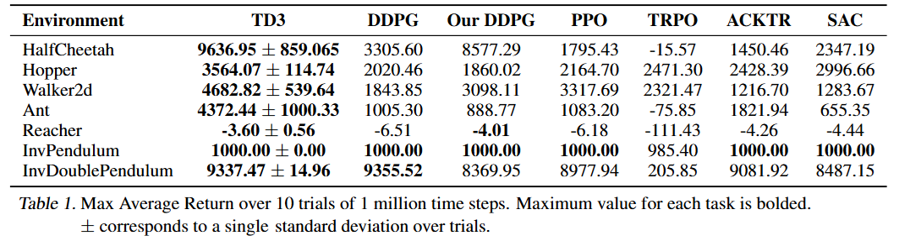

**Addressing Function Approximation Error in Actor-Critic Methods**

### Introduction

离散动作空间的RL中的Q值高估问题已经被研究得很多了，但连续动作空间的RL中的Q值高估问题还没有什么研究。在该论文中，我们将展示高估错误和TD中的累计误差。我们提出了一个方法来解决这个问题，并且效果比当前其他先进技术都要好。

高估偏差是Q Learning的一个性质，其中噪声值估计的最大化总是导致高估。在函数逼近设置中，由于拟合不精确，这种噪声是不可避免的。这种不准确性又被时间差分机制（TD）的性质进一步夸大，TD使用后续状态的估计来更新值函数的估计。这意味着在每次更新中使用不精确的估计会导致错误的积累。由于高估偏差，这种累积的误差会导致任意的糟糕状态被估计为高值，从而导致次优策略更新和发散行为。

高估偏差在处理连续动作空间的确定性策略梯度方法里也出现了。而且，在离散动作空间类问题中普遍使用的双DQN解决方案，对于actor-critic方法不适用。双DQN方案使用一个专门的目标Q网络来估计当前策略的价值，避免最大化偏差。不幸的是，在actor-critic方法中，缓慢更新的policy导致当前Q网络和target Q网络估计的值太接近而不能避免高估偏差。

可以使用通过两个Q Learning，也就是两个独立的critic网络来解决这个问题。虽然这能避免高估，但高方差也可能导致状态空间局部区域的未来高估，这反过来又会对全局策略产生负面影响。为了解决这个问题，我们提出了一种裁剪双Q Learning变体，它利用了这样一个概念，即遭受高估偏差的估计值可以用作真值估计的近似上界。这样做容易出现低估，但低估不会在训练过程中传播，因为策略避免了低价值估计的动作。

考虑到噪声与高估偏差的联系，该论文包含了一系列降低高方差的方法：

1. 首先，target网络是降低方差和累计误差的通常手段。
2. 第二，为了解决值与策略的耦合，我们引入了延迟更新policy网络，直到Q value估计收敛稳定。
3. 最后，我们引入了创新的正则化措施，对策略输出动作 π(s') 加入噪声，构造了一个“类似 SARSA”结构的目标，来降低值函数估计的方差。

我们的修改施加在当下先进的DDPG方案里，形成了twin delayed DDPG(TD3)，一种actor-critic算法，考虑了策略网络和值网络更新过程中相互作用的拟合误差。我们在gym的7个连续控制问题上评估了我们的算法，表现都明显超出当前其他先进方案。

考虑到可复现，我们在大量的随机seed上运行了我们的实验，形成了开源代码： (https://github.com/sfujim/TD3)

### Results

#### 三个措施的各自效果

（双Q \ 延迟更新 \ 策略平滑）

