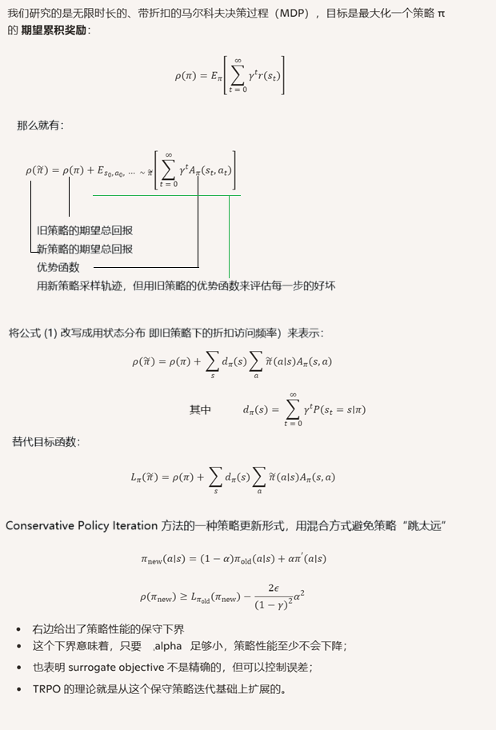
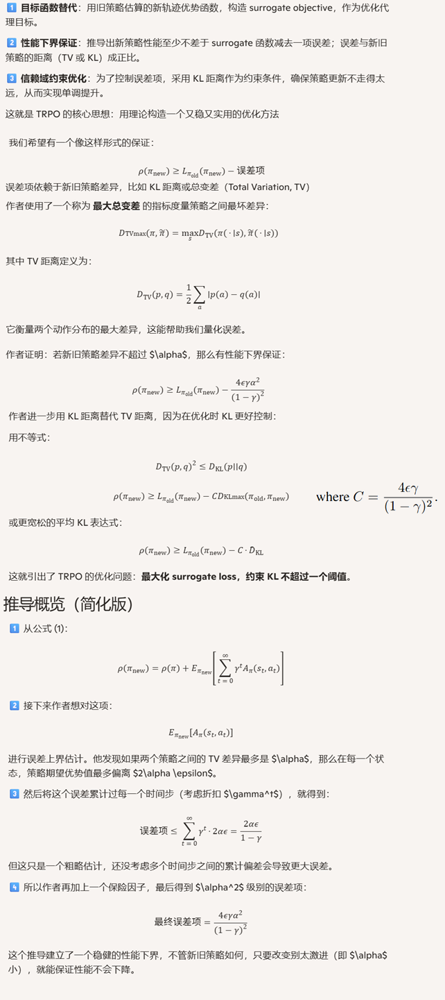
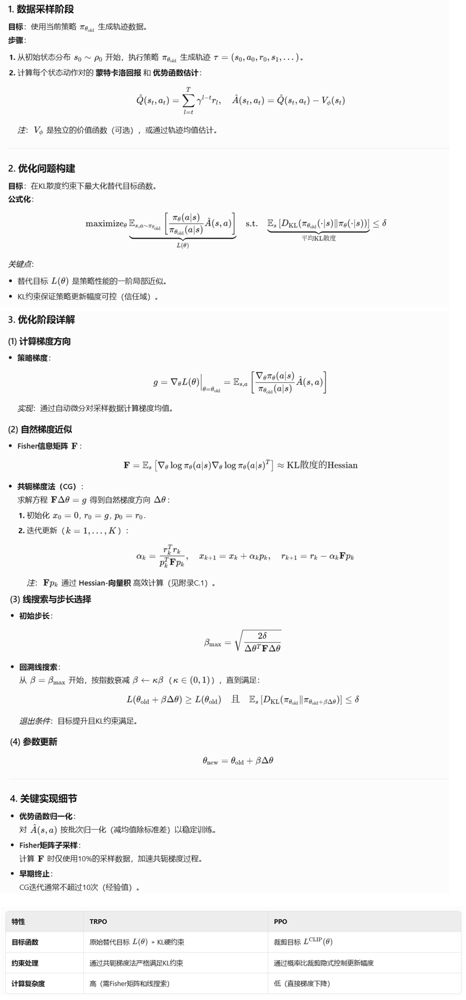
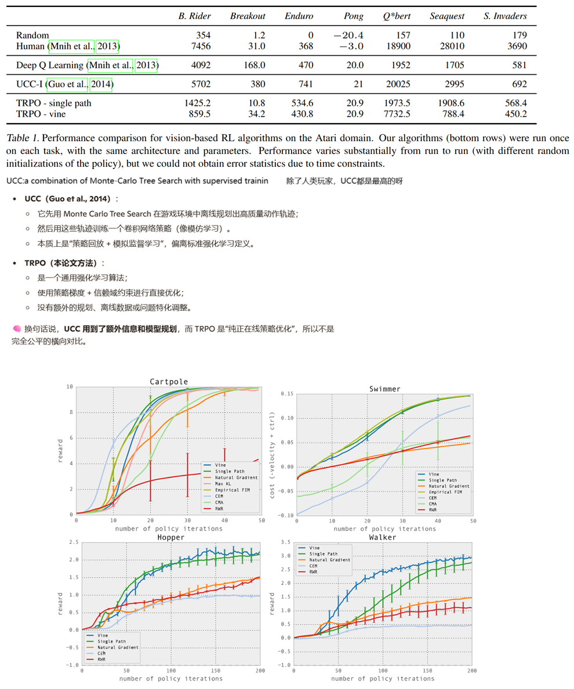
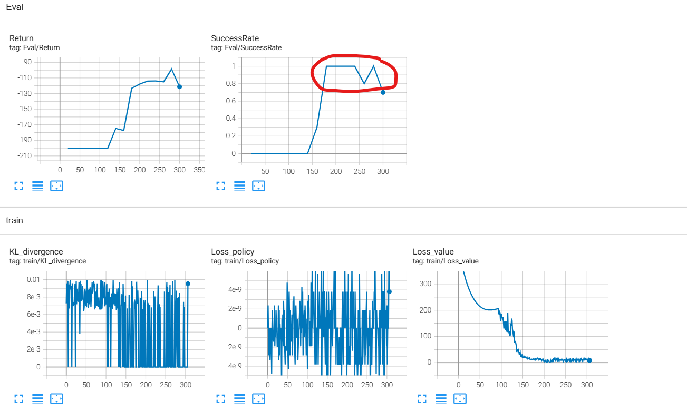

### 1、Introduction

TRPO 是一种基于策略梯度理论的实际算法，确保每次更新都带来单调提升（策略性能不会下降）。

在理论基础上，论文做了一系列近似，以发展出可扩展、稳定的 TRPO 算法，能够优化高维非线性策略（例如神经网络）。

实验表明：TRPO 可在多个任务中实现稳健表现，如模拟机器人运动（游泳、跳跃、行走）以及使用图像玩 Atari 游戏。

TRPO的优势：

1. 保证策略性能单调提升，避免回退；
2. 对超参数的调整要求较低，使用起来更加稳定；
3. 能处理高维状态与策略参数，适用于复杂策略搜索。

### 2、Preliminaries



### 3、Monotonic Improvement Guarantee for General Stochastic Policies



### 6、Practical Algorithm



### 8、Expertiments



### 9、bison的实验

开源实现：

```
https://github.com/DLR-RM/rl-baselines3-zoo
https://github.com/joschu/modular_rl #论文作者的代码，基于keras
https://github.com/ikostrikov/pytorch-trpo
https://spinningup.openai.com/en/latest/algorithms/trpo.html # 基于tensorflow
```

#### MountainCar

##### 手搓单环境

能够很好的收敛：




```python
import datetime

import gymnasium as gym
import numpy as np
import torch
import torch.nn as nn
from torch.distributions import Categorical
from torch.utils.tensorboard import SummaryWriter
import time

# ============================
# 超参数与配置封装
# ============================

class Args:
    env_name = 'MountainCar-v0'
    gamma = 0.99
    lam = 0.97                  # GAE lambda
    kl_target = 0.01
    cg_iters = 10
    backtrack_iters = 10
    backtrack_coeff = 0.8
    max_kl = 0.01
    damping = 0.1               # For Fisher matrix regularization
    lr_value = 1e-3
    epochs = 1000
    steps_per_epoch = 4000
    eval_interval = 20
    cuda = torch.device('cuda:0' if torch.cuda.is_available() else 'cpu')
    seed = 42

args = Args()

# ============================
# 策略网络
# ============================

class PolicyNet(nn.Module):
    def __init__(self, obs_dim, act_dim):
        super().__init__()
        self.net = nn.Sequential(
            nn.Linear(obs_dim, 64),
            nn.Tanh(),
            nn.Linear(64, 64),
            nn.Tanh(),
            nn.Linear(64, act_dim)
        )

    def forward(self, obs):
        logits = self.net(obs)
        return Categorical(logits=logits)

# ============================
# 值函数网络
# ============================

class ValueNet(nn.Module):
    def __init__(self, obs_dim):
        super().__init__()
        self.v = nn.Sequential(
            nn.Linear(obs_dim, 64),
            nn.Tanh(),
            nn.Linear(64, 64),
            nn.Tanh(),
            nn.Linear(64, 1)
        )

    def forward(self, obs):
        return self.v(obs).squeeze(-1)

# ============================
# 回合缓冲区，用于采样和估计
# ============================

class TrajectoryBuffer:
    def __init__(self):
        self.obs, self.act, self.rew, self.logp = [], [], [], []
        self.val, self.done = [], []

    def store(self, obs, action, reward, value, logprob, done):
        self.obs.append(obs)
        self.act.append(action)
        self.rew.append(reward)
        self.val.append(value)
        self.logp.append(logprob)
        self.done.append(done)

    def compute_advantages(self, gamma, lam, last_value):
        adv = []
        ret = []
        lastgaelam = 0

        vals = np.array(self.val + [last_value])
        for t in reversed(range(len(self.rew))):
            delta = self.rew[t] + gamma * vals[t + 1] * (1 - self.done[t]) - vals[t]
            lastgaelam = delta + gamma * lam * (1 - self.done[t]) * lastgaelam
            adv.insert(0, lastgaelam)
        for a, v in zip(adv, self.val):
            ret.append(a + v)
        return np.array(self.obs), np.array(self.act), np.array(ret), np.array(adv), np.array(self.logp)

    def clear(self):
        self.__init__()

class NormalizeWrapper(gym.Wrapper):
    def __init__(self, env, norm_obs=True, norm_reward=False, clip_obs=10.0, clip_reward=10.0, epsilon=1e-8):
        super().__init__(env)
        self.norm_obs = norm_obs
        self.norm_reward = norm_reward
        self.clip_obs = clip_obs
        self.clip_reward = clip_reward
        self.epsilon = epsilon

        obs_shape = self.observation_space.shape
        self.obs_rms_count = 0
        self.obs_mean = np.zeros(obs_shape, dtype=np.float32)
        self.obs_var = np.ones(obs_shape, dtype=np.float32)

        self.ret_rms_count = 0
        self.ret_mean = 0.0
        self.ret_var = 1.0

        self.ret = 0.0  # running return
        self.training = True  # if False, stop updating statistics

    def reset(self, **kwargs):
        self.ret = 0.0
        obs, info = self.env.reset(**kwargs)
        if self.norm_obs:
            self._update_obs_rms(obs)
            obs = self._normalize_obs(obs)
        return obs, info

    def step(self, action):
        obs, reward, terminated, truncated, info = self.env.step(action)
        done = terminated or truncated

        if self.norm_obs:
            self._update_obs_rms(obs)
            obs = self._normalize_obs(obs)

        if self.norm_reward:
            self.ret = self.ret * self.env.spec.reward_threshold + reward
            self._update_ret_rms(self.ret)
            reward = self._normalize_reward(reward)

        if done:
            self.ret = 0.0

        return obs, reward, terminated, truncated, info

    def _update_obs_rms(self, obs):
        if not self.training:
            return
        self.obs_rms_count += 1
        delta = obs - self.obs_mean
        self.obs_mean += delta / self.obs_rms_count
        self.obs_var += (obs - self.obs_mean) * delta

    def _update_ret_rms(self, ret):
        if not self.training:
            return
        self.ret_rms_count += 1
        delta = ret - self.ret_mean
        self.ret_mean += delta / self.ret_rms_count
        self.ret_var += (ret - self.ret_mean) * delta

    def _normalize_obs(self, obs):
        std = np.sqrt(self.obs_var / (self.obs_rms_count + 1e-8)) + self.epsilon
        obs_normalized = (obs - self.obs_mean) / std
        return np.clip(obs_normalized, -self.clip_obs, self.clip_obs)

    def _normalize_reward(self, reward):
        std = np.sqrt(self.ret_var / (self.ret_rms_count + 1e-8)) + self.epsilon
        reward_normalized = (reward - self.ret_mean) / std
        return np.clip(reward_normalized, -self.clip_reward, self.clip_reward)

# ============================
# 主 TRPO 算法逻辑
# ============================

class TRPOAgent:
    def __init__(self, env, eval_env):
        torch.manual_seed(args.seed)
        np.random.seed(args.seed)

        obs_dim = env.observation_space.shape[0]
        act_dim = env.action_space.n

        self.env = env
        self.eval_env = eval_env
        self.policy = PolicyNet(obs_dim, act_dim).to(args.cuda)
        self.old_policy = PolicyNet(obs_dim, act_dim).to(args.cuda)
        self.vf = ValueNet(obs_dim).to(args.cuda)
        self.buffer = TrajectoryBuffer()
        self.value_optimizer = torch.optim.Adam(self.vf.parameters(), lr=args.lr_value)
        self.writer = SummaryWriter(f'logs/TRPO_MountainCar_{datetime.datetime.now().strftime("%m%d_%H%M%S")}')
        self.step_count = 0

    def run_one_step(self, obs):
        obs_tensor = torch.tensor(obs, dtype=torch.float32).unsqueeze(0).to(args.cuda)
        with torch.no_grad():
            pi = self.policy(obs_tensor)
            val = self.vf(obs_tensor).cpu().item()
            act = pi.sample()
            logp = pi.log_prob(act).cpu().item()
        return act.cpu().item(), val, logp

    def collect_trajectories(self):
        obs, _ = self.env.reset()
        for _ in range(args.steps_per_epoch):
            act, val, logp = self.run_one_step(obs)
            next_obs, rew, term, trunc, _ = self.env.step(act)
            done = term or trunc
            self.buffer.store(obs, act, rew, val, logp, done)
            if done:
                obs, _ = self.env.reset()
            else:
                obs = next_obs
        last_obs = obs
        return last_obs

    def estimate_adv_and_return(self, last_obs):
        last_obs_tensor = torch.tensor(last_obs, dtype=torch.float32).unsqueeze(0).to(args.cuda)
        with torch.no_grad():
            last_value =  self.vf(last_obs_tensor).cpu().item()
        obs, act, ret, adv, logp = self.buffer.compute_advantages(args.gamma, args.lam, last_value)
        adv = (adv - adv.mean()) / (adv.std() + 1e-8)
        return (
            torch.tensor(obs, dtype=torch.float32).to(args.cuda),
            torch.tensor(act, dtype=torch.int64).to(args.cuda),
            torch.tensor(ret, dtype=torch.float32).to(args.cuda),
            torch.tensor(adv, dtype=torch.float32).to(args.cuda),
            torch.tensor(logp, dtype=torch.float32).to(args.cuda),
        )

    def update_value_function(self, obs, ret):
        for _ in range(10):
            value_loss = ((self.vf(obs) - ret) ** 2).mean()
            self.value_optimizer.zero_grad()
            value_loss.backward()
            self.value_optimizer.step()
        return value_loss.item()

    def surrogate_loss(self, obs, act, adv, old_logp):
        pi = self.policy(obs)
        logp = pi.log_prob(act)
        ratio = torch.exp(logp - old_logp)
        return (ratio * adv).mean(), logp

    def compute_kl(self, obs):
        pi = self.policy(obs)
        old_pi = self.old_policy(obs)
        kl = torch.distributions.kl_divergence(old_pi, pi).mean()
        return kl

    def hessian_vector_product(self, obs, act, old_logp, adv, vector):
        pi = self.policy(obs)
        logp = pi.log_prob(act)
        ratio = torch.exp(logp - old_logp)
        surrogate = (ratio * adv).mean()
        grads = torch.autograd.grad(surrogate, self.policy.parameters(), create_graph=True)
        flat_grad = torch.cat([g.view(-1) for g in grads])
        grad_vector = (flat_grad * vector).sum()
        hvp = torch.autograd.grad(grad_vector, self.policy.parameters(), retain_graph=True)
        flat_hvp = torch.cat([g.view(-1) for g in hvp]).detach()
        return flat_hvp + args.damping * vector

    def conjugate_gradient(self, obs, act, old_logp, adv, g):
        x = torch.zeros_like(g)
        r = g.clone()
        p = r.clone()
        rsold = torch.dot(r, r)
        for _ in range(args.cg_iters):
            Ap = self.hessian_vector_product(obs, act, old_logp, adv, p)
            alpha = rsold / (torch.dot(p, Ap) + 1e-8)
            x += alpha * p
            r -= alpha * Ap
            rsnew = torch.dot(r, r)
            if rsnew < 1e-10:
                break
            p = r + (rsnew / rsold) * p
            rsold = rsnew
        return x

    def flat_params(self):
        return torch.cat([p.view(-1) for p in self.policy.parameters()])

    def set_flat_params(self, flat_params, msg):
        if torch.isnan(flat_params).any() or torch.isinf(flat_params).any():
            print(f"❌ set_flat_params received NaN/Inf! Skipping update.{msg}")
            return  # 或者直接使用旧的备份参数

        idx = 0
        for name, p in self.policy.named_parameters():
            if torch.isnan(p.data).any():
                print(f"NaN in parameter: {name}")
                exit(-1)
            numel = p.numel()
            p.data.copy_(flat_params[idx:idx + numel].view_as(p))
            idx += numel

    def update_policy(self, obs, act, adv, old_logp):
        assert not torch.isnan(obs).any(), "obs contains NaN"
        assert not torch.isinf(obs).any(), "obs contains Inf"

        self.old_policy.load_state_dict(self.policy.state_dict()) #暂存老的policy

        loss, logp = self.surrogate_loss(obs, act, adv, old_logp)
        grads = torch.autograd.grad(loss, self.policy.parameters())
        grad_flat = torch.cat([g.view(-1) for g in grads]).detach()
        step_direction = self.conjugate_gradient(obs, act, old_logp, adv, grad_flat)

        shs = 0.5 * (step_direction @ self.hessian_vector_product(obs, act, old_logp, adv, step_direction))
        step_size = torch.sqrt(args.max_kl / (shs + 1e-8))
        step_size = torch.clamp(step_size, max=1.0)  # 或者更稳健的 0.5

        full_step = step_size * step_direction
        old_params = self.flat_params()

        for i in range(args.backtrack_iters):
            new_params = old_params + (args.backtrack_coeff ** i) * full_step
            self.set_flat_params(new_params, "new params")
            loss_new, _ = self.surrogate_loss(obs, act, adv, old_logp)
            kl = self.compute_kl(obs).item()

            if kl <= args.max_kl and loss_new > loss.item():
                print(f"Accepted step at line search iter {i}, KL: {kl:.5f}")
                self.writer.add_scalar("train/KL_divergence", kl, self.step_count)
                break
            if i == args.backtrack_iters - 1:
                print("Line search failed. Reverting to old parameters.")
                self.set_flat_params(old_params, "old params")
                kl = self.compute_kl(obs).item()
                self.writer.add_scalar("train/KL_divergence", kl, self.step_count)

        self.writer.add_scalar("train/Loss_policy", loss.item(), self.step_count)
        self.step_count += 1

    def evaluate(self, episodes=10):
        success = 0
        total_return = 0
        for _ in range(episodes):
            obs, _ = self.eval_env.reset()
            done = False
            ep_ret = 0
            while not done:
                obs_tensor = torch.tensor(obs, dtype=torch.float32).unsqueeze(0).to(args.cuda)
                pi = self.policy(obs_tensor)
                action = pi.probs.argmax().item()  # greedy
                obs, reward, term, trunc, _ = self.eval_env.step(action)
                done = term or trunc
                ep_ret += reward
            total_return += ep_ret
            if ep_ret >= -150:  # MountainCar considered solved at ~110
                success += 1
        avg_ret = total_return / episodes
        success_rate = success / episodes
        self.writer.add_scalar("Eval/Return", avg_ret, self.step_count)
        self.writer.add_scalar("Eval/SuccessRate", success_rate, self.step_count)
        print(f"Eval: return={avg_ret:.2f}, success_rate={success_rate:.2f}")

# ============================
# 训练入口点
# ============================

def main():
    env = gym.make(args.env_name)
    env = NormalizeWrapper(env)
    eval_env = gym.make(args.env_name)
    eval_env = NormalizeWrapper(eval_env)

    agent = TRPOAgent(env, eval_env)
    agent.step_count = 0

    for epoch in range(args.epochs):
        t0 = time.time()
        last_obs = agent.collect_trajectories()
        obs, act, ret, adv, old_logp = agent.estimate_adv_and_return(last_obs)
        value_loss = agent.update_value_function(obs, ret) #居然没有分mini-batch
        agent.writer.add_scalar("train/Loss_value", value_loss, epoch)


        agent.update_policy(obs, act, adv, old_logp)

        if (epoch+1) % args.eval_interval == 0:
            agent.evaluate()

        agent.buffer.clear()
        print(f"Epoch {epoch} done in {time.time() - t0:.1f}s")

    agent.writer.close()
    env.close()

if __name__ == "__main__":
    main()
```

##### 手搓多环境并行

不收敛，百思不得其解

```python
import datetime

import gymnasium as gym
import numpy as np
import torch
import torch.nn as nn
from torch.distributions import Categorical
from torch.utils.tensorboard import SummaryWriter
import time
from stable_baselines3.common.vec_env import SubprocVecEnv, VecNormalize, DummyVecEnv


# ============================
# 超参数与配置封装
# ============================

class Args:
    env_name = 'MountainCar-v0'
    gamma = 0.99
    lam = 0.97                  # GAE lambda
    kl_target = 0.01
    cg_iters = 10
    backtrack_iters = 10
    backtrack_coeff = 0.8
    max_kl = 0.01
    damping = 0.1               # For Fisher matrix regularization
    lr_value = 1e-3
    epochs = 400
    steps_per_epoch = 500
    eval_interval = 10
    cuda = torch.device('cuda:0' if torch.cuda.is_available() else 'cpu')
    seed = 42
    n_envs = 8
    obs_dim = 2
    act_dim = 3

args = Args()


def make_env(seed, index):
    def _init():
        env = gym.make(args.env_name) #max_episode_steps这样修改没有用，内部还是500步最大，需要继续研究
        #env = NormalizeWrapper(env)
        return env
    return _init

# ============================
# 策略网络
# ============================

class PolicyNet(nn.Module):
    def __init__(self, obs_dim, act_dim):
        super().__init__()
        self.net = nn.Sequential(
            nn.Linear(obs_dim, 64),
            nn.Tanh(),
            nn.Linear(64, 64),
            nn.Tanh(),
            nn.Linear(64, act_dim)
        )

    def forward(self, obs):
        logits = self.net(obs)
        return Categorical(logits=logits)

# ============================
# 值函数网络
# ============================

class ValueNet(nn.Module):
    def __init__(self, obs_dim):
        super().__init__()
        self.v = nn.Sequential(
            nn.Linear(obs_dim, 64),
            nn.Tanh(),
            nn.Linear(64, 64),
            nn.Tanh(),
            nn.Linear(64, 1)
        )

    def forward(self, obs):
        return self.v(obs).squeeze(-1)

# ============================
# 回合缓冲区，用于采样和估计
# ============================

class TrajectoryBuffer:
    def __init__(self):
        self.obs, self.act, self.rew, self.logp = [], [], [], []
        self.val, self.done = [], []

    def store(self, obs, action, reward, value, logprob, done):
        self.obs.append(obs)
        self.act.append(action)
        self.rew.append(reward)
        self.val.append(value)
        self.logp.append(logprob)
        self.done.append(done)

    def flatten(self):
        obs = np.array(self.obs).reshape(-1, args.obs_dim)
        act = np.array(self.act).reshape(-1, )
        logp = np.array(self.logp).reshape(-1,)
        return obs,act,logp


    def compute_advantages(self, gamma, lam, last_value):
        # 一次计算1个环境的adv/returns，并把他们拉平，包括obs  act logp都要拉平
        all_adv = []
        all_ret = []

        val_ = np.array(self.val)
        rew_ = np.array(self.rew)
        done_ = np.array(self.done)

        for env_idx in range(args.n_envs):
            lastgaelam = 0
            adv = []
            ret = []
            vals = np.array( list(val_[:, env_idx]) + list([ last_value[env_idx] ]) )
            for t in reversed(range(len(rew_[:, env_idx]))):
                delta = rew_[t, env_idx] + gamma * vals[t + 1] * (1 - done_[t, env_idx]) - vals[t]
                lastgaelam = delta + gamma * lam * (1 - done_[t, env_idx]) * lastgaelam
                adv.insert(0, lastgaelam)

            for a, v in zip(adv, val_[:, env_idx]):
                ret.append(a + v)
            all_adv.extend(adv)
            all_ret.extend(ret)

        obs, act, logp = self.flatten()
        assert len(obs) == len(all_adv), ""
        return obs, act, np.array(all_ret), np.array(all_adv), logp

    def clear(self):
        self.__init__()

# ============================
# 主 TRPO 算法逻辑
# ============================

class TRPOAgent:
    def __init__(self, env, eval_env):
        torch.manual_seed(args.seed)
        np.random.seed(args.seed)

        obs_dim = env.observation_space.shape[0]
        act_dim = env.action_space.n

        assert obs_dim == args.obs_dim and act_dim == args.act_dim, ""


        self.env = env
        self.eval_env = eval_env
        self.policy = PolicyNet(obs_dim, act_dim).to(args.cuda)
        self.old_policy = PolicyNet(obs_dim, act_dim).to(args.cuda)
        self.vf = ValueNet(obs_dim).to(args.cuda)
        self.buffer = TrajectoryBuffer()
        self.value_optimizer = torch.optim.Adam(self.vf.parameters(), lr=args.lr_value)
        self.writer = SummaryWriter(f'logs/TRPO_MountainCar_{datetime.datetime.now().strftime("%m%d_%H%M%S")}')
        self.step_count = 0

    def run_one_step(self, obs):
        obs_tensor = torch.tensor(obs, dtype=torch.float32).to(args.cuda)
        with torch.no_grad():
            pi = self.policy(obs_tensor)
            val = self.vf(obs_tensor).cpu().numpy()
            act = pi.sample()
            logp = pi.log_prob(act).cpu().numpy()
        return act.cpu().numpy(), val, logp

    def collect_trajectories(self):
        obs = self.env.reset() # (n_envs, 2)
        for _ in range(args.steps_per_epoch):
            act, val, logp = self.run_one_step(obs)
            next_obs, rew, done, info = self.env.step(act)
            self.buffer.store(obs, act, rew, val, logp, done)
            obs = next_obs
        last_obs = obs
        return last_obs

    def estimate_adv_and_return(self, last_obs):
        last_obs_tensor = torch.tensor(last_obs, dtype=torch.float32).to(args.cuda)
        with torch.no_grad():
            last_value =  self.vf(last_obs_tensor).cpu().numpy()
        obs, act, ret, adv, logp = self.buffer.compute_advantages(args.gamma, args.lam, last_value)
        adv = (adv - adv.mean()) / (adv.std() + 1e-8)
        #self.writer.add_scalar("train/adv_mean", adv.mean().item(), self.step_count)
        return (
            torch.tensor(obs, dtype=torch.float32).to(args.cuda),
            torch.tensor(act, dtype=torch.int64).to(args.cuda),
            torch.tensor(ret, dtype=torch.float32).to(args.cuda),
            torch.tensor(adv, dtype=torch.float32).to(args.cuda),
            torch.tensor(logp, dtype=torch.float32).to(args.cuda),
        )

    def update_value_function(self, obs, ret):
        for _ in range(10):
            value_loss = ((self.vf(obs) - ret) ** 2).mean()
            self.value_optimizer.zero_grad()
            value_loss.backward()
            self.value_optimizer.step()


        return value_loss.item()

    def update_value_function_minibatch(self, obs, ret, batch_size=args.steps_per_epoch, epochs=10):
        dataset = torch.utils.data.TensorDataset(obs, ret)
        loader = torch.utils.data.DataLoader(dataset, batch_size=batch_size, shuffle=True)

        for _ in range(epochs):
            for batch_obs, batch_ret in loader:
                loss = ((self.vf(batch_obs) - batch_ret) ** 2).mean()
                self.value_optimizer.zero_grad()
                loss.backward()
                self.value_optimizer.step()

        self.writer.add_scalar("train/ret_mean", ret.mean().item(), self.step_count)
        self.writer.add_scalar("train/vf_mean", self.vf(obs).mean().item(), self.step_count)

        return loss.item()

    def surrogate_loss(self, obs, act, adv, old_logp):
        pi = self.policy(obs)
        logp = pi.log_prob(act)
        ratio = torch.exp(logp - old_logp)
        return (ratio * adv).mean(), logp

    def compute_kl(self, obs):
        pi = self.policy(obs)
        old_pi = self.old_policy(obs)
        kl = torch.distributions.kl_divergence(old_pi, pi).mean()
        return kl

    def hessian_vector_product(self, obs, act, old_logp, adv, vector):
        pi = self.policy(obs)
        logp = pi.log_prob(act)
        ratio = torch.exp(logp - old_logp)
        surrogate = (ratio * adv).mean()
        grads = torch.autograd.grad(surrogate, self.policy.parameters(), create_graph=True)
        flat_grad = torch.cat([g.view(-1) for g in grads])
        grad_vector = (flat_grad * vector).sum()
        hvp = torch.autograd.grad(grad_vector, self.policy.parameters(), retain_graph=True)
        flat_hvp = torch.cat([g.view(-1) for g in hvp]).detach()
        return flat_hvp + args.damping * vector

    def conjugate_gradient(self, obs, act, old_logp, adv, g):
        x = torch.zeros_like(g)
        r = g.clone()
        p = r.clone()
        rsold = torch.dot(r, r)
        for _ in range(args.cg_iters):
            Ap = self.hessian_vector_product(obs, act, old_logp, adv, p)
            alpha = rsold / (torch.dot(p, Ap) + 1e-8)
            x += alpha * p
            r -= alpha * Ap
            rsnew = torch.dot(r, r)
            if rsnew < 1e-10:
                break
            p = r + (rsnew / rsold) * p
            rsold = rsnew
        return x

    def flat_params(self):
        return torch.cat([p.view(-1) for p in self.policy.parameters()])

    def set_flat_params(self, flat_params, msg):
        if torch.isnan(flat_params).any() or torch.isinf(flat_params).any():
            print(f"❌ set_flat_params received NaN/Inf! Skipping update.{msg}")
            return  # 或者直接使用旧的备份参数

        idx = 0
        for name, p in self.policy.named_parameters():
            if torch.isnan(p.data).any():
                print(f"NaN in parameter: {name}")
                exit(-1)
            numel = p.numel()
            p.data.copy_(flat_params[idx:idx + numel].view_as(p))
            idx += numel

    def update_policy(self, obs, act, adv, old_logp):
        assert not torch.isnan(obs).any(), "obs contains NaN"
        assert not torch.isinf(obs).any(), "obs contains Inf"

        self.old_policy.load_state_dict(self.policy.state_dict()) #暂存老的policy

        loss, logp = self.surrogate_loss(obs, act, adv, old_logp)
        grads = torch.autograd.grad(loss, self.policy.parameters())
        grad_flat = torch.cat([g.view(-1) for g in grads]).detach()
        step_direction = self.conjugate_gradient(obs, act, old_logp, adv, grad_flat)

        shs = 0.5 * (step_direction @ self.hessian_vector_product(obs, act, old_logp, adv, step_direction))
        step_size = torch.sqrt(args.max_kl / (shs + 1e-8))
        #step_size = torch.clamp(step_size, max=1.0)  # 或者更稳健的 0.5

        full_step = step_size * step_direction
        old_params = self.flat_params()

        for i in range(args.backtrack_iters):
            new_params = old_params + (args.backtrack_coeff ** i) * full_step
            self.set_flat_params(new_params, "new params")
            loss_new, _ = self.surrogate_loss(obs, act, adv, old_logp)
            kl = self.compute_kl(obs).item()

            if kl <= args.max_kl and loss_new > loss.item():
                print(f"Accepted step at line search iter {i}, KL: {kl:.5f}")
                self.writer.add_scalar("train/KL_divergence", kl, self.step_count)
                break
            if i == args.backtrack_iters - 1:
                print("Line search failed. Reverting to old parameters.")
                self.set_flat_params(old_params, "old params")
                kl = self.compute_kl(obs).item()
                self.writer.add_scalar("train/KL_divergence", kl, self.step_count)

        self.writer.add_scalar("train/Loss_policy", loss.item(), self.step_count)
        self.step_count += 1

    def evaluate(self, episodes=10):
        success = 0
        total_return = 0
        for _ in range(episodes):
            obs = self.eval_env.reset()
            done = False
            ep_ret = 0
            while not done:
                obs_tensor = torch.tensor(obs, dtype=torch.float32).to(args.cuda)
                pi = self.policy(obs_tensor)
                action = pi.probs.argmax(axis=-1).cpu().numpy()  # greedy
                obs, reward, done, _ = self.eval_env.step(action)
                ep_ret += reward[0]
            total_return += ep_ret
            if ep_ret >= -150:  # MountainCar considered solved at ~110
                success += 1
        avg_ret = total_return / episodes
        success_rate = success / episodes
        self.writer.add_scalar("Eval/Return", avg_ret, self.step_count)
        self.writer.add_scalar("Eval/SuccessRate", success_rate, self.step_count)
        print(f"Eval: return={avg_ret:.2f}, success_rate={success_rate:.2f}")

# ============================
# 训练入口点
# ============================

def main():
    env_fns = [make_env(seed=i, index=i) for i in range(args.n_envs)]
    envs = SubprocVecEnv(env_fns)
    envs = VecNormalize(envs, norm_obs=True, norm_reward=False)

    eval_env = gym.make(args.env_name)
    eval_env = DummyVecEnv([lambda: eval_env])  # 包装为 vector env
    eval_env = VecNormalize(eval_env, training=False)  # 禁止更新统计
    eval_env.obs_rms = envs.obs_rms  # 共享统计量

    agent = TRPOAgent(envs, eval_env)
    agent.step_count = 0

    for epoch in range(args.epochs):
        t0 = time.time()
        last_obs = agent.collect_trajectories()
        obs, act, ret, adv, old_logp = agent.estimate_adv_and_return(last_obs)
        value_loss = agent.update_value_function(obs, ret) #居然没有分mini-batch
        agent.writer.add_scalar("train/Loss_value", value_loss, epoch)


        agent.update_policy(obs, act, adv, old_logp)

        if (epoch+1) % args.eval_interval == 0:
            agent.evaluate()

        agent.buffer.clear()
        print(f"Epoch {epoch} done in {time.time() - t0:.1f}s")

    agent.writer.close()


if __name__ == "__main__":
    main()
```