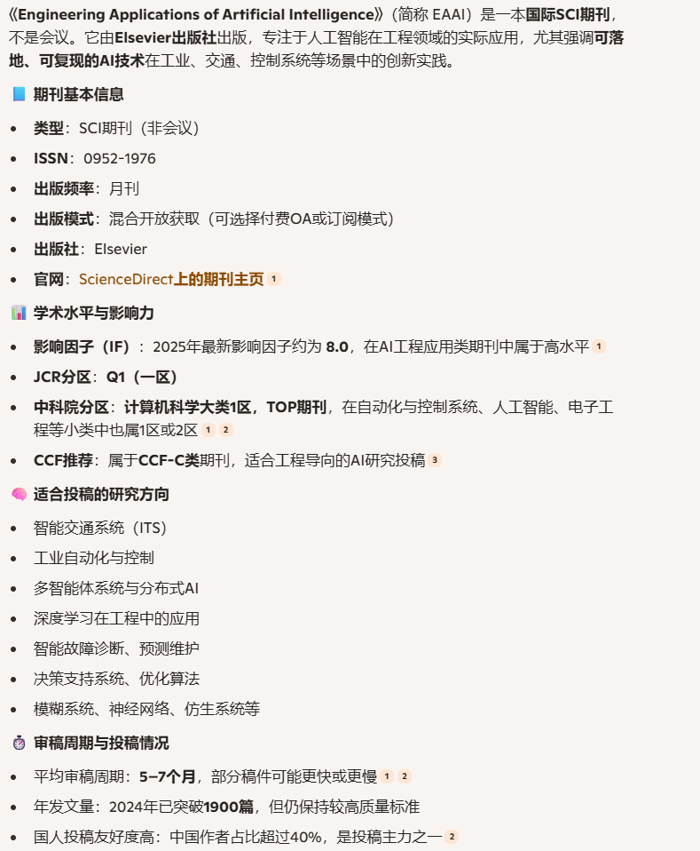

### 第一篇

An adaptive traffic signal control scheme with Proximal Policy Optimization based on deep reinforcement learning for a single intersection - ScienceDirect

1. 发表时间和单位： June 2025，天津大学/兰州交通大学/东京大学
2. url：“https://www.sciencedirect.com/science/article/pii/S0952197625004403”
3. 方法：
   1. 使用向量形式的输入（平均等待时间和平均队列长度 ）
   2. 使用PPO算法
   3. 使用 两个连续时间步的平均等待时间和平均队列长度的变化 作为reward
4. 实验环境：Simulation of Urban Mobility (SUMO)，模拟北京朝阳区的一个十字路口的交通灯
5. 对比baseline：
   1. DQN with 向量输入
   2. DQN with 栅格化的二维向量输入（即对入口车道做栅格化，标记上面出现的车辆和速度信息）
   3. D3QN（Dueling  Double Deep Qlearning Network）with 栅格化的二维向量输入
   4. PPO with 栅格化的二维向量输入
   5. PPO-TSC （本论文的方法）
6. 对比指标
   1. 平均等待队列长度
   2. 平均等待时间
   3. 平均通行时间
   4. 平均通行速度
7. 实验结果
   1. 在各项指标上，本论文的方法（PPO-TSC）均优于其他方法。**这里比较充分的实验，工作量还是比较大的**
   2. 消减实验表明：同时输入平均等待时间和平均队列长度，比只输入两者中的某一项，表现要好
   3. 实验表明，绿灯持续时间间隔的三个可选值（5s / 10s / 15s）中，10s是整体表现比较均衡的
8. 我的思考/疑问：
   1. 这个刊物不是高级的顶刊类刊物，在这里发论文是不是比较容易，也比较“水”？
   2. 该论文本身似乎没有什么创意，只是比较常规的应用DRL解决一个具体的实际问题，偏应用。工作的主要难度是实验效果要突出，这一点当然也是有价值的。这样也是可以发论文的？能满足（学硕）毕业要求吗？
   3. 类似这样的论文水平和形式，林教授是否满意？ 对这类工作如何评价？
9. 所发的刊物背景（来自AI）：

### 第二篇

Traffic signal control based on deep reinforcement learning using state fusion  and trend reward

1. 发表时间和单位：June 2025，北京交通大学

2. url：“https://www.sciencedirect.com/science/article/pii/S0952197625017038”
3. 方法
   1. 输入特征，混合使用1D的向量输入和2D的栅格化车辆位置/速度信息
   2. 奖励函数设计思路：平均等待时间上升就惩罚/下降就奖励，惩罚的幅度固定，而奖励是跟下降的比例相关：1 - (wt[i] / wt[i-1] ) ^ 2
   3. 采用D3QN算法（dueling double deep QLearning Networks）
4. 实验环境：SUMO模拟器，一个交叉路口
5. 对比指标：
   1. 累计等待时间
   2. 通行路口的平均车速
   3. 等待的车辆总数
6. 对比的baseline方案
   1. 固定时间轮转
   2. 最大压力（Max-Pressure）
   3. PPO
   4. DQN
   5. Double DQN
   6. Dueling DQN
   7. 论文建议的D3QN，每项指标都胜出
7. 对比了相同算法下不同特征输入的表现，有点类似消减实验
   1. 1D：一维方式输入信号相位 和 每个车道的队列长度
   2. 2D（single）：栅格化二维输入，只包括车速通道
   3. 2D（dual）：栅格化二维输入，包括车速通道和车辆位置通道
   4. 1D+2D（single）
   5. 1D+2D（dual）：论文采取的方案，胜出。
8. 对比了reward函数
   1. 所有车辆的平均速度（取负值作为惩罚）
   2. 所有车辆的排队数量（取负值作为惩罚）
   3. 加权组合：速度、排队数、等待时间的加权和
   4. 当前与上一时间步累计等待时间的差值
   5. 本文提出：基于等待时间变化趋势的动态奖励函数。效果最佳

