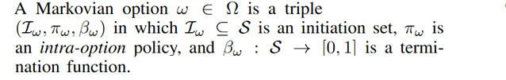
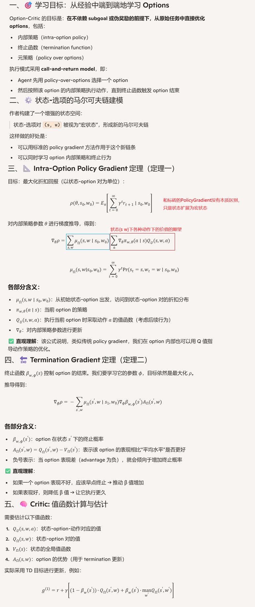
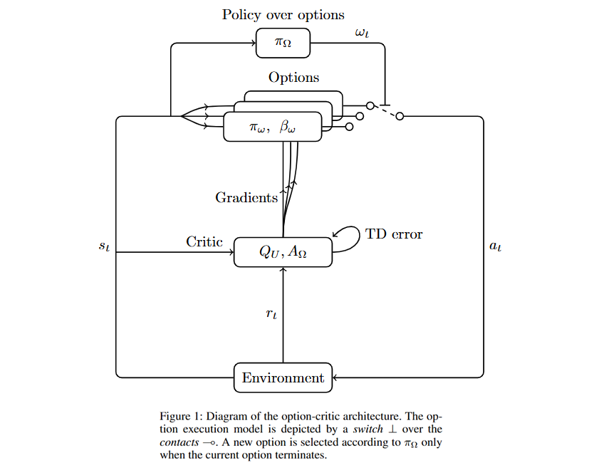
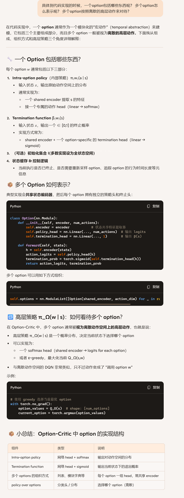
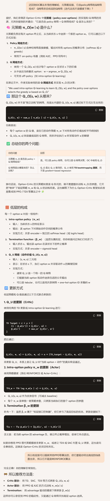
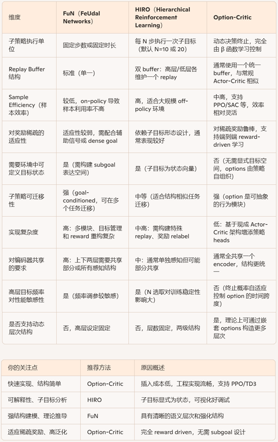
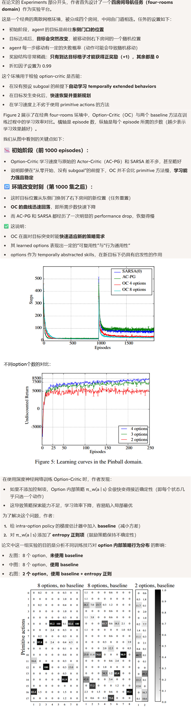

**The Option-Critic Architecture**

### 1、Introduction

1. **Temporal abstraction** 是强化学习中提升学习效率与计划能力的关键，它通过定义跨时间尺度的行为序列（options）来实现更高层次的动作选择。
2. 尽管规划方面已经掌握了如何使用 temporally extended actions（例如 options），但 **如何自动地从数据中学习这些抽象层次** 依然是一个挑战。
3. 传统方法偏向于先发现 subgoals（中间目标状态），再学习到达这些 subgoals 的策略。这种方法难以扩展到更大、更复杂的环境：
   - 寻找 subgoals 是组合性问题，计算成本高。
   - 学习每个子策略的代价可能不比直接解决整个任务低多少。
4. 论文提出一种 **无需 subgoal 指定、奖励重构或额外问题设计** 的方法，直接从经验中学习 options。所提出的 **option-critic 架构** 同时学习以下三个关键组件：
   1. intra-option policies（option 内部策略）
   2. termination functions（option 的终止条件）
   3. policy over options（选择哪个 option 的元策略）
5. 论文的方法基于 policy gradient 原理，**可端到端优化最终任务目标**，且适用于离散或连续空间、线性或非线性函数逼近器。
6. 该方法不仅能在单任务中高效学习 options，还能在迁移任务中展现较好的泛化能力。
7. 在多个环境（包括经典控制任务和 Atari 游戏）中验证其性能与效率

在强化学习中，“**temporal abstraction（时间抽象）**”是一种让智能体不用每一步都做底层决策、而是能在更长的时间尺度上思考和行动的方式。可以把它理解为我们人类在计划时不去纠结每个细节动作，而是用**高层次的行为块**来组织任务。

在强化学习中，**Options** 就是实现时间抽象的方式：

- **一个 option =（起始条件，内部策略，终止条件）**
- agent 在某个状态选择一个 option，它会沿着内部策略执行多个时间步，直到满足终止条件
- 执行期间 agent 不会做原始动作决策，而是“委托”option 控制

### 2、Preliminaries and Notation

介绍了MDP、Policy gradient methods、The options framework。



### 3、Learning Options



### 4、Algorithms and Architecture

#### 4.1 算法伪代码



```
# 初始化神经网络参数
initialize_shared_encoder()          # 表征状态 s 的共享 encoder，例如 CNN 或 MLP
initialize_option_policies()         # 每个 option w 的 π_wθ(a|s)，可共用 encoder + 分别的 head
initialize_termination_heads()       # 每个 option w 的 β_wϕ(s)：shared encoder → FC → sigmoid
initialize_policy_over_options()     # 元策略 π_Ω(w|s)，可选 softmax 或 ε-greedy
initialize_critic_Q_U_and_Q_Ω()      # 初始化 Q_U(s, w, a) 和 Q_Ω(s, w)

# 环境初始化
s = env.reset()
features = shared_encoder(s)
w = sample_from_policy_over_options(features)  # 选择初始 option

while not done:

    # 1. 从当前 option 的策略中采样动作
    a = sample_from_intra_option_policy(w, features)  # π_wθ(a | s)

    # 2. 执行动作，与环境交互
    s_next, r, done = env.step(a)
    features_next = shared_encoder(s_next)

    # 3. TD 目标用于 critic 更新
    target = r + γ * (
        (1 - β_wϕ(s_next)) * Q_Ω(s_next, w)
      + β_wϕ(s_next)      * max_w′ Q_Ω(s_next, w′)
    )

    # 4. 更新 critic 网络（可使用 TD 或 Q-learning）
    update_Q_U(s, w, a, target)
    Q_Ω(s, w) = estimate_Q_Ω_from_Q_U(s, w)

    # 5. 更新 intra-option policy（策略头）
    # 使用 Q_U(s,w,a) 指导策略提升 log π_w(a|s)
    update_policy_head(w, s, a, Q_U[s,w,a])

    # 6. 更新 termination function β_wϕ(s)
    # 使用优势函数指导其更倾向终止或延续
    A = Q_Ω(s_next, w) - V_Ω(s_next)  # 可选 baseline
    update_termination_head(w, s_next, advantage=A)  # ∇ϕ β_wϕ(s) · A

    # 7. 决定是否退出当前 option
    β = termination_head(w, features_next)  # forward 神经网络，输出终止概率
    if random() < β:
        w = sample_from_policy_over_options(features_next)  # 重新选 option

    # 8. 前进一步
    s = s_next
    features = features_next

```

#### 4.2 深入理解

##### 实现表示





##### 三个HRL算法的对比



### 5、Experiments



### 6、Related Work

### 7、Discussion