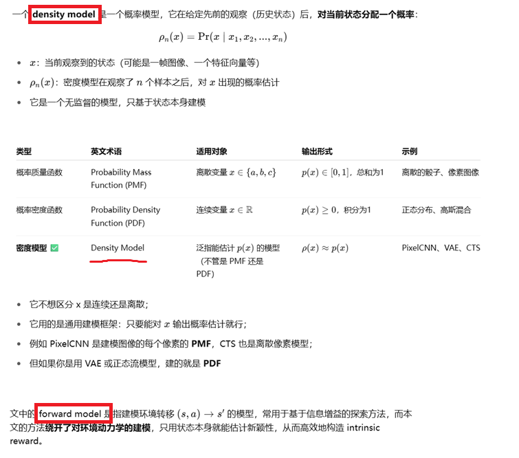

**Unifying Count-Based Exploration and Intrinsic Motivation**

### 1 Introduction

In this paper we provide formal evidence that intrinsic motivation and count-based exploration are but two sides of the same coin.

Specifically, we consider a frequently used measure of learning progress, information gain. Defined as the Kullback-Leibler divergence of a prior distribution from its posterior, information gain can be related to the confidence intervals
used in count-based exploration.

Our contribution is to propose a new quantity, the pseudo-count, which connects information-gain-as-learning-progress and count-based exploration.

The pseudo-counts we introduce here are best thought of as “function approximation for exploration”.

#### 全文快速摘要

先快速看一下AI帮忙总结的全文的摘要：

#### 什么是density model / foward model

### 2 Notation

### 3 From Densities to Counts

In the introduction we argued that the visit count Nn(x) (and consequently, Nn(x, a)) is not directly useful in practical settings, since states are rarely revisited. Specifically, Nn(x) is almost always zero and cannot help answer the question “How novel is this state?”

o estimate the uncertainty of an agent’s knowledge, we must instead look for a quantity which generalizes across states. Guided by ideas from the intrinsic motivation literature, we now derive such a quantity. 

We call it a pseudo-count as it extends the familiar notion from Bayesian estimation.

### 4 The Connection to Intrinsic Motivation